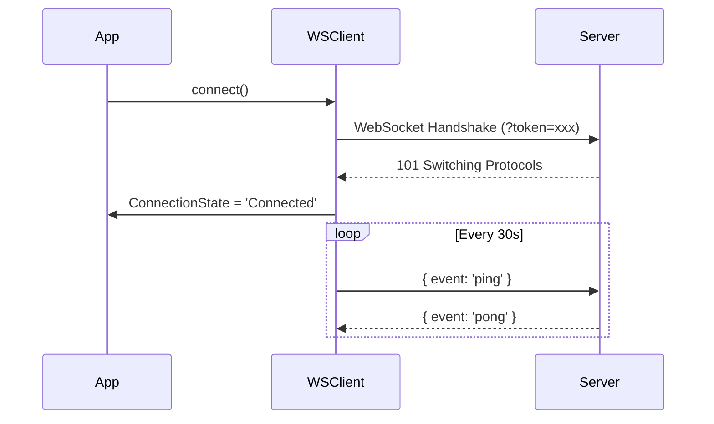
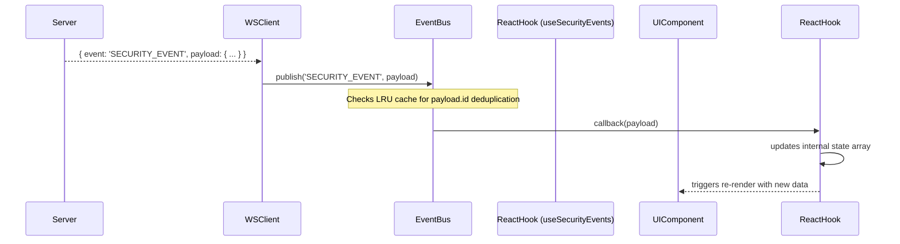
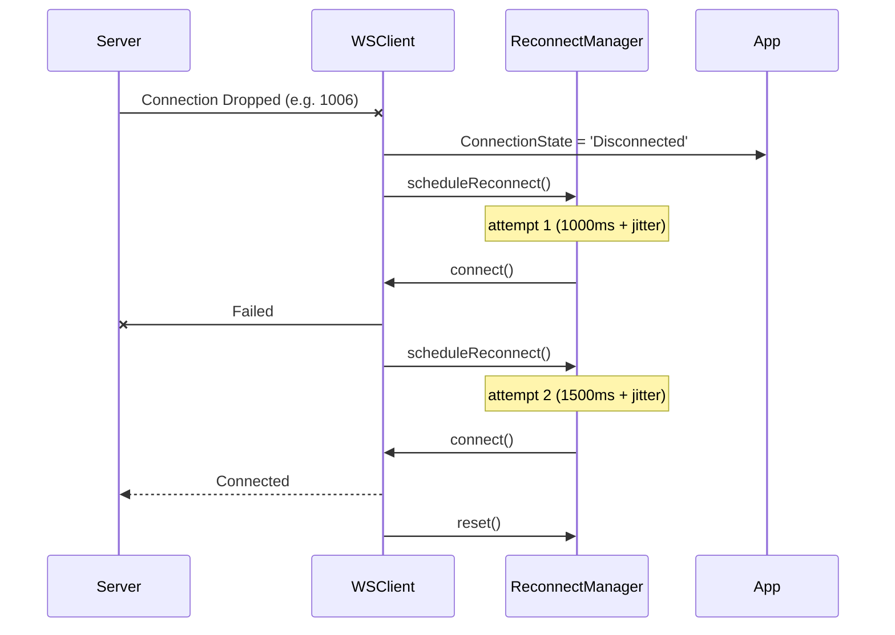

# Phase 3.2A: Real-Time Infrastructure Architecture Report

## Overview
The real-time infrastructure establishes a robust, decoupled publish/subscribe architecture for streaming live cybersecurity events from the backend to the frontend UI components. This avoids direct tight-coupling, ensures state synchronization, and natively handles connection turbulence.

## Folder Structure
```text
src/
├── realtime/
│   ├── index.ts               # Public exports
│   ├── types.ts               # Strict TypeScript event models
│   ├── eventBus.ts            # Global Pub/Sub implementation
│   ├── channels.ts            # Channel constants
│   ├── connectionMonitor.ts   # Connection state manager
│   ├── heartbeat.ts           # Ping/Pong connection health tracking
│   ├── reconnectManager.ts    # Exponential backoff retry logic
│   ├── simulator.ts           # Development simulation utilities
│   └── websocketClient.ts     # Core WebSocket integration
├── hooks/
│   ├── realtime/
│   │   ├── index.ts
│   │   ├── useRealtime.ts       # Generic base hook
│   │   ├── useSecurityEvents.ts # Specialized security event hook
│   │   ├── useAgentStream.ts    # Specialized agent telemetry hook
│   │   ├── useScanProgress.ts   # Specialized scan progress hook
│   │   └── useNotifications.ts  # Specialized user notification hook
```

## Type Definitions (`src/realtime/types.ts`)
Strict models ensure frontend consumers have safe access to payload properties.
All events extend a `BaseEvent` which requires a unique `id` for deduplication and a `timestamp` / `sequence` for ordering.

Supported Real-Time Events:
- `SecurityEvent`
- `AgentStatus`
- `IncidentUpdate`
- `ThreatAlert`
- `ScanProgress`
- `NotificationEvent`

## Sequence Diagrams

### 1. Connection & Heartbeat Sequence


### 2. Event Distribution Sequence


### 3. Reconnection Strategy


## Testing & Simulation
`src/realtime/simulator.ts` provides explicit hooks to intentionally stress-test the frontend handling logic:
- **Connection Loss**: Force-drops the WebSocket `(ws.close(1006))` to trigger reconnect sequences.
- **Duplicate Events**: Fires the identical payload ID rapidly to prove the `EventBus` LRU caching ignores the latter duplicate.
- **Out-of-Order**: Dispatches sequence `#2` before sequence `#1`, exposing raw behavior to component-level sorters.
- **Heartbeat Timeout**: Intercepts the internal heartbeat manager to force a local timeout, testing how the system autonomously recovers from silent network partitions.

## Conclusion
The application is now structurally ready to display live cybersecurity operations dynamically without tight coupling between components and the network layer.
