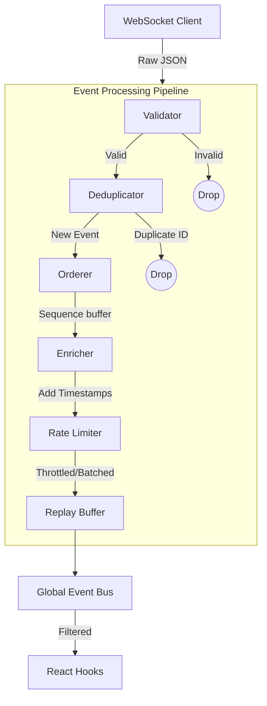

# Phase 3.2B: Event Processing Pipeline Architecture

## Overview
To handle the scale and velocity of cybersecurity telemetry, we have introduced a rigorous event processing pipeline between the raw WebSocket stream and the React Application's global EventBus.

## Folder Structure
```text
src/
└── realtime/
    └── pipeline/
        ├── index.ts           # Exports
        ├── types.ts           # Configuration & Metric models
        ├── metrics.ts         # High-performance counter/EPS tracking
        ├── validator.ts       # Type/Schema validation
        ├── deduplicator.ts    # ID-based Set/LRU duplicate dropping
        ├── orderer.ts         # Sequence-based buffering/ordering
        ├── enricher.ts        # Payload decoration (timestamps, defaults)
        ├── rateLimiter.ts     # Throttling & UI anti-flood
        ├── replayBuffer.ts    # Short-term history for late UI subscriptions
        ├── filter.ts          # Subscription matching engine
        └── pipeline.ts        # The main conductor
```

## Architecture Diagram (Flow)


## Strategy Details

### 1. Validation
The `EventValidator` checks for the existence of mandatory fields (`id` and `type`). If an event is malformed, it is immediately discarded to prevent React rendering crashes downstream.

### 2. Deduplication
A lightweight `Set` implementation (bounded to a configurable `deduplicationCacheSize`) records event IDs. Re-transmissions caused by turbulent network connections are silently ignored.

### 3. Ordering
The `EventOrderer` evaluates the `sequence` field. If sequence `N+1` is received while waiting for `N`, it buffers `N+1`. A max buffer timeout prevents infinite stalls if `N` is permanently lost.

### 4. Enrichment
The `EventEnricher` guarantees UI safety by backfilling missing but necessary data (e.g., stamping the ingestion `timestamp` or applying default fallback severities to missing fields).

### 5. Rate Limiting
The `RateLimiter` enforces a maximum dispatch frequency (e.g., 100ms) to the UI thread. It can operate in single-release mode or batch-mode to prevent React state trashing during high-volume DDoS telemetry floods.

### 6. Event Replay
The `ReplayBuffer` retains the most recent 100 events in memory. When a user navigates to a new dashboard page, the new hooks immediately receive context without waiting for the next live packet.

## Unit-Testing Strategy
To validate the pipeline without booting a backend server, we can write pure isolated unit tests:
1. **Validator Tests:** Pass malformed, empty, and well-formed JSON objects and verify `null` or object returns.
2. **Deduplicator Tests:** Call `isDuplicate` with the same ID twice. Assert the first returns false, the second true. Simulate cache eviction by overflowing the max size.
3. **Orderer Tests:** Push `seq: 2` then `seq: 1` and assert the callback fires `1` then `2`. Verify the fallback timeout fires if `seq: 1` never arrives.
4. **Rate Limiter Tests:** Enqueue 100 events instantly, mock `setTimeout`, and verify the callback fires strictly at intervals.
