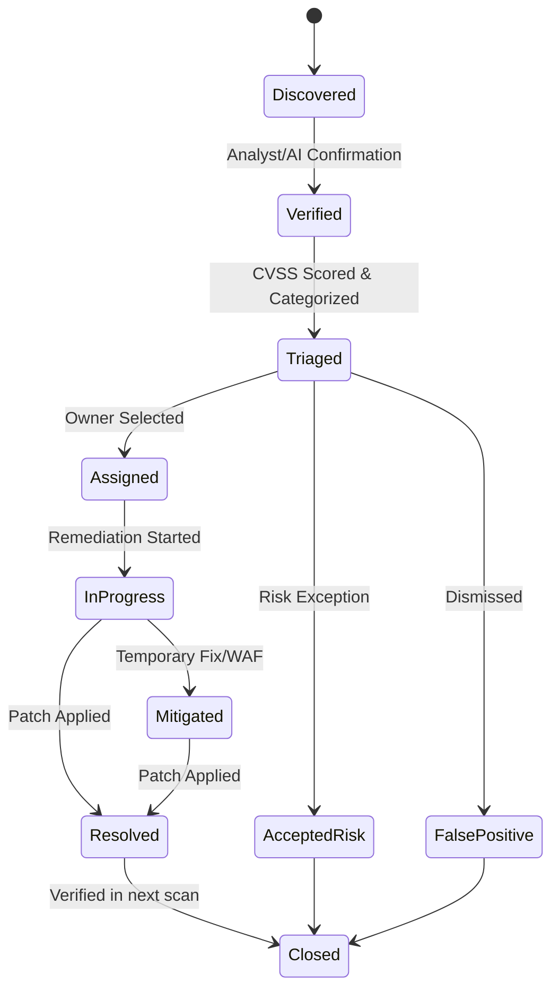
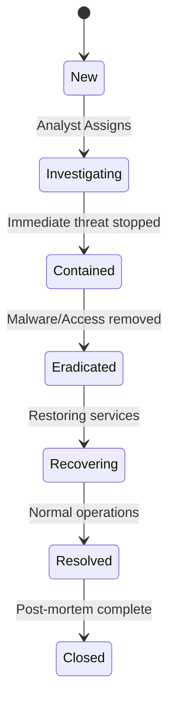

# Phase 3.3: Enterprise Security Workflows

## 1. Created Components

- **`VulnerabilityDrawer`** (`src/components/workflows/VulnerabilityDrawer.tsx`): Provides a rich slide-out drawer for inspecting and managing a single vulnerability. It includes CVSS/EPSS scores, an interactive workflow state bar (Discovered, Triaged, Mitigated, etc.), AI security analysis (Root Cause, Remediation), and a timeline of audit logs.
- **`IncidentDrawer`** (`src/components/workflows/IncidentDrawer.tsx`): A comprehensive view for incident response. It features MITRE ATT&CK mappings, an interactive incident state bar (Investigating, Contained, Recovering, etc.), AI operation recommendations (Next Action, Risk Prediction), interactive Playbook tracking, and an audit trail.
- **`Cases`** (`src/pages/Cases.tsx`): A new page module to manage long-term investigations, compliance cases, and cross-team collaboration.
- **`Tasks`** (`src/pages/Tasks.tsx`): A new page module for managing individual security tasks, remediations, deadlines, and assigned personnel.

## 2. Updated Routes

Modified `src/app/Router.tsx` to include the following new lazy-loaded routes under the Enterprise Layout:
- `/cases` -> `<Cases />`
- `/tasks` -> `<Tasks />`

Modified `src/components/layouts/EnterpriseLayout.tsx` to add "Case Management" and "Tasks" to the "SECURITY OPERATIONS" sidebar group.

Modified `AssetDetails.tsx` to include Environment, Risk Score, Exposure, DNS Records, TLS Certificates, and Asset Relationships.

## 3. API Endpoints Required

To support the React Query hooks (`useVulnerabilities`, `useIncidents`, `useAuditLogs`), the following backend REST/GraphQL endpoints are required:

- **Vulnerabilities**
  - `GET /api/v1/vulnerabilities` (List with filters/pagination)
  - `GET /api/v1/vulnerabilities/:id` (Details)
  - `PATCH /api/v1/vulnerabilities/:id/state` (Update lifecycle state)
- **Incidents**
  - `GET /api/v1/incidents` (List with filters/pagination)
  - `GET /api/v1/incidents/:id` (Details)
  - `PATCH /api/v1/incidents/:id/state` (Update lifecycle state)
- **Audit Logs**
  - `GET /api/v1/audit-logs?entityId=:id&entityType=:type` (Retrieve timeline)
- **Cases**
  - `GET /api/v1/cases`
  - `POST /api/v1/cases`
- **Tasks**
  - `GET /api/v1/tasks`
  - `POST /api/v1/tasks`

## 4. Workflow Diagrams

## 5. Remaining Backend Requirements

1. **Database Schema (Prisma)**: Models for `Vulnerability`, `Incident`, `Case`, `Task`, and `AuditLog` need to be explicitly defined in `schema.prisma`. Ensure they support multi-tenancy (`company_id`).
2. **State Machine Enforcement**: Backend controllers must strictly validate state transitions (e.g., cannot go from `New` directly to `Closed` without bypass justification).
3. **Audit Interceptors**: Prisma middleware or Express interceptors must automatically log all field mutations to the `AuditLog` table.
4. **AI Analysis Generation**: Integrate the `@google/genai` SDK in backend queue workers to automatically populate the `aiAnalysis` fields upon entity creation or significant state changes.
