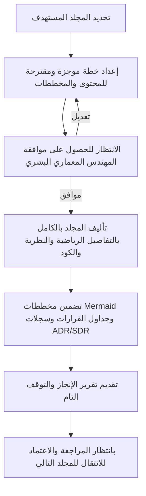

# الموسوعة الهندسية والدستور البرمجي لمنصة Sniper AI Security
## الدليل المرجعي الفائق للتطوير المعماري والأمني (Enterprise-Grade Blueprint)

مرحباً بك في **الموسوعة الهندسية الكبرى** لمنصة **Sniper AI Security**. يمثل هذا المستند الخارطة الرئيسية والدستور الحاكم لجميع عمليات التطوير، الصيانة، والتوسع المعماري للمنصة. تم تصميمه ليكون المرجع الفني المطلق لمهندسي البرمجيات، محللي الأمن السيبراني، ونماذج الذكاء الاصطناعي (مثل Gemini) لضمان اتساق الكود وجودة البناء البرمجي على مستوى المؤسسات (Enterprise-Grade).

---

## 🏛️ العقيدة المعمارية للمنصة (Architectural Creed)

تتبنى منصة **Sniper AI Security** فلسفة هندسية صارمة تقوم على مبادئ **Clean Architecture** و**Domain-Driven Design (DDD)**. يهدف هذا التصميم إلى عزل المنطق الأمني ومحركات الفحص عن واجهات المستخدم والاتصال الخارجي لضمان:
1. **الأمان المطلق (Secure-by-Design):** فصل الصلاحيات والتحقق الصارم من المدخلات في جميع الطبقات.
2. **قابلية التوسع اللانهائي (Infinite Scalability):** إمكانية إضافة محركات فحص أمني جديدة كإضافات مستقرة (Plugins).
3. **الحيادية التقنية (Decoupling):** مرونة كاملة في استبدال قواعد البيانات أو محركات الاستدلال بالذكاء الاصطناعي دون التأثير على جوهر النظام البرمجي.

---

## 🗺️ خريطة المجلدات الاثني عشر (The 12-Volume Map)

تم تقسيم هذه الموسوعة الهندسية إلى **12 مجلداً مستقلاً** ومترابطاً في آن واحد لتغطية كافة جوانب المنصة بالتفصيل الفني الكامل:

| المجلد | العنوان | الوصف الأساسي | حالة الرابط |
| :--- | :--- | :--- | :--- |
| 📖 **[Volume I](./Volume_I_Engineering_Constitution.md)** | **الدستور الهندسي العام (Constitution)** | المبادئ العامة، حوكمة القرار، ميثاق جودة الكود ومصفوفة تعريفه النهائي (Definition of Done). | *بانتظار البدء* |
| 🏗️ **[Volume II](./Volume_II_Enterprise_Architecture.md)** | **البنية المعمارية المؤسسية (Architecture)** | تفصيل الـ Clean Architecture، الأنماط المعمارية (Hexagonal, CQRS) والتحضير للـ Microservices. | *بانتظار البدء* |
| 💻 **[Volume III](./Volume_III_Backend_Bible.md)** | **مرجع التطوير الخلفي (Backend Bible)** | المعايير البرمجية لـ Express و TypeScript في نمط Strict Mode، معالجة الأخطاء والتنظيم الهيكلي. | *بانتظار البدء* |
| 🛡️ **[Volume IV](./Volume_IV_Security_Engine.md)** | **محرك الفحص والأدوات (Security Engine)** | بنية المكونات الإضافية (Plugin Interface) ودمج أدوات الفحص (Nmap, Nuclei, OWASP ZAP...). | *بانتظار البدء* |
| 🤖 **[Volume V](./Volume_V_AI_Engine.md)** | **محرك الذكاء الاصطناعي الأمني (AI Engine)** | هندسة الأوامر (Prompt Engineering)، تقليل النتائج المكررة، آلية التفكير ومقاومة الهلوسة الأمنية. | *بانتظار البدء* |
| 🗄️ **[Volume VI](./Volume_VI_PostgreSQL_Prisma.md)** | **قاعدة البيانات والاستبقاء (Database)** | تصميم المخطط العلائقي (ERD)، المعاملات (Transactions)، استراتيجية التخزين و Multi-Tenancy. | *بانتظار البدء* |
| 📊 **[Volume VII](./Volume_VII_Dashboard_UI.md)** | **لوحة التحكم وتجربة المستخدم (Dashboard)** | معايير تصميم واجهات React الأنيقة، إدارة الحالة المعقدة، والتمثيل الرسومي التفاعلي للبيانات. | *بانتظار البدء* |
| 📄 **[Volume VIII](./Volume_VIII_Reporting_Engine.md)** | **محرك التقارير التنفيذية والفنية (Reporting)** | معمارية توليد تقارير PDF/HTML/JSON والملخصات الأمنية المدعومة بالذكاء الاصطناعي مع درجات CVSS. | *بانتظار البدء* |
| ⚡ **[Volume IX](./Volume_IX_Performance_Optimization.md)** | **قياسات وتحسين الأداء (Performance)** | استراتيجيات الـ Caching والعمل في الخلفية (Background Workers) واستهلاك الذاكرة وموازنة الضغط. | *بانتظار البدء* |
| ⚙️ **[Volume X](./Volume_X_DevOps_Observability.md)** | **عمليات التطوير والأتمتة (DevOps)** | إعدادات الحاويات (Docker)، أنابيب الأتمتة (CI/CD)، والمراقبة والتحليل الحيوي للخدمات (Observability). | *بانتظار البدء* |
| 📜 **[Volume XI](./Volume_XI_Security_Compliance_Standards.md)** | **المعايير والامتثال الأمني (Compliance)** | محاذاة كود المنصة ووظائفها مع أطر العمل العالمية (OWASP, NIST CSF, MITRE ATT&CK, ISO 27001). | *بانتظار البدء* |
| 👑 **[Volume XII](./Volume_XII_AI_Master_Prompt_Constitution.md)** | **الميثاق الدستوري للذكاء الاصطناعي (Master Prompt)** | الدليل البرمجي والفكري الأقصى لنماذج اللغة الكبيرة للتفكير ككبير المهندسين المعماريين للمشروع. | *بانتظار البدء* |

---

## 📂 الهيكل الهيكلي للملفات (Documentation Directory Tree)

سيتم تنظيم مستندات هذه الموسوعة بالكامل داخل المجلد `/docs` كالتالي:

```text
/docs
├── README.md                                 # هذا الملف (خارطة الموسوعة الهندسية)
├── Volume_I_Engineering_Constitution.md       # المبادئ والقواعد والدستور الفني
├── Volume_II_Enterprise_Architecture.md       # التصميم المعماري العام والأنماط المعمارية
├── Volume_III_Backend_Bible.md               # كود الـ Backend وتفاصيل التنفيذ
├── Volume_IV_Security_Engine.md              # محركات الفحص وهيكلية الإضافات (Plugins)
├── Volume_V_AI_Engine.md                     # منطق الذكاء الاصطناعي والتحليل الأمني
├── Volume_VI_PostgreSQL_Prisma.md            # هندسة البيانات وإدارة الكيانات
├── Volume_VII_Dashboard_UI.md                # تصميم الواجهات وتدفق تجربة المستخدم
├── Volume_VIII_Reporting_Engine.md           # مولد التقارير والتحليلات الفنية والتنفيذية
├── Volume_IX_Performance_Optimization.md     # إدارة موارد الخادم وتسريع العمليات
├── Volume_X_DevOps_Observability.md          # أتمتة البنية التحتية والمراقبة الحية
├── Volume_XI_Security_Compliance_Standards.md# الامتثال للمعايير والسياسات الأمنية
└── Volume_XII_AI_Master_Prompt_Constitution.md# الميثاق النهائي والنظام الحاكم للذكاء الاصطناعي
```

---

## 🎯 بروتوكول التنفيذ والتطوير التكراري (Iterative Protocol)

لضمان تطبيق هذه المعايير دون أي عيوب أو تسرع، نلتزم بالبروتوكول الصارم التالي:



1. **مرحلة التخطيط المسبق:** قبل الشروع في كتابة أي مجلد (Volume)، سيقوم الذكاء الاصطناعي بتقديم خطة موجزة (3-5 نقاط) توضح الأقسام والمخططات المزمع إنشاؤها.
2. **الالتزام الكامل بالصحة الفنية:** لن يتم استخدام نصوص نظرية مكررة أو حشو غير مفيد، بل سيتم التركيز على نماذج حقيقية مقتبسة من كود **Sniper AI Security** الحالي (Express, TypeScript, Drizzle/PostgreSQL, D3/Recharts) لضمان أن المرجع تطبيقي وعملي 100%.
3. **التوقف الحتمي للترخيص:** لن يتم كتابة مجلدين معاً تحت أي ظرف. بعد الانتهاء من المجلد، يتوقف النظام ويطلب مراجعة وقبول المطور البشري قبل البدء في المجلد الذي يليه.

---

## 💡 كيفية قراءة واستخدام هذا الدليل للذكاء الاصطناعي

عند توجيه أي مطور ذكاء اصطناعي لتعديل أو بناء ميزة جديدة في المنصة:
- **أولاً:** يجب عليه قراءة هذا الملف الرئيسي لفهم النطاق والهدف.
- **ثانياً:** الرجوع إلى المجلد المناسب لنوع التعديل (مثال: فحص أمني جديد -> Volume IV، تعديل قاعدة البيانات -> Volume VI).
- **ثالثاً:** تطبيق الأكواد والمبادئ المعيارية الواردة حرفياً، والتحقق التلقائي من الكود المكتوب عبر تشغيل linter و compiler الخاص بالمنصة لضمان عدم وجود أخطاء صياغية أو معمارية.

---

*تم إعداد وتنسيق هذا المرجع بواسطة **المهندس المعماري الأعلى (Supreme Software Architect)** لمنصة **Sniper AI Security**.*
*جاهز وبانتظار الموافقة والاعتماد للبدء في المجلد الأول: **Volume I — Engineering Constitution**.*
