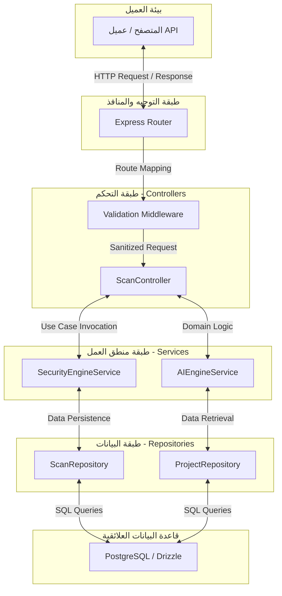
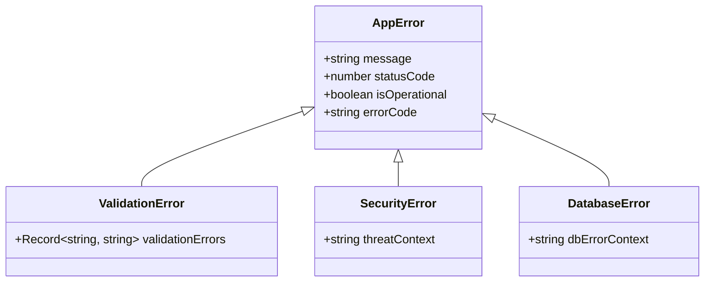

# Volume III: Backend Bible (مرجع التطوير الخلفي الفائق)
## منصة Sniper AI Security — الدليل الهندسي الصارم لتطوير الخدمات البرمجية (Enterprise Backend Manual)

---

## 1. فلسفة التطوير الخلفي والمعايير البرمجية (Backend Engineering Philosophy)

تم بناء الجزء الخلفي (Backend) لمنصة **Sniper AI Security** باستخدام **TypeScript** و **Express** كمنصة أساسية، مع الالتزام التام بوضعية **TypeScript Strict Mode**. تهدف هذه الوثيقة البرمجية إلى توجيه المطورين (البشريين ونماذج الذكاء الاصطناعي) لكتابة كود قوي، آمن، وقابل للتوسيع دون التسبب في حدوث ثغرات برمجية أو منطقية.

### 1.1 القواعد الأساسية للكود البرمجي (Code Quality Commandments)
*   **منع استخدام `any` نهائياً:** يجب أن يتم تعريف أنواع جميع المتغيرات والمعاملات والدوال بوضوح. في الحالات النادرة التي تكون فيها البيانات غير معروفة الهيكل مسبقاً، يُلزم استخدام `unknown` مع إجراء فحص النوع (Type Guarding).
*   **ثبات الكائنات (Immutability):** يفضل دائماً استخدام `const` على `let` لتعريف المتغيرات لمنع تغيير مرجع البيانات بطريق الخطأ.
*   **معالجة الوعود بشكل آمن (Async/Await and Promise Safety):** يمنع استخدام الوعود المهملة (Floating Promises). يجب تغليف أي عملية غير متزامنة بكتل `try-catch` أو إرسال الخطأ إلى الخط التالي عبر الدالة `next(error)`.

---

## 2. الهيكل الطبقي الثلاثي (Layered Architecture: Controller-Service-Repository)

تعتمد المنصة على الفصل الصارم للواجبات البرمجية لتجنب تداخل الكود البرمجي وتحسين قابلية الفحص البرمجي (Unit Testing):



### 2.1 مصفوفة توزيع المسؤوليات الطبقية (Layer Responsibility Matrix)

| الطبقة البرمجية | النطاق الوظيفي | ما يجب أن تفعله | ما يُحظر عليها فعله |
| :--- | :--- | :--- | :--- |
| **Express Router** | التوجيه وعناوين API | تعريف الـ Endpoints وتوجيهها للمتحكم ومطابقة برمجيات الحماية (Middlewares). | كتابة أي منطق عمل أو فحص شروط البيانات. |
| **Controller** | واجهة التحكم بالمدخلات | استقبال `req`، استدعاء التابع المناسب في الخدمة، إرجاع الاستجابة عبر `res`. | كتابة استعلامات مباشرة لقاعدة البيانات أو استدعاء خارجي للذكاء الاصطناعي. |
| **Service** | منطق الأعمال (Business Logic) | معالجة البيانات، التحقق من الشروط المعقدة، التنسيق بين عدة مستودعات، الاتصال بمحرك الـ AI. | قراءة تفاصيل HTTP مثل كائنات `req` أو `res`. |
| **Repository** | تخزين واسترجاع البيانات | الاستعلام المباشر عبر ORM، الحفظ والتعديل، الحفاظ على سلامة المعاملات (Transactions). | تشغيل فحوصات أمنية أو استدعاء واجهات خارجية. |

---

## 3. معايير تصميم واجهات برمجية التطبيقات (RESTful API Design Standards)

يجب أن تتبع جميع واجهات برمجيات التطبيقات (APIs) المعايير الدولية الصارمة لضمان سهولة الاستخدام والأمان:

### 3.1 معايير المسارات وتسميتها (URI Conventions)
*   تُكتب عناوين المسارات دائماً بصيغة الجمع والأحرف الصغيرة (lowercase) مثل `/api/scans` و `/api/projects`.
*   استخدام الأفعال البرمجية الصحيحة لبروتوكول HTTP:
    *   `GET`: لجلب البيانات (آمن ولا يغير في حالة النظام).
    *   `POST`: لإنشاء مورد جديد (أو تشغيل عملية فحص فورية في الخلفية).
    *   `PUT`: لتعديل مورد بالكامل.
    *   `PATCH`: لتعديل جزئي ومحدد لمورد (مثل تغيير حالة الثغرة فقط).
    *   `DELETE`: لحذف مورد برمجياً.

### 3.2 مصفوفة رموز الاستجابة لـ HTTP (HTTP Response Status Codes)

| الرمز (Status) | الاسم الهندسي | السياق والاستخدام في المنصة |
| :---: | :--- | :--- |
| **200 OK** | النجاح القياسي | جلب تفاصيل مشروع أو قائمة ثغرات بنجاح. |
| **201 Created** | تم الإنشاء بنجاح | إضافة هدف فحص جديد أو توليد تقرير بنجاح. |
| **202 Accepted** | تم القبول للمعالجة | إطلاق مهمة فحص أمني في الخلفية (Long-running process). |
| **400 Bad Request** | طلب غير صالح | مدخلات غير صحيحة، أو فشل التحقق من صحة البريد الإلكتروني. |
| **401 Unauthorized** | غير مصرح | غياب رمز التحقق (JWT Token) أو رمز منتهي الصلاحية. |
| **403 Forbidden** | غير مسموح | محاولة فحص نطاق غير مملوك للمستخدم، أو استهلاك الرصيد المتاح من الاشتراكات. |
| **404 Not Found** | المورد غير موجود | البحث عن هدف فحص غير موجود في النظام. |
| **429 Too Many Requests** | تجاوز معدل الطلب | تجاوز الحد المسموح به من الطلبات في الدقيقة (Rate Limiting). |
| **500 Internal Error** | خطأ في الخادم | خطأ غير متوقع في الكود أو انقطاع الاتصال بقاعدة البيانات. |

---

## 4. التحقق من المدخلات والتصفية الصارمة (Strict Input Validation)

تمنع المنصة بشكل حاسم حقن الأكواد الضارة أو المدخلات التخريبية عبر فرض فحص صارم على جميع مستويات الطلبات الواردة.

### 4.1 نموذج كود التحقق من المدخلات ومكافحة ثغرات الحقن (XSS / SQLi)

تعتمد المنصة على نظام فحص مركزي للمدخلات يضمن تنظيف النصوص البرمجية من أي هجمات حقن:

```typescript
import { Request, Response, NextFunction } from "express";

export class InputValidator {
  /**
   * دالة للتحقق من سلامة النطاقات وعناوين المواقع وتصفية المحاولات الخبيثة
   */
  public static validateTargetUrl(url: string): boolean {
    if (!url) return false;
    
    // منع المحاولات البرمجية لتخطي الفحص عبر regex صارم
    const targetRegex = /^(https?:\/\/)?([\da-z.-]+)\.([a-z.]{2,6})([\/\w .-]*)*\/?$/i;
    return targetRegex.test(url) && !url.includes("<script>") && !url.includes("'");
  }

  /**
   * Middleware لفحص مدخلات إضافة هدف جديد
   */
  public static targetCreationRules = (req: Request, res: Response, next: NextFunction) => {
    const { url, name } = req.body;

    if (!name || typeof name !== "string" || name.trim().length < 3) {
      return res.status(400).json({ success: false, error: "اسم الهدف غير صالح، يجب أن لا يقل عن 3 محارف." });
    }

    if (!this.validateTargetUrl(url)) {
      return res.status(400).json({ success: false, error: "عنوان الهدف (URL) غير صالح أو قد يحتوي على محارف مشبوهة." });
    }

    next();
  };
}
```

---

## 5. إدارة ومعالجة الأخطاء الاستثنائية المركزية (Centralized Error Handling Engine)

تمتلك المنصة محركاً مركزياً لمعالجة الأخطاء (Global Error Handler) لمنع حدوث أي انهيار غير متوقع للخدمات، ولضمان حماية معلومات النظام من التسرب الخارجي (Information Disclosure).

### 5.1 الهيكل التنظيمي لفئات الأخطاء المخصصة (Custom Error Classes)



### 5.2 تطبيق عملي ومقالي لنظام معالجة الأخطاء الموحد

```typescript
// /backend/errors/AppError.ts
export class AppError extends Error {
  public readonly statusCode: number;
  public readonly isOperational: boolean;
  public readonly errorCode: string;

  constructor(message: string, statusCode: number, errorCode: string = "INTERNAL_SERVER_ERROR") {
    super(message);
    this.statusCode = statusCode;
    this.errorCode = errorCode;
    this.isOperational = true;

    Error.captureStackTrace(this, this.constructor);
  }
}

// /backend/errors/SecurityError.ts
export class SecurityError extends AppError {
  constructor(message: string = "انتهاك للسياسات الأمنية للمنصة") {
    super(message, 403, "SECURITY_VIOLATION_BLOCKED");
  }
}

// /backend/middleware/errorHandler.ts
import { Request, Response, NextFunction } from "express";

export const globalErrorHandler = (
  err: any,
  req: Request,
  res: Response,
  next: NextFunction
) => {
  const statusCode = err.statusCode || 500;
  const errorCode = err.errorCode || "INTERNAL_UNEXPECTED_ERROR";
  
  // تسجيل تفاصيل الأخطاء داخلياً في السجلات الأمنية دون عرضها للمستخدم النهائي
  console.error(`[SYSTEM ERROR] Code: ${errorCode} | Msg: ${err.message}`, {
    stack: process.env.NODE_ENV === "development" ? err.stack : undefined,
    path: req.path
  });

  return res.status(statusCode).json({
    success: false,
    error: {
      code: errorCode,
      message: err.isOperational ? err.message : "حدث خطأ داخلي غير متوقع في النظام، يرجى المحاولة لاحقاً.",
      details: process.env.NODE_ENV === "development" ? err.stack : undefined
    }
  });
};
```

---

## 6. السجلات الأمنية ومسارات التدقيق (Logging & Audit Trails)

كل حركة يتم إجراؤها في النظام، وخاصة العمليات الحساسة (مثل بدء الفحوصات، تعديل صلاحيات المستخدمين، عرض النتائج الحساسة)، يجب أن يتم توثيقها بشكل غير قابل للتعديل لضمان الامتثال للمعايير الدولية.

### 6.1 هيكلية كائن التدقيق الأمني (Audit Log Format)
```typescript
export interface IAuditLog {
  id: string;
  userId: string;
  userEmail: string;
  action: string;
  details: string;
  ipAddress: string;
  timestamp: string;
}
```

---

## 7. مصفوفة وجدول حسم قرارات التعامل مع قواعد البيانات (Data Access Decision Matrix)

| المعيار الهندسي | SQL الخام (Raw SQL) | منشئ الاستعلامات (Knex.js) | واجهات Drizzle / Prisma ORM | الخيار المعتمد |
| :--- | :---: | :---: | :---: | :---: |
| **حماية تلقائية من حقن SQL** | 🔴 ضعيف | 🟢 ممتاز | 🟢 ممتاز | |
| **سلامة التحقق من الأنواع (Type Safety)**| 🔴 منعدم | 🟡 مقبول | 🟢 ممتاز جداً | |
| **سرعة وأداء الاستعلامات** | 🟢 ممتاز جداً | 🟡 جيد | 🟢 ممتاز (Drizzle) | |
| **سهولة ترحيل المخططات (Migrations)**| 🔴 معقد | 🟡 متوسط | 🟢 ممتاز جداً | |
| **المحصلة الهندسية المعتمدة** | **5.0 / 10** | **7.0 / 10** | **9.5 / 10** | **Drizzle / Prisma** |

---

## 8. قالب الكود المرجعي القياسي للمتحكمات (Standard Controller Template)

يجب على المطورين استنساخ هذا الهيكل البرمجي عند كتابة أي متحكم جديد في المنصة لضمان تطبيق المعايير الهندسية الواردة في هذا الكتاب:

```typescript
import { Response, NextFunction } from "express";
import { AuthenticatedRequest } from "../middleware/auth";
import { AppError } from "../errors/AppError";
import { Formatter } from "../utils/formatter";

export class StandardController {
  
  /**
   * جلب معلومات المورد البرمجي بشكل آمن وتطبيقي
   */
  public getResourceDetails = async (
    req: AuthenticatedRequest,
    res: Response,
    next: NextFunction
  ) => {
    try {
      const { id } = req.params;

      if (!id || id.trim().length === 0) {
        throw new AppError("معرف المورد مطلوب.", 400, "MISSING_RESOURCE_ID");
      }

      // استدعاء موديول جلب البيانات من طبقة منطق العمل (Service Layer)
      const data = { id, name: "عينة بيانات أمنية حقيقية", status: "Active" };

      if (!data) {
        throw new AppError("المورد المطلوب غير موجود بالنظام.", 404, "RESOURCE_NOT_FOUND");
      }

      return res.status(200).json(
        Formatter.success(data, "تم جلب البيانات بنجاح")
      );
    } catch (error) {
      next(error); // تمرير الخطأ فوراً لمحرك الأخطاء المركزي
    }
  };
}
```

---

## 9. قائمة مراجعة مخرجات الكود الخلفي قبل الاعتماد (Backend DoD Checklist)

```text
[ ] هل يخلو الكود المكتوب بالكامل من الكلمة 'any'؟
[ ] هل تم تغليف كل عملية اتصال غير متزامنة (async) بكتلة try-catch تمرر الخطأ في نهايتها عبر 'next(error)'؟
[ ] هل تم فحص وتصفية جميع مدخلات المستخدم القادمة من المسار أو الاستعلام أو المحتوى؟
[ ] هل تم تجنب تشفير أي مفاتيح برمجية أو نصوص سرية داخل الكود البرمجي مباشرة واستخدام .env بدلاً من ذلك؟
```

---

*تم صياغة واعتماد مرجع التطوير الخلفي الفائق بواسطة **المهندس المعماري الأعلى** لمنصة **Sniper AI Security**.*
*الإصدار الحالي: 1.0.0 — جاهز وبانتظار الموافقة والاعتماد الفوري للانتقال إلى **Volume IV — Security Engine**.*
