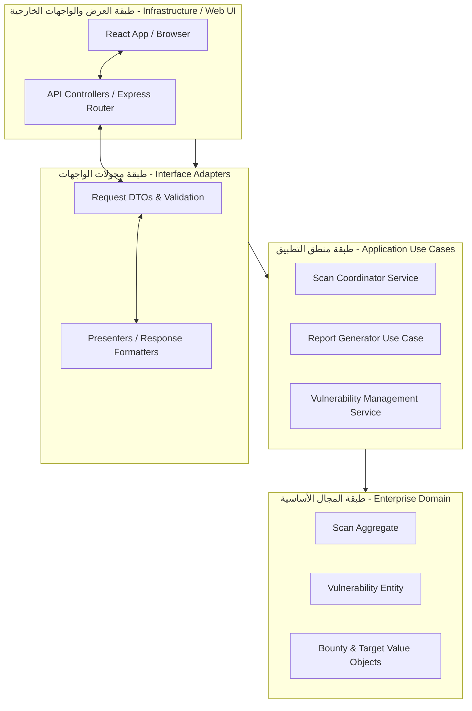
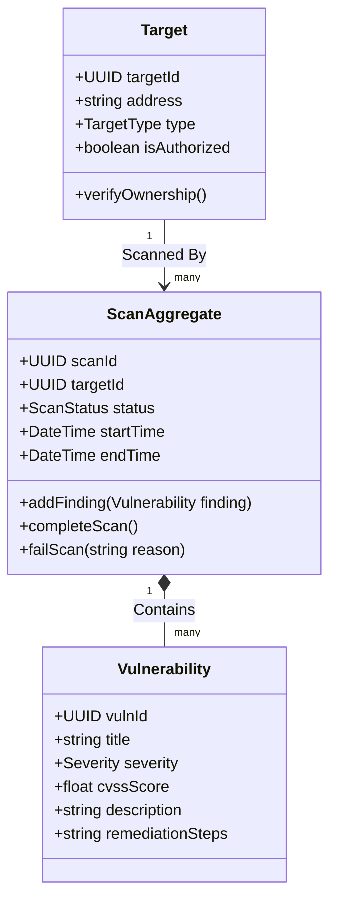
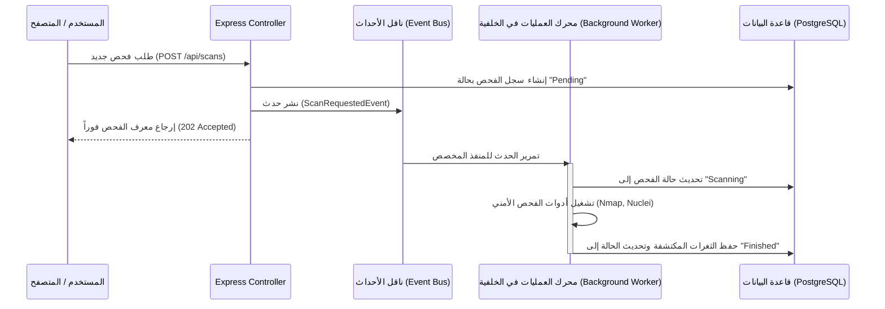

# Volume II: Enterprise Architecture (البنية المعمارية المؤسسية)
## منصة Sniper AI Security — الدليل المرجعي الفائق للأنماط والقرارات المعمارية

---

## 1. فلسفة البنية المعمارية والمبادئ الحاكمة (Architectural Paradigm)

تتبنى منصة **Sniper AI Security** بنية معمارية هجينة متطورة تجمع بين قوة ونقاء **العمارة النظيفة (Clean Architecture)** ومبادئ **التصميم الموجه بالمجال (Domain-Driven Design - DDD)**، متمثلة في نموذج **Monolith أحادي موديولي (Modular Monolith)** مهيأ بالكامل للتحول إلى **خدمات مصغرة (Microservices-Ready)** عند الحاجة لتوسيع النطاق بشكل أفقي.

الهدف الأساسي من هذه المعمارية هو فصل منطق العمل الأساسي (Core Business Logic/Domain) عن التفاصيل التقنية الخارجية (مثل واجهات المستخدم، قواعد البيانات، ومحركات الفحص الخارجية). يضمن هذا الفصل مرونة النظام، وقابليته للاختبار، وحمايته من التغييرات التقنية المفاجئة.



---

## 2. التصميم الموجه بالمجال والعمارة السداسية (DDD & Hexagonal Architecture)

تُطبَّق معايير **العمارة السداسية (Hexagonal Architecture / Ports and Adapters)** في المنصة لعزل الكيانات الأمنية ومحركات التحليل عن أي تفاصيل برمجية للطرف الثالث. يتم تحقيق ذلك من خلال تعريف **المنافذ (Ports)** كواجهات (Interfaces) داخل طبقة المجال (Domain) وتطبيق **المحولات (Adapters)** في طبقة البنية التحتية (Infrastructure).

### 2.1 مصطلحات لغة المجال الموحدة (Ubiquitous Language)
*   **Target (الهدف):** أي نطاق (Domain)، عنوان IP، أو شبكة يتم تحديدها لإجراء الفحوصات الأمنية عليها.
*   **Scan Job (مهمة الفحص):** عملية تشغيل فعلية مجدولة أو فورية لمحركات الفحص على هدف محدد.
*   **Vulnerability (الثغرة):** نقطة ضعف أمنية مؤكدة أو محتملة تم اكتشافها وتحليلها وتصنيفها وفق معايير CVSS.
*   **Bounty Campaign (حملة المكافآت):** برنامج منظم لإدارة الثغرات المكتشفة ومطابقتها مع معايير تسليم الجوائز والمكافآت للباحثين الأمنيين.

### 2.2 مصفوفة الكيانات والمجمعات (Entities & Aggregates)



---

## 3. فصل الأوامر والاستعلامات وبنية الأحداث (CQRS & Event-Driven Architecture)

للحفاظ على كفاءة الأداء الفائقة واستجابة واجهات المستخدم الفورية أثناء عمليات الفحص الطويلة والمستهلكة للموارد، تعتمد المنصة على نمط **CQRS المبسط** بالتكامل مع **بنية الأحداث الموجهة (Event-Driven Architecture)**.

*   **الأوامر (Commands):** مثل بدء فحص جديد أو تحديث حالة ثغرة. تمر عبر خدمات معالجة الأوامر لتحديث قاعدة البيانات وإرسال حدث عبر ناقل الأحداث الداخلي (Internal Event Bus).
*   **الاستعلامات (Queries):** مثل جلب إحصائيات الثغرات للوحة التحكم أو تصدير التقارير. تستعلم مباشرة من قاعدة البيانات بأسلوب فائق السرعة عبر طرق مخصصة دون الحاجة للعبور بكيانات المجال المعقدة.



---

## 4. بنية المكونات الإضافية لمحركات الفحص (Plugin-Based Scanner Architecture)

يعتبر محرك الفحص في **Sniper AI Security** نظاماً مفتوحاً وقابلاً للتوسع بشكل كامل عبر تبني **النمط الإضافي (Plugin Pattern)**. كل أداة فحص خارجية (مثل Nmap أو Nuclei أو OWASP ZAP) يتم تمثيلها كـ **Plugin Adapter** يحقق واجهة الاتصال البرمجية الموحدة (Interface Contract).

### 4.1 عقد الواجهة البرمجية للفحوصات (IScannerPlugin)

```typescript
export interface IScanResult {
  vulnCode: string;
  title: string;
  severity: 'Critical' | 'High' | 'Medium' | 'Low' | 'Info';
  cvssScore: number;
  description: string;
  evidence: string;
  remediation: string;
}

export interface IScannerPlugin {
  name: string;
  version: string;
  supportedTargetTypes: ('IP' | 'Domain' | 'CIDR')[];
  
  validateConfig(config: Record<string, any>): boolean;
  execute(target: string, options: Record<string, any>): Promise<IScanResult[]>;
}
```

---

## 5. مصفوفة وجدول القرارات المعمارية (Architectural Decision Matrix)

لتحقيق أقصى درجات الموضوعية الهندسية، تم استخدام مصفوفة القرارات التالية للمقارنة بين الهياكل المعمارية واختيار الأنسب للمنصة في مرحلتها الحالية:

| المعايير الهندسية | Monolith التقليدي | الخدمات المصغرة (Microservices) | المونوليث الموديولي (Modular Monolith) | الخيار الفائز |
| :--- | :---: | :---: | :---: | :---: |
| **سرعة التطوير والبداية** | 🟢 ممتاز | 🔴 ضعيف جداً | 🟡 جيد جداً | |
| **سهولة الفحص والاختبار** | 🟢 ممتاز | 🔴 معقد جداً | 🟢 ممتاز | |
| **الحد الأمني ومستوى العزل**| 🔴 ضعيف | 🟢 ممتاز | 🟡 جيد جداً | |
| **سهولة التوزيع الأفقي** | 🔴 ضعيف | 🟢 ممتاز | 🟡 مقبول | |
| **المحصلة الهندسية** | **6.5 / 10** | **7.5 / 10** | **9.0 / 10** | **Modular Monolith** |

---

## 6. سجلات القرارات المعمارية الحيوية (Architectural Decision Records - ADR)

### ADR-002: اعتماد النمط المونوليث الموديولي (Modular Monolith) في معمارية المنصة

*   **الحالة (Status):** Accepted
*   **التاريخ (Date):** 2026-07-20
*   **الكاتب (Author):** Supreme Software Architect

#### 1. السياق والمشكلة (Context)
يحتاج مشروع Sniper AI Security إلى نظام فحص أمني تفاعلي وسريع مع ضرورة عزل الوحدات البرمجية لتسهيل الصيانة والتطوير المستقبلي. البناء بنظام الخدمات المصغرة (Microservices) من اليوم الأول يرفع كلفة التشغيل والتعقيد الهندسي للشبكة وإدارة الاتصالات (Network Overhead)، بينما المونوليث التقليدي يسبب تشابكاً برمجياً (Spaghetti Code) يمنع نمو المنصة.

#### 2. الحل المقترح (Decision)
تقرر اعتماد **Modular Monolith** بحيث يتم تجميع الكود في مستودع واحد (Monorepo) ولكن مع فرض جدران حماية صارمة بين الموديولات (Modules). كل موديول (مثل: `UserModule`, `ScanModule`, `AIModule`, `ReportModule`) يمتلك بنيته الداخلية الخاصة (Controllers, Services, Repositories) ولا يُسمح بالاتصال المباشر بين الموديولات إلا عبر واجهات معلنة بوضوح (Interfaces/APIs) أو عبر ناقل الأحداث الداخلي (Event Bus).

#### 3. التبعات (Consequences)
*   **إيجابياً:** تسريع وتيرة التطوير البرمجي، سهولة مراجعة واكتشاف الأخطاء البرمجية والامتدادات الأمنية، وبقاء المنصة جاهزة تماماً لفك أي موديول وتحويله لخدمة مصغرة مستقلة (Microservice) في أقل من 48 ساعة وبدون تعديل منطق العمل الأساسي.
*   **سلباً:** يتطلب التزاماً صارماً من قبل فريق التطوير والذكاء الاصطناعي لعدم كسر حدود الموديولات أو استخدام استيراد عشوائي للبيانات عبر تخطي المنافذ البرمجية المعتمدة.

---

## 7. مصفوفة وقائمة مراجعة التحقق من المعمارية (Architectural DoD Checklist)

لتأكيد الالتزام بالمعايير الهندسية الواردة في هذا المجلد قبل النشر، يجب مراجعة الأسئلة التالية:

```text
[ ] هل الكود الجديد معزول تماماً داخل موديول مخصص؟
[ ] هل تم تمرير الأحداث الأمنية الهامة عبر ناقل الأحداث بدلاً من الاستدعاء المباشر لوظائف من موديولات أخرى؟
[ ] هل تم الالتزام بواجهة "IScannerPlugin" الموحدة عند إضافة أو تعديل أي محرك فحص أمني؟
[ ] هل تقع جميع واجهات الاستدعاء الخارجية والـ Adapters في طبقة البنية التحتية (Infrastructure Layer)؟
```

---

*تم صياغة واعتماد البنية المعمارية المؤسسية بواسطة **المهندس المعماري الأعلى** لمنصة **Sniper AI Security**.*
*الإصدار الحالي: 1.0.0 — جاهز وبانتظار الموافقة والاعتماد الفوري للانتقال إلى **Volume III — Backend Bible**.*
