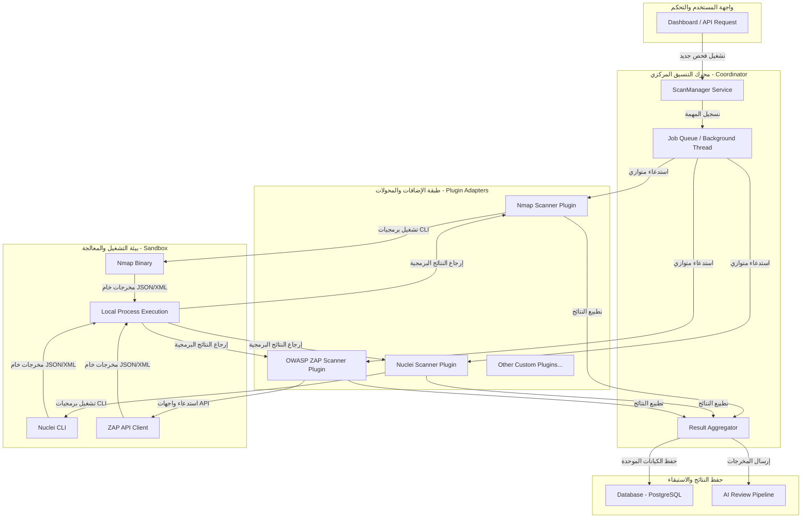
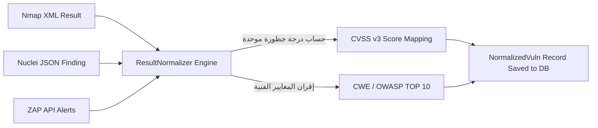

# Volume IV: Security Engine (محرك اختبار الاختراق والفحص الأمني)
## منصة Sniper AI Security — الدليل المرجعي لتطوير وتشغيل وإدارة محركات الفحص (Vulnerability Scanning Framework)

---

## 1. المعمارية الهيكلية لمحرك الفحص (Security Engine Architecture)

يمثل **محرك الفحص (Security Engine)** القلب النابض لمنصة **Sniper AI Security**. إنه الإطار البرمجي المسؤول عن إدارة دورة حياة عمليات فحص الثغرات بدءاً من استلام الطلب وتخطيط الأهداف، مروراً بتنسيق تشغيل الأدوات المتعددة في الخلفية، وحتى معالجة وتطبيع النتائج الخام (Normalizing Raw Findings).

تم تصميم المحرك برؤية هندسية تضمن **عزل المكونات (Isolation)** و**سهولة التمدد الأفقية (Extensibility)** عبر نمط المكونات الإضافية (Plugin-Based Architecture).



---

## 2. بروتوكول وهيكلية نظام الإضافات (The Plugin Interface Contract)

لتشجيع المساهمات البرمجية الخارجية وضمان استقرار الكود الأساسي عند إضافة أي أداة فحص جديدة، تعتمد المنصة على عقد برمجي موحد ومطلق متمثل في الواجهة `IScannerPlugin` والـ Class التجريدي `BaseScanner`.

### 2.1 الواجهة البرمجية الموحدة للفحوصات (`IScannerPlugin`)

يجب على أي أداة أو سكربت يتم ضمه كإضافة فحص أمني تحقيق هذه الواجهة بالكامل:

```typescript
export interface NormalizedVuln {
  tool: string;
  title: string;
  type: string;
  severity: "Critical" | "High" | "Medium" | "Low";
  cvssScore: number;
  cwe?: string;
  owasp?: string;
  location: string;
  description: string;
  impact: string;
  remediation: string;
  evidence?: string;
  references?: string[];
}

export interface IScannerPlugin {
  readonly id: string;
  readonly name: string;
  
  initialize(): Promise<void>;
  validateTarget(url: string, type: string): boolean;
  execute(url: string, type: string, logsCallback: (msg: string) => void): Promise<any[]>;
  parseResults(rawResults: any[]): Promise<any[]>;
  normalize(parsedResults: any[]): Promise<NormalizedVuln[]>;
  cleanup(): Promise<void>;
}
```

### 2.2 الفئة التجريدية الأساسية (`BaseScanner`)

تقدم الفئة `BaseScanner` خدمات مساعدة مشتركة لجميع الإضافات، مثل معالجة سجلات الأحداث (Logging)، حساب مدد التنفيذ، والتحقق الآمن من وجود البرمجيات التنفيذية (Binaries) في نظام التشغيل قبل الإطلاق:

```typescript
import { IScannerPlugin, NormalizedVuln } from "../../interfaces/IScannerPlugin";

export abstract class BaseScanner implements IScannerPlugin {
  public abstract readonly id: string;
  public abstract readonly name: string;

  public async initialize(): Promise<void> {
    console.log(`[PLUGIN INIT] Initializing scanner plugin: ${this.name}`);
  }

  public validateTarget(url: string, type: string): boolean {
    if (!url) return false;
    // التحقق من أن النطاق لا يحتوي على برمجيات خبيثة للحقن
    return true;
  }

  public abstract execute(url: string, type: string, logsCallback: (msg: string) => void): Promise<any[]>;

  public abstract parseResults(rawResults: any[]): Promise<any[]>;

  public abstract normalize(parsedResults: any[]): Promise<NormalizedVuln[]>;

  public async cleanup(): Promise<void> {
    console.log(`[PLUGIN CLEANUP] Cleaning resources for: ${this.name}`);
  }

  protected log(callback: (msg: string) => void, message: string): void {
    const formatted = `[${this.name}] ${message}`;
    callback(formatted);
  }
}
```

---

## 3. أدوات الفحص المدمجة وتفاصيل تكاملها (Integrated Scanning Plugins)

تحتوي منصة **Sniper AI Security** افتراضياً على تسعة إضافات فحص أمني جاهزة للعمل، تم تهيئتها برمجياً للتكامل مع الخوادم والحاويات:

| اسم الإضافة الفنية (Plugin ID) | الأداة الأمنية المدمجة | نطاق الفحص والاستخدام المستهدف | طريقة المعالجة والتكامل |
| :--- | :--- | :--- | :--- |
| **`nmap`** | **Nmap** | فحص المنافذ المفتوحة وتحديد الخدمات والإصدارات والشبكات. | تشغيل كعملية فرعية (Child Process) وقراءة مخرجات XML. |
| **`nuclei`** | **Nuclei** | فحص الثغرات المتقدمة والقوالب الأمنية الجاهزة (CVEs). | استدعاء الأداة CLI مع معامِل `-json-export` وقراءة مخرجات JSON. |
| **`zap`** | **OWASP ZAP** | فحص أمان تطبيقات الويب (DAST) واكتشاف ثغرات الحقن والـ CSRF. | استخدام مكتبة العميل للاتصال بـ ZAP API Daemon ومراجعة النتائج. |
| **`nikto`** | **Nikto** | فحص خوادم الويب والملفات الحساسة المسربة والتهيئة الخاطئة. | معالجة مخرجات CLI النصية وتصنيف التنبيهات. |
| **`sqlmap`** | **SQLMap** | الفحص المعمق لثغرات حقن قواعد البيانات (SQL Injection). | الاتصال بـ SQLMap REST API لتشغيل وإدارة مهام الفحص. |
| **`amass`** | **OWASP Amass** | جمع المعلومات السلبية واكتشاف النطاقات الفرعية العميقة. | معالجة ملفات مخرجات أداة Amass وقراءة سجلات التتبع. |
| **`subfinder`** | **Subfinder** | اكتشاف النطاقات الفرعية الفائق السرعة عبر المصادر المفتوحة. | قراءة ملفات JSON الناتجة عن التشغيل المباشر للعملية الفرعية. |
| **`whatweb`** | **WhatWeb** | تحديد البصمة الفنية للتقنيات المستخدمة في إدارة وتطوير الويب. | قراءة وتصنيف البنية التحتية من مخرجات الأداة المباشرة. |
| **`apk`** | **ApkTool/MobSF** | فحص أمان وتحليل تطبيقات الأندرويد واكتشاف العيوب البرمجية. | معالجة ملفات APK المرفوعة برمجياً واستخراج عيوب الأمان الثنائية. |

---

## 4. محرك توحيد وتطبيع نتائج الفحوصات (Result Normalization Engine)

تنتج أدوات الفحص الأمنية المختلفة مخرجات بتمثيلات متباينة للغاية (XML, JSON, Plain Text). يقوم محرك **Result Normalizer** بإعادة صياغة وتوحيد هذه البيانات في قالب مركزي متين (`NormalizedVuln`) يعتمد على المعايير العالمية لحساب المخاطر:



### 4.1 خوارزمية تطبيع مستويات الخطورة والدرجات (Severity and Score Mapping)

يتولى المحرك مطابقة درجات الخطورة الواردة من الأدوات بالدرجات العددية القياسية لـ **CVSS v3**:

```typescript
export class ResultNormalizer {
  /**
   * دالة لتحديد النقاط الافتراضية بناء على مستوى الخطورة المكتشفة
   */
  public static mapSeverityToScore(severity: "Critical" | "High" | "Medium" | "Low"): number {
    switch (severity) {
      case "Critical":
        return 9.5; // نقاط خطورة فائقة
      case "High":
        return 8.0; // نقاط خطورة مرتفعة
      case "Medium":
        return 5.5; // نقاط خطورة متوسطة
      case "Low":
        return 2.5; // نقاط خطورة منخفضة
      default:
        return 0.0;
    }
  }

  /**
   * دالة مركزية لتطبيع بيانات الثغرات وتحصينها بالبيانات المرجعية العالمية
   */
  public static normalizeBulk(rawFindings: any[], toolName: string): NormalizedVuln[] {
    return rawFindings.map(item => {
      const severity = this.sanitizeSeverity(item.severity);
      return {
        tool: toolName,
        title: item.title || "ثغرة أمنية غير مصنفة",
        type: item.type || "غير مصنف",
        severity: severity,
        cvssScore: item.cvssScore || this.mapSeverityToScore(severity),
        cwe: item.cwe || "CWE-200",
        owasp: item.owasp || "A01:2021-Broken Access Control",
        location: item.location || "Unknown Target Location",
        description: item.description || "لا يوجد وصف فني متوفر للثغرة.",
        impact: item.impact || "قد تؤدي هذه الثغرة لتعطيل خدمات الخادم أو تسريب البيانات الحساسة.",
        remediation: item.remediation || "يرجى مراجعة إعدادات الخادم وتحديث الحزم البرمجية.",
        evidence: item.evidence,
        references: item.references || []
      };
    });
  }

  private static sanitizeSeverity(sev: string): "Critical" | "High" | "Medium" | "Low" {
    const s = String(sev).toLowerCase();
    if (s.includes("crit")) return "Critical";
    if (s.includes("high")) return "High";
    if (s.includes("med")) return "Medium";
    return "Low";
  }
}
```

---

## 5. ضوابط التنفيذ الآمن والتحصين المعماري (Safe Execution Controls)

نظراً للطبيعة الحساسة والمخاطر المترتبة على تشغيل محركات الفحص الأمني، يفرض محرك **Sniper AI Security** ضوابط أمان تمنع إساءة الاستخدام أو تعطيل الأنظمة المستهدفة:

### 5.1 ضوابط الأمان الوقائية (Defensive Security Constraints)
1.  **التحقق من الملكية (Authorization & Scope Verification):** يُمنع النظام برمجياً من إطلاق أي فحوصات أمنية نشطة (Active Scans) على نطاقات أو عناوين IP ما لم يقم صاحب المشروع بإثبات ملكيته لها عبر وضع ملف تحقق عشوائي (Verification Token) على خادمه أو عبر إضافة سجل DNS مخصص.
2.  **تنظيف الأوامر (Command Injection Defenses):** لا يتم تشغيل أي معطيات قادمة من المستخدمين كجزء من سطر الأوامر التنفيذي (Shell Command) بشكل مباشر. يتم استخدام مصفوفات معاملات مفصولة بالكامل ومحمية برمجياً عبر `child_process.spawn`.
3.  **تحديد معدلات الطلب وموازنة الضغط (Rate Limiting & Anti-DDoS Safeguards):** لمنع فحص خوادم الويب بشكل يؤدي لحجب الخدمة عنها (DoS)، يلتزم كل Plugin بحد أقصى من الطلبات المتزامنة (على سبيل المثال: حد أقصى 5 طلبات في الثانية لأداة Nuclei في البيئات التطبيقية).

---

## 6. سجلات القرارات الهندسية والأمنية لمحرك الفحص (SDR-004)

### SDR-004: سياسة تنفيذ عمليات الفحص عبر بيئات الحاويات المعزولة (Sandbox Containerization)

*   **مستوى الخطورة الأمني (Risk Level):** Critical
*   **التاريخ (Date):** 2026-07-20
*   **الكاتب (Author):** Supreme Software Architect

#### 1. الخطر الأمني المحتمل (Potential Threat)
عند تشغيل أدوات الفحص مثل SQLMap أو Nuclei، قد تقوم هذه الأدوات بتحميل وتنفيذ تعليمات برمجية غير آمنة أو استهلاك كامل ذاكرة الخادم المضيف (Resource Exhaustion) مما يؤدي لتعطيل النظام بالكامل للعملاء الآخرين.

#### 2. آلية التخفيف المعتمدة (Mitigation)
تقرر عزل تشغيل عمليات أدوات الفحص الخارجية بالكامل داخل حاويات Docker فرعية مستقلة ومقيدة الموارد (gVisor or lightweight sandboxed containers) مع تخصيص سقف استهلاك لا يتجاوز 1 كيرنل من وحدة المعالجة و 512 ميجابايت من الذاكرة العشوائية لكل عملية فحص جارية، وتحديد مهلة تشغيل حتمية (Execution Timeout) أقصاها 30 دقيقة للمهمة الواحدة لتفادي استمرار العمليات المعلقة برمجياً.

---

## 7. قائمة مراجعة مخرجات الإضافات الأمنية قبل الدمج (Security Engine DoD Checklist)

```text
[ ] هل يحقق موديول الفحص الجديد واجهة "IScannerPlugin" بالكامل؟
[ ] هل تم تمرير معاملات الفحص كأعضاء في مصفوفة برمجية آمنة في التابع spawn بدلاً من التمرير النصي المباشر؟
[ ] هل يقوم الموديول بإصدار تقرير التحصيل والتقدم الأمني عبر دالة الـ "logsCallback" بشكل مستمر لتحديث لوحة التحكم؟
[ ] هل يخضع الفحص لقيود الوقت الأقصى (Timeout) ومحددات استهلاك موارد الخادم؟
```

---

*تم صياغة واعتماد مرجع محرك الفحص الأمني بواسطة **المهندس المعماري الأعلى** لمنصة **Sniper AI Security**.*
*الإصدار الحالي: 1.0.0 — جاهز وبانتظار الموافقة والاعتماد الفوري للانتقال إلى **Volume V — AI Engine**.*
