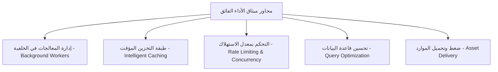
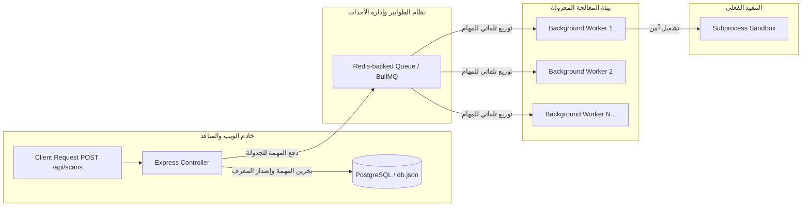
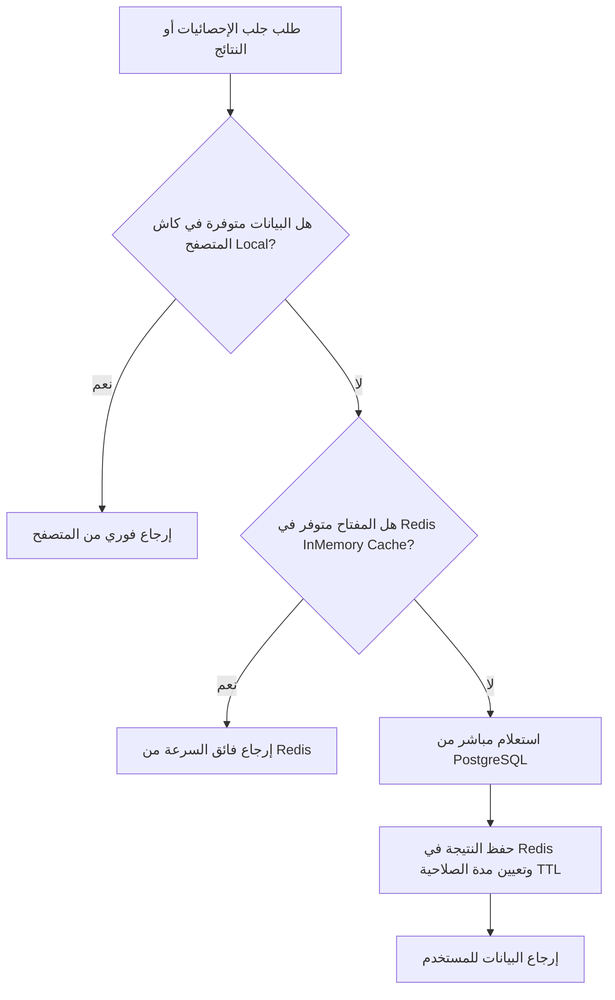

# Volume IX: Performance Optimization & Scalability (تحسين الأداء والكفاءة التشغيلية)
## منصة Sniper AI Security — الدليل المعماري للفصل البرمجي، التخزين المؤقت، وإدارة موارد الأنظمة (High-Performance SecOps Blueprint)

---

## 1. فلسفة الأداء الفائق والتحصين التشغيلي (Performance Engineering Philosophy)

تمثل السرعة والموثوقية حجر الزاوية في منصة **Sniper AI Security**. نظراً للطبيعة الحساسة لعمليات الفحص الأمني (والتي قد تستهلك كميات ضخمة من معالجات الخوادم وتتسبب في إرسال ملايين طلبات الشبكة للتحقق من الثغرات)، فإن تحسين الأداء ليس رفاهية مضافة، بل هو ضرورة حتمية لمنع انهيار النظام وحمايته من التوقف الكلي (Service Outages).

تتبنى المنصة ميثاق أداء صارم يرتكز على خمسة محاور أساسية:



---

## 2. إدارة الطوابير والعمليات غير المتزامنة (Job Queues & Worker Threads)

تمنع المنصة بشكل قاطع تشغيل أي فحص أمني طويل أو كثيف المعالجة (مثل فحص المنافذ بـ Nmap أو تشغيل قوالب Nuclei) داخل الخيط الرئيسي لـ Express (Express Event Loop). تداخل هذه العمليات يعيق استقبال الخادم لطلبات العملاء الآخرين ويؤدي لتجميد الاستجابة بالكامل.

### 2.1 بنية معالجة المهام عبر نظام الطوابير المعزول (Background Processing Architecture)



*   **ناقل المهام (Job Queuing):** يتم استخدام نظام طوابير متطور مدعوم بـ **Redis** (مثل **BullMQ** في بيئات الإنتاج) لتلقي طلبات الفحص وتخزينها بأمان.
*   **عزل العمليات (Workers Isolation):** تعمل برمجيات المعالجة (Workers) كعمليات مستقلة تماماً (Separate Node.js Processes or Cluster Threads). يقوم كل Worker بسحب مهمة واحدة ومعالجتها في معزله التام دون التأثير على حركة المرور لشبكة الويب للمستخدمين.

---

## 3. طبقة التخزين المؤقت واستبقاء النتائج (Intelligent Caching Tier)

لتقليص الكلفة التشغيلية الناتجة عن تكرار فحص الأهداف ذاتها في فترات زمنية متقاربة، ولضمان جلب إحصائيات لوحة التحكم في أجزاء من الملي ثانية، تعتمد المنصة على طبقة تخزين مؤقت ثنائية المستوى (Two-Level Caching):

### 3.1 مستويات التخزين المؤقت ومصفوفة اتخاذ القرار



### 3.2 معايير إخلاء وحفظ البيانات الكاش (Cache Eviction Policies)

تفرض المنصة سياسة صارمة لتحديد صلاحية البيانات المؤقتة (Time-To-Live - TTL) لتجنب عرض نتائج أمنية قديمة ومضللة للباحثين:
## 5. التسجيل والمراقبة الأمنية (Security Logging & SIEM Integration Specification)

> **ملاحظة معمارية مفضلة:** تم تفضيل إدراج معيار السجلات الأمنية في **المجلد التاسع (تحسين الأداء والكفاءة)** بدلاً من المجلد السادس (قواعد البيانات)، نظراً لأن هيكلة شحن السجلات (Log Shipping Engine) تؤثر مباشرة على معدلات الإدخال والإخراج (I/O Performance) وخيوط معالجة الخادم. تضمن الكتابة اللامتزامنة للسجلات الحفاظ على سرعة الخادم وتدفق الطلبات دون تعريض خيط Node.js الرئيسي للتوقف (Non-blocking I/O).

### 5.1 معيار السجلات المهيكلة بصيغة JSON (Structured JSON Logging Standard)
تلتزم المنصة بتسجيل كافة الأحداث البرمجية والأمنية بصيغة **JSON مهيكلة وموحدة** بدلاً من النصوص العادية (Raw Text)، لتمكين المعالجة الآلية والبحث السريع والربط المنطقي.

#### نموذج هيكل كائن السجل الموحد (JSON Log Envelope):
```json
{
  "timestamp": "2026-07-21T09:10:00.123Z",
  "level": "WARN",
  "service": "security-engine",
  "traceId": "t-9b1deb4d-3b7d-4bad-9bdd-2b0d7b3dcb6d",
  "action": "VULNERABILITY_DETECTED",
  "meta": {
    "target": "https://target-site.com",
    "vulnerability": "SQL Injection",
    "severity": "HIGH",
    "cvssScore": 8.8
  },
  "message": "Potential SQLi detected on parameter 'id' during automated active scan."
}
```

### 5.2 مستويات السجلات والسياسة التشغيلية (Log Levels Specification)
تخضع السجلات لمستويات تصفية صارمة تحدد حجم ونوع البيانات المخزنة:

| المستوى (Level) | الوصف الهندسي والسياسة الأمنية |
| :---: | :--- |
| **ERROR** | رصد عطل حاد في النظام (مثل فشل الاتصال بالكامل بقاعدة البيانات، انهيار Worker). يستدعي تنبيهاً فورياً لفريق العمليات. |
| **WARN** | اكتشاف ثغرة أمنية عالية الخطورة، أو محاولة قرصنة مشبوهة (مثل فشل متكرر للمصادقة)، أو تخطي حدود الاستهلاك. |
| **INFO** | السجل التشغيلي الطبيعي (مثل بدء مهمة فحص جديدة، توليد تقرير بنجاح، مصادقة مستخدم بنجاح). |
| **DEBUG** | تفاصيل المطورين لتتبع التدفق البرمجي في بيئة التطوير (يُمنع تفعيله تماماً في بيئات الإنتاج لتقليص استهلاك القرص). |

### 5.3 آلية التكامل مع أنظمة إدارة الأحداث الأمنية (SIEM Integration & Alerting)
* **برمجيات شحن السجلات (Log Shippers):** يتم تجميع كافة السجلات المكتوبة في المخرج القياسية (Stdout) لحاويات Docker آلياً بواسطة **Fluentbit** بشكل لامتزامن بالكامل دون التأثير على ذاكرة خادم الويب.
* **الربط مع أنظمة SIEM:** تُشحن السجلات مباشرة إلى مركز تحليل أمني مركزي مثل **Wazuh SIEM** أو **Elastic Stack (ELK)**.
* **نظام التنبيهات الفوري (Real-time Alerting):** يتم إعداد قواعد تحليل (Detection Rules) في Wazuh لإطلاق تنبيهات أمنية فورية (عبر Slack أو البريد الإلكتروني لفريق الأمان) عند رصد أحداث متكررة بمستوى `WARN` (أكثر من 5 محاولات في دقيقة لنفس عنوان IP) أو أي حدث بمستوى `ERROR`.

---

## 6. مقاييس الأداء والأهداف الرقمية (Performance Benchmarks & SLAs)

تفرض المنصة معايير أداء عددية دقيقة يجب على جميع المطورين والمهندسين الحفاظ عليها لضمان مطابقة الكود لميثاق الكفاءة في بيئة الإنتاج:

| مقياس الأداء (Metric Type) | الهدف الرقمي المستهدف (Target Benchmark) | طريقة القياس والمراقبة |
| :--- | :--- | :--- |
| **زمن استجابة واجهات برمجية التطبيق (API Response Time)** | **< 100ms** (بالنسبة للطلبات غير الحسابية مثل الاستعلام عن قوائم الأهداف والثغرات الكاش). | قياس زمن الاستجابة التلقائي في برمجيات Express Middleware المخصصة للمراقبة. |
| **الحد الأقصى للفحوصات المتزامنة للمستأجر (Tenant Max Concurrency)** | **3 فحوصات نشطة بالتوازي** كحد أقصى لكل حساب لمنع غمر موارد الشبكة والمخدم. | مراقبة حيوية لعداد الطوابير عبر Redis/BullMQ. |
| **الحد الأقصى لزمن استغلال المعالج للـ Worker (CPU Limit per Worker)** | **أقل من 60%** من طاقة المعالج المخصصة للحاوية في الأوضاع العادية. | رصد إحصائيات الحاوية عبر Docker Stats و Cloud Run Telemetry. |
| **استهلاك الذاكرة العشوائية للـ Worker (Worker RAM Consumption)** | **< 512MB RAM** لكل خيط عمل فرعي (Worker Thread) يطلق عمليات فحص. | تطبيق قيود الحاويات وعزل خيوط العمل (RAM Limits). |

---

## 7. استراتيجية اختبار التحميل والكفاءة (Load & Stress Testing Strategy)

للتحقق المستمر من مقاومة المنصة للانهيارات ومراقبة قدرتها على التمدد الفوري تحت الضغط الشديد، تُطبق المنصة اختبارات تحميل دورية صارمة:

### 7.1 الأدوات المعتمدة للفحص (Tool Selection)
* **الأداة الرئيسية لاختبارات التحميل:** نعتمد **k6** من Grafana لكتابة سيناريوهات الاختبار بصيغة أسلوب كودي (Code-driven Testing) بلغة JavaScript/TypeScript، نظراً لكفاءتها العالية واستهلاكها الضئيل للذاكرة مقارنة بـ JMeter.
* **الأداة البديلة للفحوصات السريعة للواجهة:** استخدام **Artillery** لاختبار تحمل خادم Express ومعدلات الطلبات المتلاحقة على واجهات API الحيوية.

### 7.2 سيناريوهات اختبار التحميل (Load Testing Scenarios)
تُجرى الاختبارات بصفة دورية أو قبل إطلاق الإصدارات الكبرى للتأكد من المعايير التالية:

1. **سيناريو محاكاة الاستهلاك المتزامن (Concurrent Scanners Simulation):**
   * **الهدف:** إطلاق 150 مستخدم وهمي متزامن يقومون بتشغيل عمليات فحص أمنية وهمية في نفس اللحظة.
   * **طريقة التحقق:** رصد سلوك طوابير Redis، والتأكد من بقاء خادم Express مستجيباً للطلبات العادية وتوجيه بقية طلبات الفحص آلياً وبانتظام لطابور الانتظار (Rate Limit & Queue Check) مع الرد بالرمز `202 Accepted`.

2. **سيناريو توليد التقارير الضخمة (Massive Reports Stress Test):**
   * **الهدف:** محاكاة طلب توليد 50 تقرير فني وتنفيذي ضخم بالتوازي (بصيغة HTML و PDF لثغرات تتجاوز 1000 ثغرة).
   * **طريقة التحقق:** التأكد من عدم حدوث انهيار للذاكرة العشوائية للخادم (Out of Memory - OOM Error)، والتحقق من أن طبقة توليد التقارير تعزل معالجة PDF في خيوط عمل فرعية لامتصية (Worker Threads) مع تفعيل التخزين المؤقت للتقارير المكررة.

---

## 8. سجل القرارات الهندسية للأداء والكفاءة (ADR-009)

### ADR-009: اعتماد بروتوكول الاتصال المتعدد ومشاركة الخادم عبر العناقيد (Node.js Clustering)

*   **الحالة (Status):** Accepted
*   **التاريخ (Date):** 2026-07-20
*   **الكاتب (Author):** Supreme Software Architect

#### 1. السياق والمشكلة (Context)
يعمل محرك Node.js افتراضياً على خيط معالجة واحد (Single-threaded). في بيئات الإنتاج وغرف العمليات الأمنية الكثيفة (SOC Environments) حيث يتزامن مئات الباحثين والمهندسين في استخدام المنصة، قد يتعرض المعالج لضغط كثيف يؤدي لتأخير الاستجابة رغم وجود معالجات متعددة الأنوية (Multi-core processors) غير مستغلة في الخادم المضيف.

#### 2. الحل المقترح (Decision)
تقرر دمج وتفعيل موديول **Node.js Cluster** في ملف تشغيل الخادم الرئيسي لبيئات الإنتاج. يقوم النظام تلقائياً بتوليد خيوط عمل فرعية (Worker Processes) متطابقة مع عدد أنوية المعالج المتوفرة في الخادم، مع مشاركة منفذ الاستماع الموحد `3000` وتوزيع طلبات الاتصال الواردة بين الأنوية بشكل آمن وعادل عبر خوارزمية (Round-Robin).

#### 3. التبعات (Consequences)
*   **إيجابياً:** مضاعفة قدرة استيعاب طلبات الواجهة لعدة مرات، ضمان استمرارية الخدمة بنسبة 99.9% حتى في حالة انهيار أحد الخيوط الفرعية (حيث يقوم الخيط الرئيسي بإعادة توليده فوراً)، والاستغلال الأمثل لكامل طاقة معالجات الخوادم السحابية.
*   **سلباً:** تتطلب هذه المعمارية عزل حالة الجلسات (Sessions) بالكامل عن ذاكرة النظام المحلية، وهو ما تم تحقيقه مسبقاً عبر تشفير وحفظ بيانات الجلسات والتحقق داخل رموز JWT وتخزين حالات الكاش في خادم Redis المستقل.

---

## 9. قالب الكود المرجعي للتحكم بمعدل الاستهلاك وبناء الكاش (Caching Middleware Template)

يجب استخدام الموديول المساعد القياسي التالي عند الرغبة في إلحاق ميزة التخزين المؤقت وحماية الاستهلاك بأي من مسارات واجهات التطبيق لضمان الكفاءة القصوى:

```typescript
import { Request, Response, NextFunction } from "express";
import { db } from "../database/db";

// مخزن محلي لمحاكاة كاش الذاكرة الموقت الخفيف لبيئات التطوير
const localCacheStore = new Map<string, { data: any; expiresAt: number }>();

export class PerformanceHelper {
  /**
   * Middleware للتخزين المؤقت الذكي للاستعلامات لتقليص الكلفة وحمل الخادم
   */
  public static cacheMiddleware = (durationSeconds: number) => {
    return (req: Request, res: Response, next: NextFunction) => {
      // استخدام مسار الطلب الفريد كمفتاح للكاش
      const cacheKey = req.originalUrl || req.url;
      const cached = localCacheStore.get(cacheKey);

      if (cached && cached.expiresAt > Date.now()) {
        console.log(`[CACHE HIT] Returning compiled results from memory for: ${cacheKey}`);
        return res.status(200).json(cached.data);
      }

      // اعتراض استجابة الإرسال لحفظ البيانات الجديدة بداخل الكاش تلقائياً قبل تسليمها للمتصفح
      const originalJson = res.json;
      res.json = function (body: any) {
        if (res.statusCode === 200) {
          localCacheStore.set(cacheKey, {
            data: body,
            expiresAt: Date.now() + durationSeconds * 1000,
          });
        }
        return originalJson.call(this, body);
      };

      console.log(`[CACHE MISS] Fetching fresh data from database repository for: ${cacheKey}`);
      next();
    };
  };

  /**
   * دالة مخصصة لمسح وإخلاء مفاتيح الكاش عند حدوث عمليات تحديث للبيانات
   */
  public static invalidateCache(urlPattern: string): void {
    const keys = Array.from(localCacheStore.keys());
    keys.forEach((key) => {
      if (key.includes(urlPattern)) {
        localCacheStore.delete(key);
        console.log(`[CACHE INVALIDATED] Key cleared successfully from memory: ${key}`);
      }
    });
  }
}
```

---

## 10. قائمة مراجعة مخرجات موديول تحسين الأداء (Performance DoD Checklist)

```text
[ ] هل يخلو خيط العمل الرئيسي لـ Express من أي عمليات فحص أمني أو تشغيل لبرمجيات CLI الخارجية؟
[ ] هل تم تعيين مدد صلاحية منطقية (TTL) لجميع موارد واجهات التخزين المؤقت لمنع تسرب البيانات القديمة؟
[ ] هل تم تطبيق محددات استهلاك وطلب الواجهة (Rate Limiting) على المسارات الحساسة وعمليات الإطلاق؟
[ ] هل تم تجنب حفظ حالات الجلسات أو التحقق بداخل ذاكرة الخادم المحلية والاعتماد على JWT والـ State المعزول؟
[ ] هل تتطابق السجلات مع المعيار الموحد JSON وهيكل المستويات المحددة لتسريع شحنها للـ SIEM؟
[ ] هل يجتاز الكود اختبارات التحميل الافتراضية بأداة k6 دون التسبب في تسريبات للذاكرة (Memory Leaks)؟
```

---

*تم صياغة واعتماد دستور كفاءة وتحسين الأداء التشغيلي بواسطة **المهندس المعماري الأعلى** لمنصة **Sniper AI Security**.*
*الإصدار الحالي: 1.1.0 — تم التحديث وسد الفجوات للهيكل التشغيلي بنجاح تام.*
