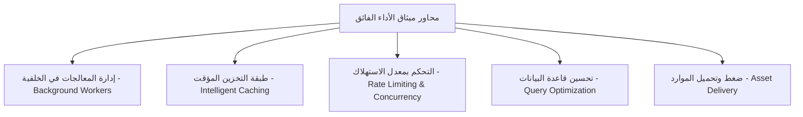
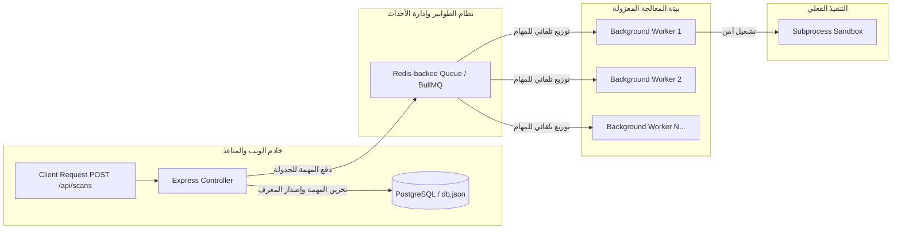
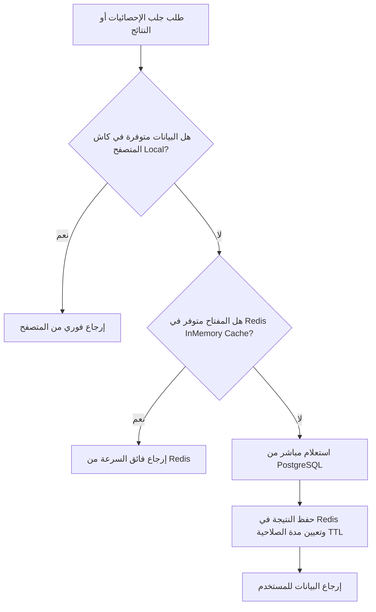

# Volume IX: Performance Optimization & Scalability (تحسين الأداء والكفاءة التشغيلية)
## منصة Sniper AI Security — الدليل المعماري للفصل البرمجي، التخزين المؤقت، وإدارة موارد الأنظمة (High-Performance SecOps Blueprint)

---

## 1. فلسفة الأداء الفائق والتحصين التشغيلي (Performance Engineering Philosophy)

تمثل السرعة والموثوقية حجر الزاوية في منصة **Sniper AI Security**. نظراً للطبيعة الحساسة لعمليات الفحص الأمني (والتي قد تستهلك كميات ضخمة من معالجات الخوادم وتتسبب في إرسال ملايين طلبات الشبكة للتحقق من الثغرات)، فإن تحسين الأداء ليس رفاهية مضافة، بل هو ضرورة حتمية لمنع انهيار النظام وحمايته من التوقف الكلي (Service Outages).

تتبنى المنصة ميثاق أداء صارم يرتكز على خمسة محاور أساسية:



---

## 2. إدارة الطوابير والعمليات غير المتزامنة (Job Queues & Worker Threads)

تمنع المنصة بشكل قاطع تشغيل أي فحص أمني طويل أو كثيف المعالجة (مثل فحص المنافذ بـ Nmap أو تشغيل قوالب Nuclei) داخل الخيط الرئيسي لـ Express (Express Event Loop). تداخل هذه العمليات يعيق استقبال الخادم لطلبات العملاء الآخرين ويؤدي لتجميد الاستجابة بالكامل.

### 2.1 بنية معالجة المهام عبر نظام الطوابير المعزول (Background Processing Architecture)



*   **ناقل المهام (Job Queuing):** يتم استخدام نظام طوابير متطور مدعوم بـ **Redis** (مثل **BullMQ** في بيئات الإنتاج) لتلقي طلبات الفحص وتخزينها بأمان.
*   **عزل العمليات (Workers Isolation):** تعمل برمجيات المعالجة (Workers) كعمليات مستقلة تماماً (Separate Node.js Processes or Cluster Threads). يقوم كل Worker بسحب مهمة واحدة ومعالجتها في معزله التام دون التأثير على حركة المرور لشبكة الويب للمستخدمين.

---

## 3. طبقة التخزين المؤقت واستبقاء النتائج (Intelligent Caching Tier)

لتقليص الكلفة التشغيلية الناتجة عن تكرار فحص الأهداف ذاتها في فترات زمنية متقاربة، ولضمان جلب إحصائيات لوحة التحكم في أجزاء من الملي ثانية، تعتمد المنصة على طبقة تخزين مؤقت ثنائية المستوى (Two-Level Caching):

### 3.1 مستويات التخزين المؤقت ومصفوفة اتخاذ القرار



### 3.2 معايير إخلاء وحفظ البيانات الكاش (Cache Eviction Policies)

تفرض المنصة سياسة صارمة لتحديد صلاحية البيانات المؤقتة (Time-To-Live - TTL) لتجنب عرض نتائج أمنية قديمة ومضللة للباحثين:

| نوع الكيان والمورد | مدة الصلاحية الافتراضية (TTL) | سياسة تحديث وإخلاء البيانات (Eviction / Invalidation Trigger) |
| :--- | :--- | :--- |
| **إحصائيات لوحة التحكم العامة** | **5 دقائق (300 ثانية)** | يتم مسح الكاش تلقائياً وفوراً عند اكتمال فحص جديد لأي هدف تابع للمشروع. |
| **قائمة الثغرات المؤكدة** | **15 دقيقة (900 ثانية)** | يتم إخلاء الكاش عند قيام المحلل الأمني بوسم أي ثغرة كـ "تنبيه كاذب" (False Positive) أو تغيير حالتها. |
| **الملخصات التنفيذية للذكاء الاصطناعي** | **24 ساعة (86400 ثانية)**| مستقرة بطبيعتها؛ ويتم إعادة بنائها فقط عند قيام المستخدم بالنقر على زر "إعادة توليد التقرير الذكي". |
| **بيانات تهيئة وإعدادات المشاريع** | **1 ساعة (3600 ثانية)** | يتم إخلاؤها فوراً عند إجراء أي تعديل برمي على إعدادات المشروع أو إضافة مستخدمين جدد. |

---

## 4. التحكم بمعدلات تدفق البيانات والضغط (Rate Limiting & Concurrency)

نظراً لأن منصة **Sniper AI Security** تطلق عمليات فحص تفاعلية ونشطة على شبكات الويب، فإن غياب ضوابط الاستهلاك قد يحول المنصة برمجياً إلى سلاح هجومي لحجب الخدمة (DDoS). لتفادي ذلك، يتم تطبيق محددات استهلاك صارمة:

### 4.1 محددات الاستهلاك والوقاية (Throttling Configurations)
1.  **معدل طلبات الواجهة البرمجية (API Rate Limiting):**
    يُسمح للعملاء في الخطط القياسية بحد أقصى **100 طلب في الدقيقة** لواجهات الاستدعاء العامة، وحد أقصى **5 طلبات في الدقيقة** لواجهة تشغيل الفحوصات الفورية، ويتم حظر أي تجاوز مؤقتاً بالرمز `429 Too Many Requests`.
2.  **معدل الفحص المتزامن (Concurrency Limits):**
    يُحد كل مشروع بحد أقصى **3 مهمات فحص نشطة في نفس الوقت**. تُوضع أي طلبات إضافية في حالة "الانتظار المنظم" (Pending Queue) حتى اكتمال إحدى المهمات الجارية لتفادي خنق موارد الشبكة وخوادم الاستضافة.

---

## 5. سجل القرارات الهندسية للأداء والكفاءة (ADR-009)

### ADR-009: اعتماد بروتوكول الاتصال المتعدد ومشاركة الخادم عبر العناقيد (Node.js Clustering)

*   **الحالة (Status):** Accepted
*   **التاريخ (Date):** 2026-07-20
*   **الكاتب (Author):** Supreme Software Architect

#### 1. السياق والمشكلة (Context)
يعمل محرك Node.js افتراضياً على خيط معالجة واحد (Single-threaded). في بيئات الإنتاج وغرف العمليات الأمنية الكثيفة (SOC Environments) حيث يتزامن مئات الباحثين والمهندسين في استخدام المنصة، قد يتعرض المعالج لضغط كثيف يؤدي لتأخير الاستجابة رغم وجود معالجات متعددة الأنوية (Multi-core processors) غير مستغلة في الخادم المضيف.

#### 2. الحل المقترح (Decision)
تقرر دمج وتفعيل موديول **Node.js Cluster** في ملف تشغيل الخادم الرئيسي لبيئات الإنتاج. يقوم النظام تلقائياً بتوليد خيوط عمل فرعية (Worker Processes) متطابقة مع عدد أنوية المعالج المتوفرة في الخادم، مع مشاركة منفذ الاستماع الموحد `3000` وتوزيع طلبات الاتصال الواردة بين الأنوية بشكل آمن وعادل عبر خوارزمية (Round-Robin).

#### 3. التبعات (Consequences)
*   **إيجابياً:** مضاعفة قدرة استيعاب طلبات الواجهة لعدة مرات، ضمان استمرارية الخدمة بنسبة 99.9% حتى في حالة انهيار أحد الخيوط الفرعية (حيث يقوم الخيط الرئيسي بإعادة توليده فوراً)، والاستغلال الأمثل لكامل طاقة معالجات الخوادم السحابية.
*   **سلباً:** تتطلب هذه المعمارية عزل حالة الجلسات (Sessions) بالكامل عن ذاكرة النظام المحلية، وهو ما تم تحقيقه مسبقاً عبر تشفير وحفظ بيانات الجلسات والتحقق داخل رموز JWT وتخزين حالات الكاش في خادم Redis المستقل.

---

## 6. قالب الكود المرجعي للتحكم بمعدل الاستهلاك وبناء الكاش (Caching Middleware Template)

يجب استخدام الموديول المساعد القياسي التالي عند الرغبة في إلحاق ميزة التخزين المؤقت وحماية الاستهلاك بأي من مسارات واجهات التطبيق لضمان الكفاءة القصوى:

```typescript
import { Request, Response, NextFunction } from "express";
import { db } from "../database/db";

// مخزن محلي لمحاكاة كاش الذاكرة الموقت الخفيف لبيئات التطوير
const localCacheStore = new Map<string, { data: any; expiresAt: number }>();

export class PerformanceHelper {
  /**
   * Middleware للتخزين المؤقت الذكي للاستعلامات لتقليص الكلفة وحمل الخادم
   */
  public static cacheMiddleware = (durationSeconds: number) => {
    return (req: Request, res: Response, next: NextFunction) => {
      // استخدام مسار الطلب الفريد كمفتاح للكاش
      const cacheKey = req.originalUrl || req.url;
      const cached = localCacheStore.get(cacheKey);

      if (cached && cached.expiresAt > Date.now()) {
        console.log(`[CACHE HIT] Returning compiled results from memory for: ${cacheKey}`);
        return res.status(200).json(cached.data);
      }

      // اعتراض استجابة الإرسال لحفظ البيانات الجديدة بداخل الكاش تلقائياً قبل تسليمها للمتصفح
      const originalJson = res.json;
      res.json = function (body: any) {
        if (res.statusCode === 200) {
          localCacheStore.set(cacheKey, {
            data: body,
            expiresAt: Date.now() + durationSeconds * 1000,
          });
        }
        return originalJson.call(this, body);
      };

      console.log(`[CACHE MISS] Fetching fresh data from database repository for: ${cacheKey}`);
      next();
    };
  };

  /**
   * دالة مخصصة لمسح وإخلاء مفاتيح الكاش عند حدوث عمليات تحديث للبيانات
   */
  public static invalidateCache(urlPattern: string): void {
    const keys = Array.from(localCacheStore.keys());
    keys.forEach((key) => {
      if (key.includes(urlPattern)) {
        localCacheStore.delete(key);
        console.log(`[CACHE INVALIDATED] Key cleared successfully from memory: ${key}`);
      }
    });
  }
}
```

---

## 7. قائمة مراجعة مخرجات موديول تحسين الأداء (Performance DoD Checklist)

```text
[ ] هل يخلو خيط العمل الرئيسي لـ Express من أي عمليات فحص أمني أو تشغيل لبرمجيات CLI الخارجية؟
[ ] هل تم تعيين مدد صلاحية منطقية (TTL) لجميع موارد واجهات التخزين المؤقت لمنع تسرب البيانات القديمة؟
[ ] هل تم تطبيق محددات استهلاك وطلب الواجهة (Rate Limiting) على المسارات الحساسة وعمليات الإطلاق؟
[ ] هل تم تجنب حفظ حالات الجلسات أو التحقق بداخل ذاكرة الخادم المحلية والاعتماد على JWT والـ State المعزول؟
```

---

*تم صياغة واعتماد دستور كفاءة وتحسين الأداء التشغيلي بواسطة **المهندس المعماري الأعلى** لمنصة **Sniper AI Security**.*
*الإصدار الحالي: 1.0.0 — جاهز وبانتظار الموافقة والاعتماد الفوري للانتقال إلى **Volume X — Deployment & Devops**.*
