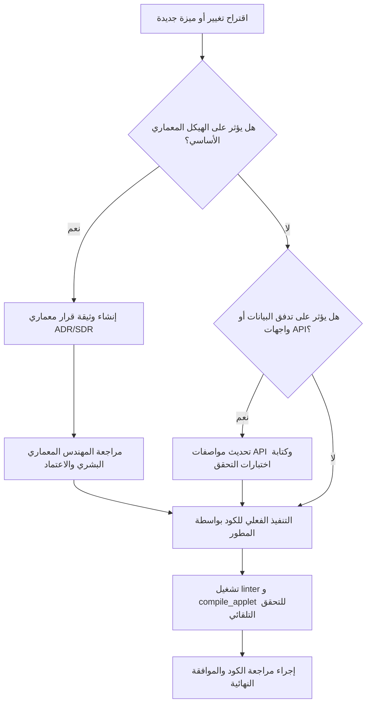

# Volume I: Engineering Constitution (الدستور الهندسي العام)
## منصة Sniper AI Security — الدليل المرجعي الفائق للسياسات والمعايير الفنية

---

## 1. الرؤية الهندسية والفلسفة العامة (Architectural Vision & Philosophy)

إن منصة **Sniper AI Security** ليست مجرد أداة فحص أمني عادية، بل هي منصة مؤسسية متكاملة (Enterprise-Grade SecOps Platform) تجمع بين قوة محركات اختبار الاختراق التقليدية وذكاء الاستدلال التوليدي للذكاء الاصطناعي. تتبنى المنصة فلسفة هندسية صارمة تقوم على المبادئ التالية:

### 1.1 مبادئ التصميم الأساسية (Core Design Tenets)
*   **أمان التصميم أولاً (Secure-by-Design):** كل سطر كود يتم كتابته يجب أن يخضع للتحقق من الصلاحيات والمدخلات عند أدنى مستوى ممكن. لا نثق بأي بيانات قادمة من واجهة المستخدم أو من مصادر خارجية (Zero Trust Architecture).
*   **بساطة التنفيذ (KISS - Keep It Simple, Stupid):** يفضل دائماً الحل المباشر والواضح على الحل المعقد والمبهر ظاهرياً. الكود البسيط أسهل في المراجعة الأمنية وأقل عرضة للثغرات المنطقية (Business Logic Flaws).
*   **عدم التكرار الذكي (DRY - Don't Repeat Yourself):** يتم تجريد المنطق المشترك في خدمات (Services) أو أدوات مساعدة (Utility classes) مستقلة لضمان مركزية التعديل والصيانة.
*   **القابلية للاختبار والمحاكاة (Testability):** تُكتب الوحدات البرمجية بطريقة تسمح بفصل الاعتماديات (Loose Coupling) لتسهيل إجراء اختبارات الوحدة (Unit Tests) واختبارات التكامل (Integration Tests).

---

## 2. مصفوفة حوكمة القرارات المعمارية (Decision Matrix & Governance)

لتجنب العشوائية الفنية والتوسع غير المحسوب للميزات (Scope Creep)، تخضع جميع القرارات المعمارية لمصفوفة حوكمة واضحة تحدد المسؤوليات والصلاحيات بين المهندس البشري والذكاء الاصطناعي المسؤول عن البناء:



### 2.1 جدول تحديد الصلاحيات (Responsibility Matrix)

| الدور الفني | الذكاء الاصطناعي المطور (AI Developer) | المهندس المعماري البشري (Lead Architect) |
| :--- | :--- | :--- |
| **اقتراح الحلول الفنية** | 🟢 مبادر (يقترح البدائل والأنماط المناسبة) | 🔵 مراجع وموجه |
| **تعديل مخططات البيانات (Schema)** | 🟡 مقترح (ينشئ مسودة Drizzle ويعرضها) | 🔴 صاحب قرار الاعتماد النهائي |
| **دمج مكتبات خارجية جديدة** | 🔴 ممنوع بدون إذن صريح ومبرر أمني | 🟢 مرخص ومصادق على سلامة المكتبة |
| **تحسين الأداء وحل الأخطاء (Refactoring)** | 🟢 مسموح ومطلوب بشكل مستمر | 🔵 مراجع وضامن للموثوقية |

---

## 3. مصفوفة التعريف النهائي للعمل (Definition of Done - DoD)

لا يعتبر أي تعديل برمي أو ميزة جديدة "منتهية" وجاهزة للنشر والدمج في الفرع الرئيسي للمنصة ما لم تستوفِ الشروط الصارمة التالية:

### 3.1 قائمة التحقق المعيارية للإنجاز (Strict DoD Checklist)

```text
[ ] مطابقة الكود مع نظام TypeScript Strict Mode بالكامل (لا وجود للنوع 'any' غير المبرر).
[ ] غياب أي تحذيرات أو أخطاء صياغية عند تشغيل 'npm run lint'.
[ ] نجاح عملية البناء والتجميع بالكامل عبر أداة 'compile_applet'.
[ ] معالجة الأخطاء بشكل كامل (No silent failures) واستخدام Logger النظام الموحد للتسجيل.
[ ] عزل معلومات الاتصال والمفاتيح السرية بالكامل في ملف البيئة .env.example.
[ ] توثيق جميع التغييرات في واجهات API أو الهياكل في الأقسام المخصصة بالموسوعة الهندسية.
```

---

## 4. ميثاق صياغة ومراجعة الكود (Code Style & Review Guidelines)

لتسهيل القراءة وتوحيد الطابع الفني عبر كامل ملفات مشروع **Sniper AI Security**، يلتزم المطورون بالقواعد التنسيقية والصياغية التالية:

### 4.1 القواعد الإرشادية لـ TypeScript و Express
1.  **عزل المنطق عن التحكم (Separation of Concerns):**
    *   **الـ Controllers:** مسؤولة فقط عن استقبال الطلبات (Requests) والتحقق الأولي من المدخلات (Validation) وإرجاع الاستجابة (Response).
    *   **الـ Services:** تحتوي على منطق العمل الأساسي (Business Logic) والعمليات المعقدة.
    *   **الـ Repositories:** مسؤولة حصرياً عن الاستعلام والكتابة في قاعدة البيانات (مثل استخدام Drizzle ORM).
2.  **التسميات الموحدة (Naming Conventions):**
    *   الملفات والمجلدات: استخدام نمط `camelCase` للملفات والوظائف، ونمط `PascalCase` للمكونات والـ Classes.
    *   واجهات البيانات (Interfaces): تبدأ دائماً بحرف `I` الكبير (مثال: `IProject`, `IScanJob`).
3.  **إدارة الأخطاء والاستثناءات (Robust Error Handling):**
    *   يُمنع استخدام كتل `try-catch` فارغة. يجب تسجيل جميع الأخطاء بواسطة نظام `Logger` مخصص يوضح السياق البرمجي للأخطاء مع تفاصيل تتبع المكدس (Stack Trace) في بيئة التطوير.

---

## 5. قوالب التوثيق الهندسي والأمني (Engineering Templates)

تعتمد المنصة على وثيقتين رئيسيتين لتوثيق التحولات الهندسية والأمنية الحساسة:

### 5.1 قالب وثيقة القرار المعماري (Architectural Decision Record - ADR)
تُستخدم لتبرير تبني تكنولوجيا جديدة، تغيير هيكلي في مجلدات المنصة، أو اعتماد بروتوكول اتصال معين.

```markdown
# ADR-[ID]: [عنوان القرار المعماري]

*   **الحالة (Status):** [Draft | Proposed | Accepted | Rejected | Superceded]
*   **التاريخ (Date):** [YYYY-MM-DD]
*   **الكاتب (Author):** [اسم الكاتب / الدور الفني]

## 1. السياق والمشكلة (Context & Problem)
[وصف المشكلة التقنية الحالية والدوافع الفنية للتغيير].

## 2. الحلول البديلة المدروسة (Alternatives Considered)
*   **البديل الأول:** [اسم البديل ومميزاته وعيوبه].
*   **البديل الثاني:** [اسم البديل ومميزاته وعيوبه].

## 3. القرار المعتمد (Decision)
[توضيح الحل الفني الذي تم اختياره مع تبرير هندسي دقيق لسبب تفضيله على البدائل الأخرى].

## 4. التبعات والتأثيرات (Consequences)
*   **إيجابياً:** [تأثيره الإيجابي على السرعة، الحجم، الأمان أو قابلية الصيانة].
*   **سلباً:** [الجهد الإضافي المطلوب، منحنى التعلم، أو زيادة استهلاك الموارد].
```

### 5.2 قالب وثيقة القرار الأمني (Security Decision Record - SDR)
تُستخدم عند اتخاذ قرارات تتعلق بتشفير البيانات، صلاحيات المستخدمين، آليات المصادقة، أو التعامل مع الثغرات الأمنية المكتشفة في معالجة المدخلات.

```markdown
# SDR-[ID]: [عنوان القرار الأمني]

*   **مستوى الخطورة الأمني (Risk Level):** [Critical | High | Medium | Low]
*   **التاريخ (Date):** [YYYY-MM-DD]
*   **الكاتب (Author):** [اسم الكاتب / خبير الأمن السيبراني]

## 1. التهديد الأمني المحتمل (Potential Threat)
[تحديد التهديد البرمجي أو الخطر الأمني الذي تهدف هذه البنية لمعالجته وفق تصنيفات OWASP أو MITRE].

## 2. آلية التخفيف المعتمدة (Mitigation Strategy)
[شرح الآلية الأمنية التي سيتم دمجها في الكود البرمجي لتفادي هذا الخطر وضمان الحماية الفعالة].

## 3. معايير الامتثال (Compliance Alignment)
[توضيح مدى مطابقة هذا الإجراء للسياسات القياسية مثل NIST CSF أو OWASP ASVS].
```

---

*تم صياغة واعتماد هذا الدستور بواسطة **المهندس المعماري الأعلى** لمنصة **Sniper AI Security**.*
*الإصدار الحالي: 1.0.0 — جاهز وبانتظار الموافقة للانتقال إلى **Volume II — Enterprise Architecture**.*
