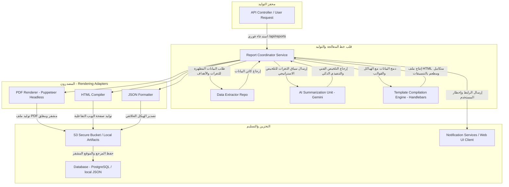

# Volume VIII: Reporting Engine (محرك التقارير التنفيذية والفنية)
## منصة Sniper AI Security — المعمارية الهندسية لمولد التقارير الأمنية وتصدير البيانات (Enterprise Reporting Framework)

---

## 1. فلسفة محرك التقارير وتصنيف الجمهور المستهدف (Reporting Philosophy)

يعتبر **محرك التقارير (Reporting Engine)** في منصة **Sniper AI Security** حلقة الوصل الحيوية بين التفاصيل التقنية الدقيقة لثغرات اختبار الاختراق وصناع القرار داخل المؤسسات. لا يقتصر دور المحرك على تجميع البيانات وحسب، بل يمتد إلى ترجمة المخاطر الرقمية المعقدة إلى رؤى استراتيجية مفهومة ومحفزة لخطوات الإصلاح الفوري.

تتبنى المنصة استراتيجية تقارير ثنائية الاتجاه (Dual-Perspective Reporting):

1.  **التقرير التنفيذي (Executive Summary):**
    *   **المستهدفون:** الإدارة العليا (C-Level Executives) ومدراء المنتجات.
    *   **المحتوى الفني:** درجات ومؤشرات المخاطر العامة، مصفوفة التهديدات الإجمالية، الخسائر المالية والتشغيلية المتوقعة، والملخص التحليلي المصاغ بواسطة الذكاء الاصطناعي مع تجنب المصطلحات البرمجية البحتة.
2.  **التقرير التقني المفصل (Technical Report):**
    *   **المستهدفون:** المهندسون، مسؤولو النظم، ومطورو البرمجيات.
    *   **المحتوى الفني:** عناوين الثغرات المكتشفة، الأدلة التقنية المباشرة (Evidence & Response Banners)، مكان الثغرة بالتحديد (Location/Endpoints)، درجات CVSS v3 التفصيلية، وخطوات ومكعبات الكود البرمجي الآمن لإصلاح وسد الثغرة (Remediation Playbook).

---

## 2. المعمارية الهيكلية لتوليد التقارير (Report Generation Pipeline)

يتبع توليد التقارير داخل المنصة دورة معالجة معزولة ومحمية بالكامل لضمان الأمان الفائق للأسرار التقنية للمشاريع، بالاعتماد على معمارية المراحل المتتابعة (Stage-Based Pipeline):



---

## 3. توليد الملخصات المدعومة بالذكاء الاصطناعي وحساب المخاطر (AI-Powered Summaries)

يتكامل محرك التقارير بشكل مباشر مع **AI Security Engine** لتوليد تحليلات ذكية شاملة ومصاغة بدقة متناهية تعتمد على المعطيات الفعلية المكتشفة، لتجنب الهلوسة البرمجية.

### 3.1 معايير مصفوفة التقييم وحساب درجات المخاطر الإجمالية للمشروع (Risk Scoring)
تقوم المعادلة الرياضية للمنصة بحساب مقياس المخاطر الإجمالي (Project Risk Score) بمدى يمتد من `0` (آمن بالكامل) إلى `100` (خطر داهم حتمي) بالاعتماد على توزيع أعداد ومستويات خطورة الثغرات المفتوحة التي لم تُغلق بعد:

$$\text{Project Risk Score} = \min\left(100, \sum (N_{\text{Critical}} \times 10) + \sum (N_{\text{High}} \times 7) + \sum (N_{\text{Medium}} \times 3) + \sum (N_{\text{Low}} \times 1)\right)$$

---

## 4. تفاصيل التنسيقات والمخرجات المتعددة (Formats & Specifications)

تتيح المنصة للمستخدمين تصدير التقارير بثلاثة تنسيقات قياسية دولية تلائم كافة الاستخدامات:

### 4.1 التصدير بتنسيق JSON (Relational Export JSON Schema)
يُستخدم هذا التنسيق لدمج نتائج الفحوصات بداخل أنظمة إدارة ثغرات المؤسسات (GRC Tools) أو ممرات البناء الأوتوماتيكية (CI/CD Pipelines).

```json
{
  "$schema": "https://json-schema.org/draft/2020-12/schema",
  "title": "SniperScanReport",
  "type": "object",
  "properties": {
    "reportId": { "type": "string", "format": "uuid" },
    "projectName": { "type": "string" },
    "scanDate": { "type": "string", "format": "date-time" },
    "riskMetrics": {
      "type": "object",
      "properties": {
        "overallScore": { "type": "number", "minimum": 0, "maximum": 100 },
        "criticalCount": { "type": "integer" },
        "highCount": { "type": "integer" },
        "mediumCount": { "type": "integer" },
        "lowCount": { "type": "integer" }
      },
      "required": ["overallScore", "criticalCount", "highCount", "mediumCount", "lowCount"]
    },
    "vulnerabilities": {
      "type": "array",
      "items": {
        "type": "object",
        "properties": {
          "id": { "type": "string", "format": "uuid" },
          "title": { "type": "string" },
          "severity": { "type": "string", "enum": ["Critical", "High", "Medium", "Low"] },
          "cvssScore": { "type": "number" },
          "location": { "type": "string" },
          "description": { "type": "string" },
          "remediation": { "type": "string" }
        },
        "required": ["id", "title", "severity", "cvssScore", "location", "description", "remediation"]
      }
    }
  },
  "required": ["reportId", "projectName", "scanDate", "riskMetrics", "vulnerabilities"]
}
```

### 4.2 التصدير بتنسيق PDF و HTML
*   **تصميم القالب (Layout Grid):** نعتمد على نظام تخطيط شبكي فائق البساطة ومطعم بشعار المنصة المعياري. يُمنع استخدام الجداول المعقدة متداخلة الحدود لضمان اتساق الطباعة (Print Layout Friendly).
*   **التلوين وكسر الصفحة (Page-breaks):** تُحقن أوراق الأنماط بتوجيهات `@media print` الصارمة التي تمنع كسر بطاقات الثغرة الواحدة عبر صفحات متعددة (تثبيت الخاصية `page-break-inside: avoid`).

---

## 5. سجل القرارات الهندسية لمحرك التقارير (ADR-008)

### ADR-008: استخدام نظام التصفيف القالبي المسبق المعتمد على Handlebars و Puppeteer لتوليد مستندات PDF

*   **الحالة (Status):** Accepted
*   **التاريخ (Date):** 2026-07-20
*   **الكاتب (Author):** Supreme Software Architect

#### 1. السياق والمشكلة (Context)
تحتاج المنصة لتوليد تقارير PDF ذات طابع احترافي شديد الأناقة والدقة والتحكم بالخطوط والرسوم البيانية التفاعلية. المكتبات البرمجية لتوليد ملفات الـ PDF بشكل مباشر عبر الكود (مثل PDFKit or jsPDF) تطلب كتابة سطور كودية طويلة وعشوائية لتحديد قياس البكسل يدوياً، وتمنع تطبيق التنسيقات والرسومات البيانية المتطورة لـ Recharts.

#### 2. الحل المقترح (Decision)
تقرر اعتماد **محرك ثنائي المراحل (Two-Stage Rendering)**:
1.  **المرحلة الأولى:** جلب البيانات وتجميع التلخيصات ثم استخدام محرك القوالب **Handlebars** لدمج البيانات بداخل صفحة ويب قياسية مبنية بـ Tailwind CSS ومكتملة الرسوم البيانية التفاعلية كـ HTML كامل ومستقل.
2.  **المرحلة الثانية:** تشغيل حاوية متصفح صامت في الخلفية (Headless Chrome via Puppeteer) وفتح صفحة الويب المتولدة، ثم استخدام التابع البرمجي `page.pdf()` لتصدير وطباعة المستند بجودة طباعة فائقة (Vector PDF Generation).

#### 3. التبعات (Consequences)
*   **إيجابياً:** تحكم وتنسيق كامل بشكل وتصميم الواجهة، الحفاظ على دقة الأنماط والألوان التابعة للمنصة، وإمكانية تضمن الرسوم البيانية والجداول المعقدة بدون أي كلفة معمارية في حساب إحداثيات المستند.
*   **سلباً:** كلفة زمنية إضافية لاستهلاك الذاكرة العشوائية لتشغيل المتصفح الصامت في بيئة الخادم، والتي تم التخفيف منها عن طريق حجز وتخصيص معالج واحد للعملية مع فرض حد زمني للطباعة (Print Timeout).

---

## 6. قالب الكود المرجعي لتوليد التقارير في الخلفية (Report Generator Implementation)

يجب على المطورين ومهندسي الأنظمة اتباع القالب البرمجي القياسي الآتي عند بناء أو تعديل آليات تصدير التقارير في المنصة لضمان كفاءة البناء وأمان العمليات:

```typescript
import { db } from "../database/db";
import { AppError } from "../errors/AppError";
import { GoogleGenAI } from "@google/genai";

// تهيئة عميل الذكاء الاصطناعي الأمني
const ai = new GoogleGenAI({ apiKey: process.env.GEMINI_API_KEY });

export interface IReportMetadata {
  reportId: string;
  projectId: string;
  projectName: string;
  riskScore: number;
  aiExecutiveSummary: string;
  generatedAt: string;
}

export class ReportGeneratorService {
  /**
   * دالة مركزية لتجميع وتخليق التقارير بالذكاء الاصطناعي مع حسابات نقاط المخاطر
   */
  public async generateExecutiveReport(projectId: string): Promise<IReportMetadata> {
    try {
      // 1. جلب المشروع والأهداف المرتبطة به من قاعدة البيانات
      const project = db.projects.find((p: any) => p.id === projectId);
      if (!project) {
        throw new AppError("المشروع المطلوب لتصدير التقرير غير موجود.", 404, "PROJECT_NOT_FOUND");
      }

      const vulnerabilities = db.vulnerabilities.filter((v: any) => v.projectId === projectId && !v.isFalsePositive);

      // 2. حساب مؤشر المخاطر الإجمالي بناء على المعادلة البرمجية المعتمدة
      let criticals = 0;
      let highs = 0;
      let mediums = 0;
      let lows = 0;

      vulnerabilities.forEach((v: any) => {
        if (v.severity === "Critical") criticals++;
        else if (v.severity === "High") highs++;
        else if (v.severity === "Medium") mediums++;
        else if (v.severity === "Low") lows++;
      });

      const calculatedRisk = Math.min(
        100,
        criticals * 10 + highs * 7 + mediums * 3 + lows * 1
      );

      // 3. استدعاء الذكاء الاصطناعي لصياغة التلخيص الاستراتيجي التنفيذي الآمن
      let executiveSummary = "لا يوجد ملخص أمني متوفر حالياً.";
      
      if (process.env.GEMINI_API_KEY) {
        const prompt = `
          أنت كبير مدراء مراجعة المخاطر الأمنية (CISO). قم بصياغة ملخص تنفيذي احترافي وبشكل منسق جداً عن الحالة الأمنية للمشروع التالي:
          اسم المشروع: ${project.name}
          مقياس المخاطر الإجمالي المحسوب: ${calculatedRisk}/100
          توزع الثغرات المكتشفة: فائقة الخطورة (${criticals})، مرتفعة (${highs})، متوسطة (${mediums})، منخفضة (${lows}).
          
          تعليمات هامة:
          - ركز على التبعات الاستراتيجية للأعمال والتشغيل دون إسهاب تقني برمي في هذا الجزء.
          - قدم 3 توصيات استراتيجية للإدارة لتخصيص الميزانيات وإدارة المخاطر.
        `;

        const response = await ai.models.generateContent({
          model: "gemini-3.5-flash",
          contents: prompt,
          config: {
            systemInstruction: "أنت كبير مستشاري حماية الأعمال وتصنيف المخاطر الأمنية للمؤسسات."
          }
        });

        executiveSummary = response.text || executiveSummary;
      }

      // 4. بناء الكائن النهائي وحفظه بسجل التقارير التاريخية بالنظام
      const reportMetadata: IReportMetadata = {
        reportId: `rep-${Math.random().toString(36).substr(2, 9)}`,
        projectId: projectId,
        projectName: project.name,
        riskScore: calculatedRisk,
        aiExecutiveSummary: executiveSummary,
        generatedAt: new Date().toISOString()
      };

      console.log(`[REPORT GENERATED] Successfully compiled report metadata for project: ${project.name}`);
      return reportMetadata;

    } catch (error: any) {
      console.error("[REPORT SERVICE ERROR] Failed to compile executive report:", error);
      throw new AppError(
        `فشل مولد التقارير في تشييد البيانات: ${error.message || error}`,
        500,
        "REPORT_COMPILATION_FAILED"
      );
    }
  }
}
```

---

## 7. قائمة مراجعة مخرجات محرك التقارير (Reporting Engine DoD Checklist)

```text
[ ] هل التقرير التنفيذي معزول كلياً عن الإفراط التقني وموجه لمستوى صناع القرار؟
[ ] هل يتم احتساب مقياس المخاطر بدقة بناء على معادلة الخطورة المفتوحة المعتمدة هندسياً؟
[ ] هل يتطابق التصدير الهيكلي لـ JSON مع واجهة ومصفوفة التحقق JSON Schema؟
[ ] هل قوالب HTML/PDF مطعمة بمحددات التنسيق الصارمة لمنع تشوه العناصر والكسر العشوائي للصفحات؟
[ ] هل تم الاحتفاظ بملخصات وسجلات التقارير داخل مستودعات وقاعدة البيانات للرجوع التاريخي؟
```

---

*تم صياغة واعتماد دستور محرك التقارير التنفيذية والفنية بواسطة **المهندس المعماري الأعلى** لمنصة **Sniper AI Security**.*
*الإصدار الحالي: 1.0.0 — جاهز وبانتظار الموافقة والاعتماد الفوري للانتقال إلى **Volume IX — Performance Optimization**.*
