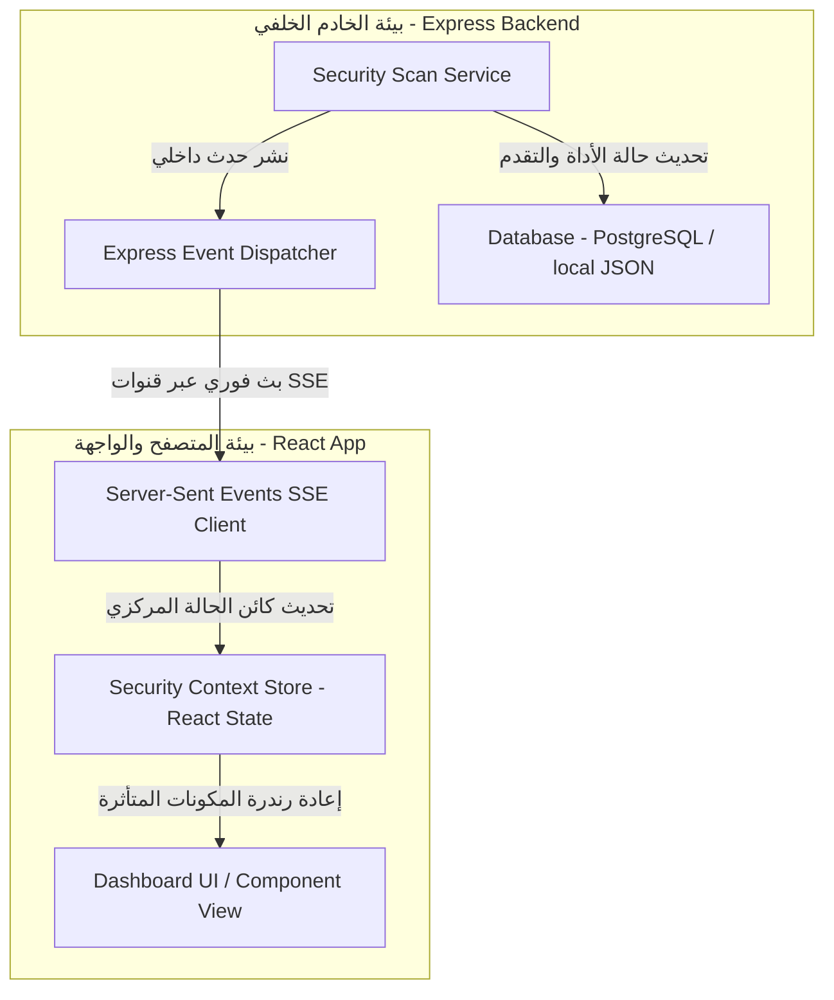
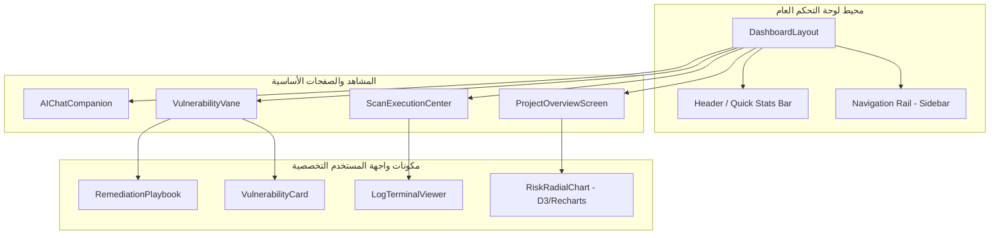

# Volume VII: Dashboard UI & User Experience (لوحة التحكم وتجربة المستخدم)
## منصة Sniper AI Security — المعايير الهندسية والفنية لبناء الواجهات الرسومية التفاعلية (Enterprise Front-End Blueprint)

---

## 1. فلسفة التصميم والهوية البصرية للمنصة (UI Design Philosophy & Theme)

يعتبر واجهة المستخدم في منصة **Sniper AI Security** أكثر من مجرد لوحة عرض للبيانات؛ إنها مركز عمليات أمني تفاعلي (Security Operations Center - SOC) مصمم لتمكين المحللين والمديرين الأمنيين من اتخاذ القرارات المصيرية في غضون ثوانٍ.

### 1.1 المبادئ البصرية الحاكمة (Core UI Tenets)
*   **السمة الكونية الداكنة المتوازنة (Cosmic Dark Visual Theme):** نتبنى تصميماً يرتكز على خلفيات شديدة الكثافة والظلمة مصحوبة بألوان تباين ممتازة تمنع إجهاد العين أثناء المراقبة الليلية الطويلة.
*   **التدرج الوظيفي للخطورة (Functional Severity Coloring):** الألوان في المنصة لها دلالات أمنية صارمة وموحدة عبر كامل الواجهات:
    *   🔴 **الخطورة الفائقة (Critical):** أحمر قرمزي ناصع (`#EF4444`) للإشارة إلى ثغرات الحقن أو الاختراق المباشر.
    *   🟠 **الخطورة المرتفعة (High):** برتقالي ناري (`#F97316`) للإشارة إلى ثغرات التخطي وتسريب الصلاحيات.
    *   🟡 **الخطورة المتوسطة (Medium):** أصفر ذهبي دافئ (`#EAB308`) للإشارة إلى غياب بروتوكولات الحماية الإضافية.
    *   🔵 **الخطورة المنخفضة والمعلوماتية (Low/Info):** أزرق سماوي/رمادي هادئ لبيانات الهياكل والبصمات الفنية.
*   **المساحات السلبية الفسيحة (Spacious Negative Space):** نرفض تماماً تكتل البيانات العشوائي. يتم إعطاء كل عنصر رسومي ومخطط مساحة تمدد تضمن سهولة قراءة التحليلات واستيعابها.

---

## 2. إدارة الحالة والمزامنة اللحظية للفحوصات (State Management & Live Sync)

أثناء تشغيل عمليات الفحص الأمني الطويلة، يحتاج المستخدم لمتابعة فورية ومباشرة لتقدم الأدوات دون الحاجة لتحديث الصفحة يدوياً. يتم تحقيق ذلك عبر البنية المعمارية التالية لإدارة حالة الواجهة:



### 2.1 مزامنة تقدم الفحص البرمجي (Real-time Scan Sync)
تستخدم المنصة قنوات **Server-Sent Events (SSE)** كخيار مفضل وأكثر خفة من واجهات WebSockets لنقل تقدم الفحوصات ومخرجات الأوامر (Command Execution Logs) بشكل أحادي الاتجاه وفوري إلى العميل.

---

## 3. هيكلية المكونات الأمنية ولوحة التحكم (UI Component Architecture)

تم تقسيم واجهة المستخدم في **Sniper AI Security** برؤية موديولية صارمة تضمن استقلالية المكونات وقابليتها لإعادة الاستخدام السريع (Component Reusability):



### 3.1 بطاقة عرض الثغرة الأمنية الموحدة (`VulnerabilityCard`)
تعتبر هذه البطاقة المكون الأهم في واجهات عرض النتائج؛ حيث تتلقى بيانات الثغرة المطهرة وتوفر المحتوى المعرفي التالي:
*   مؤشر لون جانبي ديناميكي يعكس مستوى الخطورة الفعلي.
*   منطقة استعراض الدليل الرقمي والتقني (Evidence & Output Terminal) بتنسيق خطوط ثابتة المرتكز (Mono-spaced Font).
*   علامة تفاعلية تمكن المحلل الأمني من وسم الثغرة كـ "تنبيه كاذب" (False Positive)، مما يرسل تحديثاً فورياً لمحرك التعلم الآلي لتجنبها مستقبلاً.

---

## 4. الرسومات والتحليلات التفاعلية (Data Visualization Strategy)

لتمكين متخذي القرار من فهم الحالة الأمنية للمشاريع ككل، تعتمد المنصة على دمج مكتبات رسم البيانات **Recharts** و **D3.js** لبناء لوحات قياس المخاطر.

### 4.1 مصفوفة المخططات البيانية المعتمدة في الواجهة

| نوع المخطط (Chart Type) | المحتوى والبيانات المعروضة | المكتبة التقنية المستخدمة | هدف العرض وفوائده |
| :--- | :--- | :--- | :--- |
| **Radar Chart** | بصمة التهديد ومقارنة ثغرات OWASP Top 10 | **Recharts** | إظهار النواحي البرمجية الأقل تحصيناً للعملاء. |
| **Area Spline Chart**| تاريخ وتذبذب معدل نقاط الخطورة بمرور الوقت | **Recharts** | إثبات كفاءة عمليات سد الثغرات بمرور الزمن. |
| **Risk Gauge Bar** | الدرجة الإجمالية لمخاطر المشروع (0-100) | **D3.js / Custom SVG** | تقديم مقياس بسيط وسريع لخطورة المشروع. |
| **Donut Chart** | نسب توزع مستويات الخطورة للثغرات الحالية | **Recharts** | إيضاح نسبة الثغرات الفائقة والمرتفعة التي تتطلب علاجاً فورياً. |

---

## 5. سجل القرارات الفنية للتصميم ولوحة العرض (ADR-007)

### ADR-007: اعتماد Tailwind CSS و Lucide React في بناء عناصر الواجهة

*   **الحالة (Status):** Accepted
*   **التاريخ (Date):** 2026-07-20
*   **الكاتب (Author):** Supreme Software Architect

#### 1. السياق والمشكلة (Context)
يحتاج تطبيق Sniper AI Security إلى واجهة رسومية خفيفة للغاية وسريعة التحميل، مع ضرورة الالتزام بتوفير تصاميم متجاوبة (Responsive) تعمل بكفاءة متطابقة على شاشات غرف SOC الضخمة وشاشات الأجهزة الذكية للمديرين أثناء التنقل، مع تقليل حجم حزم التحميل البرمجي (Bundle Size) لأقصى حد.

#### 2. الحل المقترح (Decision)
تقرر اعتماد **Tailwind CSS** كنظام معالجة وتنسيق رئيسي ووحيد للأنماط البرمجية، نظراً لكفاءته في التخلص من الأنماط غير المستخدمة أثناء البناء (Purging) وتوفيره للوحدات المساعدة سهلة التركيب. وتنسيق واجهات الأيقونات بالكامل باستخدام مكتبة **Lucide React** لضمان خفتها وتناسق خطوطها الفنية.

#### 3. التبعات (Consequences)
*   **إيجابياً:** الحصول على سرعة معالجة ورسم فورية للواجهات، غياب ملفات CSS الضخمة والمعقدة، وتسهيل صيانة وتحديث الألوان والمسافات البصرية للمطورين ونماذج الذكاء الاصطناعي بشكل موحد.
*   **سلباً:** يتطلب كتابة فئات تنسيق طويلة (Utility Classes) في أسطر الكود البرمجي للمكونات، والتي يتم معالجتها وتنظيمها بتنسيق الكود المعتاد لضمان القابلية للقراءة.

---

## 6. قالب كود المكونات البرمجية القياسي للواجهات (React Component Template)

يلتزم جميع مهندسي الواجهات باستنساخ البنية الهيكلية التالية عند بناء أي مكون تفاعلي جديد في المنصة لضمان سلامة الأنماط وحسابات الأداء:

```typescript
import React, { useState } from "react";
import { Shield, AlertTriangle, CheckCircle, Info } from "lucide-react";

interface IVulnerabilityItemProps {
  id: string;
  title: string;
  severity: "Critical" | "High" | "Medium" | "Low";
  cvssScore: number;
  location: string;
  onSelect: (id: string) => void;
}

export const VulnerabilityItem: React.FC<IVulnerabilityItemProps> = ({
  id,
  title,
  severity,
  cvssScore,
  location,
  onSelect,
}) => {
  const [isHovered, setIsHovered] = useState(false);

  // تحديد أيقونات ولون مستوى الخطورة ديناميكياً بناءً على سياسات الدستور
  const getSeverityStyles = (sev: string) => {
    switch (sev) {
      case "Critical":
        return {
          border: "border-red-500/30 bg-red-950/20",
          text: "text-red-400",
          icon: <AlertTriangle className="w-5 h-5 text-red-500 animate-pulse" />,
        };
      case "High":
        return {
          border: "border-orange-500/30 bg-orange-950/20",
          text: "text-orange-400",
          icon: <AlertTriangle className="w-5 h-5 text-orange-500" />,
        };
      case "Medium":
        return {
          border: "border-yellow-500/30 bg-yellow-950/20",
          text: "text-yellow-400",
          icon: <Info className="w-5 h-5 text-yellow-500" />,
        };
      default:
        return {
          border: "border-slate-700/30 bg-slate-800/10",
          text: "text-slate-400",
          icon: <CheckCircle className="w-5 h-5 text-slate-400" />,
        };
    }
  };

  const styles = getSeverityStyles(severity);

  return (
    <div
      id={`vuln-item-${id}`}
      className={`p-4 rounded-xl border transition-all duration-300 cursor-pointer ${styles.border} ${
        isHovered ? "translate-x-1 shadow-lg shadow-black/40" : ""
      }`}
      onMouseEnter={() => setIsHovered(true)}
      onMouseLeave={() => setIsHovered(false)}
      onClick={() => onSelect(id)}
    >
      <div className="flex items-start justify-between gap-4">
        <div className="flex items-center gap-3">
          {styles.icon}
          <div>
            <h4 className="font-sans font-medium text-sm text-slate-100 leading-snug">{title}</h4>
            <p className="font-mono text-xs text-slate-500 mt-1">{location}</p>
          </div>
        </div>
        <div className="text-right">
          <span className={`text-xs font-bold px-2.5 py-1 rounded-full bg-slate-900/60 border border-slate-700/50 ${styles.text}`}>
            CVSS {cvssScore.toFixed(1)}
          </span>
          <p className="text-[10px] text-slate-500 uppercase font-bold tracking-wider mt-2">{severity}</p>
        </div>
      </div>
    </div>
  );
};
```

---

## 7. قائمة مراجعة واجهات المستخدم وتجربة الاستخدام (UI DoD Checklist)

```text
[ ] هل يحقق المكون الجديد معايير السمة الكونية الداكنة ومستويات الألوان المحددة للخطورة؟
[ ] هل يخلو المكون البرمجي بالكامل من أي أحجام شاشات ثابتة واستخدام فئات Tailwind المتجاوبة بدلاً من ذلك؟
[ ] هل جميع الأيقونات البرمجية مستوردة من مكتبة 'lucide-react' الحصرية؟
[ ] هل تم تجنب الاستعلامات الدورية المتكررة (Polling) واستبدالها بنظام SSE لمزامنة الفحوصات اللحظية؟
[ ] هل تم إلحاق معاملات التحقق الفريدة 'id' على جميع العناصر البرمجية القابلة للتفاعل لتسهيل الفحص والتصميم؟
```

---

*تم صياغة واعتماد دستور واجهات المستخدم وتجربة الاستخدام بواسطة **المهندس المعماري الأعلى** لمنصة **Sniper AI Security**.*
*الإصدار الحالي: 1.0.0 — جاهز وبانتظار الموافقة والاعتماد الفوري للانتقال إلى **Volume VIII — Reporting Engine**.*
