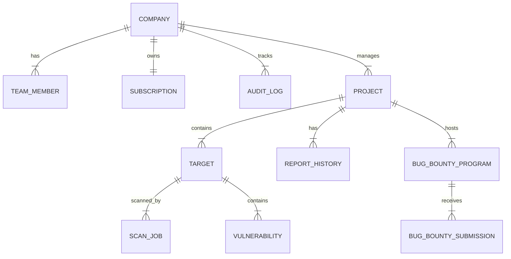
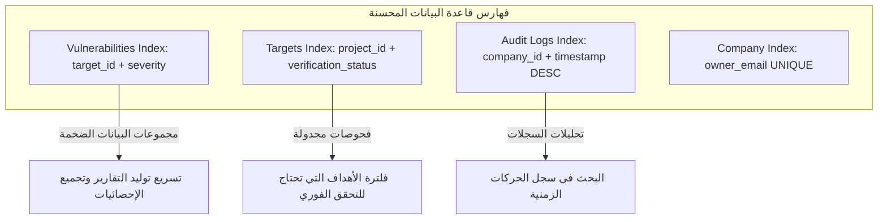

# Volume VI: Database Architecture (هندسة قواعد البيانات والاستبقاء)
## منصة Sniper AI Security — المخطط الهيكلي لإدارة الكيانات ومزامنة البيانات (PostgreSQL, Prisma, and JSON Engines)

---

## 1. الفلسفة العامة وهندسة البيانات (Database Engineering Philosophy)

تتبنى منصة **Sniper AI Security** استراتيجية استبقاء بيانات هجينة تجمع بين **الكفاءة اللحظية (High-Performance Local Persistence)** المتمثلة في محرك الحفظ المحلي الخفيف `database.json` لبيئات المطورين والتطوير التلقائي، و**البنية المؤسسية العلائقية المتكاملة (Enterprise Relational Core)** المعتمدة على **PostgreSQL** و **Prisma ORM** لبيئات الإنتاج والمؤسسات الكبرى (Multi-Tenant Production Environments).

تعتمد هذه المعمارية على مبدأ **الاستقلالية والحساب المعزول (Data Decoupling)**. حيث يتم حزم جميع استعلامات قراءة وتعديل البيانات داخل واجهة موحدة (Repository Pattern) لضمان إمكانية التبديل الكلي بين التخزين المحلي وقاعدة البيانات السحابية بمرونة كاملة ودون كسر أي منطق برمجي في خدمات ومتحكمات المنصة.



---

## 2. المخطط الهيكلي الكامل للجداول والكيانات (Full Entity-Relationship Schema)

في بيئات الإنتاج المؤسسي، يتم تمثيل كيانات المنصة عبر الجداول العلائقية المترابطة بالتفصيل الفني والقيود (Constraints) الصارمة كالتالي:

### 2.1 الجداول والكيانات الأساسية وتفاصيل الحقول (Schema Specification)

#### 1. جدول الشركات والمشتركين (`companies`)
*   **الوصف:** يمثل الحساب الرئيسي أو المنظمة (Tenant) في النظام متعدد المستأجرين (Multi-Tenant).
*   **الحقول:**
    *   `id`: `UUID` (Primary Key, Default: `gen_random_uuid()`)
    *   `name`: `VARCHAR(255)` (Not Null) - اسم المؤسسة.
    *   `owner_email`: `VARCHAR(255)` (Unique, Not Null) - البريد الإلكتروني للمسؤول الرئيسي.
    *   `joined_at`: `TIMESTAMP` (Default: `CURRENT_TIMESTAMP`)

#### 2. جدول أعضاء الفريق (`team_members`)
*   **الوصف:** يمثل الحسابات الفرعية والموظفين والصلاحيات المرتبطة بالشركة.
*   **الحقول:**
    *   `id`: `UUID` (Primary Key)
    *   `company_id`: `UUID` (Foreign Key -> `companies.id`, On Delete Cascade)
    *   `name`: `VARCHAR(100)` (Not Null)
    *   `email`: `VARCHAR(255)` (Not Null)
    *   `role`: `VARCHAR(50)` (Not Null) - [Admin, Security Analyst, Viewer]
    *   `joined_at`: `TIMESTAMP`

#### 3. جدول المشاريع والحدود الأمنية (`projects`)
*   **الوصف:** بيئة معزولة لتجميع الأهداف البرمجية والشبكية المشتركة.
*   **الحقول:**
    *   `id`: `UUID` (Primary Key)
    *   `company_id`: `UUID` (Foreign Key -> `companies.id`)
    *   `name`: `VARCHAR(255)` (Not Null)
    *   `description`: `TEXT`
    *   `created_at`: `TIMESTAMP`

#### 4. جدول الأهداف الأمنية (`targets`)
*   **الوصف:** نطاقات الويب وعناوين IP والمنافذ المحددة للفحص.
*   **الحقول:**
    *   `id`: `UUID` (Primary Key)
    *   `project_id`: `UUID` (Foreign Key -> `projects.id`, On Delete Cascade)
    *   `name`: `VARCHAR(255)` (Not Null)
    *   `url`: `VARCHAR(1024)` (Not Null)
    *   `type`: `VARCHAR(50)` (Not Null) - [Website, API, Mobile, Source Code]
    *   `verification_token`: `VARCHAR(255)` (Not Null) - رمز التحقق العشوائي.
    *   `verification_status`: `VARCHAR(50)` (Default: 'Pending') - [Pending, Verified]
    *   `verified_at`: `TIMESTAMP` (Nullable)
    *   `last_scan_at`: `TIMESTAMP` (Nullable)
    *   `current_risk_score`: `INT` (Nullable)

#### 5. جدول الثغرات والمخاطر المكتشفة (`vulnerabilities`)
*   **الوصف:** السجلات الموحدة والمطهرة لجميع الثغرات المكتشفة في الأهداف.
*   **الحقول:**
    *   `id`: `UUID` (Primary Key)
    *   `target_id`: `UUID` (Foreign Key -> `targets.id`, On Delete Cascade)
    *   `target_name`: `VARCHAR(255)` (Not Null)
    *   `title`: `VARCHAR(512)` (Not Null)
    *   `type`: `VARCHAR(100)` (Not Null)
    *   `severity`: `VARCHAR(50)` (Not Null) - [Critical, High, Medium, Low]
    *   `cvss_score`: `DECIMAL(3,1)` (Not Null)
    *   `location`: `VARCHAR(1024)` (Not Null) - مكان رصد الثغرة (عنوان الـ Endpoint أو الملف).
    *   `description`: `TEXT` (Not Null)
    *   `impact`: `TEXT` (Not Null)
    *   `remediation`: `TEXT` (Not Null)
    *   `is_false_positive`: `BOOLEAN` (Default: `false`)
    *   `owasp_mapping`: `VARCHAR(255)`
    *   `iso27001_mapping`: `VARCHAR(255)`
    *   `pci_dss_mapping`: `VARCHAR(255)`

---

## 3. تمثيل الكيانات عبر مخطط Prisma ORM (Prisma Schema Specification)

يعتبر المخطط التالي هو الكود البرمجي القياسي المعتمد لتوليد وترحيل البيانات في بيئات PostgreSQL:

```prisma
datasource db {
  provider = "postgresql"
  url      = env("DATABASE_URL")
}

generator client {
  provider = "prisma-client-js"
}

model Company {
  id         String       @id @default(dbgenerated("gen_random_uuid()")) @db.Uuid
  name       String       @db.VarChar(255)
  ownerEmail String       @unique @map("owner_email") @db.VarChar(255)
  joinedAt   DateTime     @default(now()) @map("joined_at")
  
  teamMembers  TeamMember[]
  projects     Project[]
  subscription Subscription?
  auditLogs    AuditLog[]

  @@map("companies")
}

model TeamMember {
  id        String   @id @default(dbgenerated("gen_random_uuid()")) @db.Uuid
  companyId String   @map("company_id") @db.Uuid
  name      String   @db.VarChar(100)
  email     String   @db.VarChar(255)
  role      String   @db.VarChar(50) // Admin, Security Analyst, Viewer
  joinedAt  DateTime @default(now()) @map("joined_at")

  company   Company  @relation(fields: [companyId], references: [id], onDelete: Cascade)

  @@map("team_members")
}

model Project {
  id          String   @id @default(dbgenerated("gen_random_uuid()")) @db.Uuid
  companyId   String   @map("company_id") @db.Uuid
  name        String   @db.VarChar(255)
  description String?  @db.Text
  createdAt   DateTime @default(now()) @map("created_at")

  company Company  @relation(fields: [companyId], references: [id], onDelete: Cascade)
  targets Target[]

  @@map("projects")
}

model Target {
  id                 String          @id @default(dbgenerated("gen_random_uuid()")) @db.Uuid
  projectId          String          @map("project_id") @db.Uuid
  name               String          @db.VarChar(255)
  url                String          @db.VarChar(1024)
  type               String          @db.VarChar(50) // Website, API, Mobile, Source Code
  verificationToken  String          @map("verification_token") @db.VarChar(255)
  verificationStatus String          @default("Pending") @map("verification_status") @db.VarChar(50)
  verifiedAt         DateTime?       @map("verified_at")
  lastScanAt         DateTime?       @map("last_scan_at")
  currentRiskScore   Int?            @map("current_risk_score")
  
  project            Project         @relation(fields: [projectId], references: [id], onDelete: Cascade)
  vulnerabilities    Vulnerability[]

  @@map("targets")
}

model Vulnerability {
  id              String   @id @default(dbgenerated("gen_random_uuid()")) @db.Uuid
  targetId        String   @map("target_id") @db.Uuid
  targetName      String   @map("target_name") @db.VarChar(255)
  title           String   @db.VarChar(512)
  type            String   @db.VarChar(100)
  severity        String   @db.VarChar(50) // Critical, High, Medium, Low
  cvssScore       Decimal  @map("cvss_score") @db.Decimal(3, 1)
  location        String   @db.VarChar(1024)
  description     String   @db.Text
  impact          String   @db.Text
  remediation     String   @db.Text
  isFalsePositive Boolean  @default(false) @map("is_false_positive")
  owasp           String?  @db.VarChar(255)
  iso27001        String?  @db.VarChar(255)
  pciDss          String?  @db.VarChar(255)

  target          Target   @relation(fields: [targetId], references: [id], onDelete: Cascade)

  @@map("vulnerabilities")
}

model Subscription {
  id                       String   @id @default(dbgenerated("gen_random_uuid()")) @db.Uuid
  companyId                String   @unique @map("company_id") @db.Uuid
  plan                     String   @db.VarChar(50) // Starter, Professional, Enterprise
  status                   String   @db.VarChar(50) // active, past_due, canceled
  currentPeriodEnd         DateTime @map("current_period_end")
  maxProjects              Int      @map("max_projects")
  maxTargetsPerProject     Int      @map("max_targets_per_project")
  scansPerMonth            Int      @map("scans_per_month")
  scansRemainingThisMonth  Int      @map("scans_remaining_this_month")
  aiConsultationsPerMonth  Int      @map("ai_consultations_per_month")
  aiConsultationsRemaining Int      @map("ai_consultations_remaining")
  cost                     Decimal  @db.Decimal(10, 2)

  company                  Company  @relation(fields: [companyId], references: [id], onDelete: Cascade)

  @@map("subscriptions")
}

model AuditLog {
  id        String   @id @default(dbgenerated("gen_random_uuid()")) @db.Uuid
  companyId String   @map("company_id") @db.Uuid
  userId    String   @map("user_id") @db.VarChar(100)
  userEmail String   @map("user_email") @db.VarChar(255)
  action    String   @db.VarChar(255)
  details   String   @db.Text
  ipAddress String   @map("ip_address") @db.VarChar(50)
  timestamp DateTime @default(now())

  company   Company  @relation(fields: [companyId], references: [id], onDelete: Cascade)

  @@map("audit_logs")
}
```

---

## 4. استراتيجية الفهرسة وتحسين الأداء (Database Indexing Strategy)

لضمان معالجة الاستعلامات والبحث عن الثغرات بسرعة ملي ثانية في بيئات المؤسسات الكبرى، يفرض الدستور الفهرسة (Indexing) التالية:



### 4.1 الفهارس الأساسية في لغة SQL (PostgreSQL Indices)
*   **الفهرس المركب للثغرات:**
    `CREATE INDEX idx_vulnerabilities_target_severity ON vulnerabilities(target_id, severity);`
    *التبرير:* يتم استخدام هذا الفهرس باستمرار عند تجميع وعرض إحصائيات لوحة التحكم وتوليد التقارير لكل هدف.
*   **الفهرس الزمني للسجلات الحركية:**
    `CREATE INDEX idx_audit_logs_company_time ON audit_logs(company_id, timestamp DESC);`
    *التبرير:* لضمان سرعة تصفح سجلات التدقيق الأمني الكثيفة مرتبة تنازلياً من الأحدث للأقدم.

---

## 5. استراتيجية العزل والأنظمة متعددة المستأجرين (Multi-Tenancy Isolation)

تمثل حماية خصوصية بيانات المؤسسات حجر الزاوية لمنصة **Sniper AI Security**. لمنع أي تسرب للبيانات بين الشركات المختلفة (Cross-Tenant Data Leakage)، يلتزم النظام بالضوابط التقنية التالية:

### 5.1 ضوابط العزل الأمني في طبقة البيانات (Logical Isolation Controls)
1.  **العزل المنطقي عبر المفاتيح الخارجية (Tenant Key Partitioning):** ترتبط جميع الكيانات (Projects, Members, Logs) بالمعرّف الفرعي للشركة المظلة `company_id`.
2.  **مرشحات الاستعلامات التلقائية (Global Query Filters):** في طبقة الكود والأدوات، يتم عزل جميع طلبات القراءة بشكل تلقائي وإجباري عن طريق إلحاق تصفية `where companyId = req.user.companyId` في كل استدعاء لقاعدة البيانات، ويُمنع كتابة أي استعلام مفتوح.
3.  **العزل الفعلي التام (Database-per-Tenant Option):** بالنسبة للعملاء من فئة المؤسسات الكبرى (Enterprise-grade)، تدعم بنية المنصة المعمارية تهيئة جدار فني مخصص يوجه الاتصالات البرمجية إلى قاعدة بيانات سحابية مستقلة ومشفّرة تماماً بمعزل عن قاعدة البيانات المشتركة لضمان الامتثال لسياسات تخزين البيانات السيادية.

---

## 6. معالجة وحفظ المعاملات الحساسة (Strict Transaction Management)

للحفاظ على سلامة البيانات ومنع حدوث حالات التنافس والتضارب (Race Conditions)، وخاصة أثناء سحب مبالغ المكافآت أو تحديث رصيد الفحوصات واستهلاك الاشتراكات، يفرض الدستور تغليف كتل العمليات المالية والأمنية الحساسة بداخل **معاملات آمنة ومترابطة (Database Transactions)**.

```typescript
import { db } from "../database/db";
import { AppError } from "../errors/AppError";

export class SubscriptionService {
  /**
   * عملية فحص واستهلاك رصيد فحص أمني بشكل آمن ومترابط
   */
  public async consumeScanLimit(companyId: string): Promise<void> {
    // في بيئة الإنتاج يتم تمثيلها بـ Prisma Transaction:
    // await prisma.$transaction(async (tx) => { ... })
    
    // محاكاة معالجة المعاملة بشكل آمن
    const sub = db.subscription;
    
    if (sub.limits.scansRemainingThisMonth <= 0) {
      throw new AppError(
        "لقد تجاوزت الحد المسموح به لعمليات الفحص الشهري في خطتك الحالية، يرجى الترقية.",
        403,
        "SUBSCRIPTION_LIMIT_EXCEEDED"
      );
    }
    
    // استهلاك وحدة فحص واحدة وحفظ التغييرات
    sub.limits.scansRemainingThisMonth -= 1;
    db.saveDatabase();
  }
}
```

---

## 7. سجل القرارات الهندسية والأمنية لقواعد البيانات (SDR-006)

### SDR-006: سياسة حماية وحفظ البيانات الساكنة والتشفير (Encryption at Rest)

*   **مستوى الخطورة الأمني (Risk Level):** High
*   **التاريخ (Date):** 2026-07-20
*   **الكاتب (Author):** Supreme Software Architect

#### 1. الخطر الأمني المحتمل (Potential Threat)
تحتوي قاعدة البيانات على معلومات أمنية بالغة الحساسية، تشمل قائمة الثغرات البرمجية المكتشفة التي لم يتم إصلاحها بعد، بالإضافة إلى الرموز السرية ومفاتيح التحقق من ملكية المواقع (Verification Tokens)، والتي إذا تم تسريبها قد تمكن المهاجمين من استهداف خوادم العملاء مباشرة.

#### 2. آلية التخفيف المعتمدة (Mitigation)
تقرر فرض تشفير كامل لقاعدة بيانات PostgreSQL الساكنة في بيئات الإنتاج باستخدام تقنية التشفير المتقدمة **AES-256** (Transparent Data Encryption). بالإضافة إلى تشفير الحقول ذات الحساسية الفائقة مثل الرموز السرية وعناوين الخوادم الفردية عند مستوى التطبيق (Application-level Encryption) قبل كتابتها في السجلات لتجنب رصدها حتى في حالة السيطرة الكاملة على خوادم الاستضافة.

---

## 8. قائمة مراجعة مخرجات موديول قواعد البيانات (Database DoD Checklist)

```text
[ ] هل تم ربط جميع الجداول والكيانات الجديدة بمعرّف الشركة 'company_id' لضمان عزل البيانات؟
[ ] هل تم وضع فهارس برمجية مناسبة على الحقول التي يكثر البحث والتصفية بها؟
[ ] هل تم تغليف العمليات المالية وتحديث مستويات استهلاك الرصيد ضمن معاملات (Transactions)؟
[ ] هل يخلو الكود البرمجي بالكامل من أي استعلامات برمجية مباشرة (Hardcoded SQL strings)؟
```

---

*تم صياغة واعتماد مرجع البنية البرمجية لقواعد البيانات بواسطة **المهندس المعماري الأعلى** لمنصة **Sniper AI Security**.*
*الإصدار الحالي: 1.0.0 — جاهز وبانتظار الموافقة والاعتماد الفوري للانتقال إلى **Volume VII — Dashboard UI**.*
