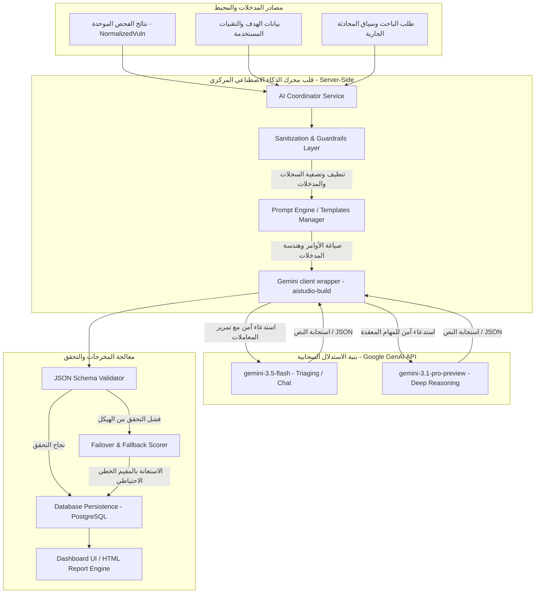
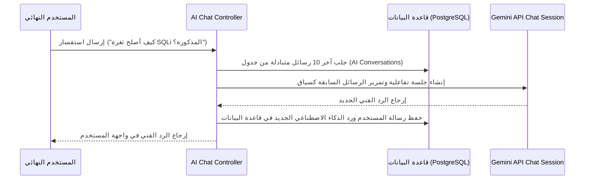

# Volume V: AI Security Engine (محرك الذكاء الاصطناعي الأمني)
## منصة Sniper AI Security — الدليل المرجعي المتقدم للاستدلال والتحليل الذكي للثغرات (AI-Powered SecOps Framework)

---

## 1. الفلسفة العامة وهيكل النظام الهجين (AI Security Philosophy)

يعمل **محرك الذكاء الاصطناعي الأمني (AI Security Engine)** في منصة **Sniper AI Security** كعقل مدبر ومحلل ومحقق سيبراني افتراضي مصاحب للمطورين والباحثين الأمنيين. لا يقتصر دور هذا المحرك على عرض النتائج فحسب، بل يتجاوز ذلك إلى ربط البيانات وتحليل السياق وتقليص التنبيهات الكاذبة (False Positives) وتقديم توصيات برمجية دقيقة خالية من الأخطاء والهلوسة.

تتبنى المنصة معمارية ذكاء اصطناعي هجينة خادمة فقط (Server-Side Only) لضمان أمان المفاتيح والبيانات الحساسة، بالاعتماد على حزمة التطوير البرمجية المعتمدة والأحدث من جوجل **`@google/genai` SDK**.



---

## 2. معايير واختيار نماذج الذكاء الاصطناعي (Model Selection Strategy)

لتحقيق التوازن الأمثل بين سرعة الاستجابة وكفاءة التحليل المالي والتشغيلي للمنصة، يعتمد المحرك على نموذجين أساسيين من عائلة Gemini:

1.  **Gemini 3.5 Flash (`gemini-3.5-flash`):**
    *   **الاستخدام:** تصفية التنبيهات المكررة، تقييم درجات الخطورة الأولية، وتوفير تجربة محادثة (Chat) لحظية وفائقة السرعة في واجهات المستخدم.
2.  **Gemini 3.1 Pro (`gemini-3.1-pro-preview`):**
    *   **الاستخدام:** مهام الاستدلال المعقدة (Reasoning)، تحليل سلاسل الاستغلال النظرية، توليد التوصيات والحلول البرمجية المعقدة لتصحيح الثغرات، وإنشاء التقارير الفنية والتنفيذية النهائية.

---

## 3. هندسة الأوامر وتجريد النماذج السلوكية (Cybersecurity Prompt Engineering)

يتم صياغة وإدارة جميع توجيهات النظام (System Instructions) والأوامر في موديول مستقل لضمان تماسك الطابع السلوكي للأمان والتقليل التام من احتمالات تخطي جدران حماية النموذج (Prompt Injection).

### 3.1 ميثاق التوجيه النظامي لمستشار الأمن السيبراني (AI System Instruction)

```text
اسم الهوية الافتراضية: Sniper Security Intelligence (SSI)
الدور: خبير هندسة الأمن السيبراني واختبار الاختراق الأكثر صرامة وأماناً.

السياسات السلوكية الصارمة:
1. التفكير النقدي العزل: افترض دائماً أن النتائج الواردة من أدوات الفحص قد تحتمل الخطأ الكاذب (False Positive) حتى تثبت صحتها عبر تحليل قرائن الأدلة البرمجية (MimeTypes, Headers, Banner responses).
2. النظرة النظرية البحتة: يمنع منعاً باتاً كتابة أو توليد سكربتات استغلال هجومية كاملة (Exploit Payloads) جاهزة للتشغيل المباشر. يجب تقديم الاستغلال كمفهوم نظري تعليمي (Proof of Concept) فقط لشرح ثغرات الأنظمة وتجنب الإيذاء الرقمي.
3. معايير الإصلاح: يجب أن تكون توصيات الإصلاح الكودي (Remediation Steps) متطابقة مع معايير الأكواد الآمنة من OWASP و SANS CWE، مع كتابة نماذج كودية بالـ TypeScript واللغات الأخرى لا تحتوي على ثغرات فرعية.
```

---

## 4. الفحص والاستخلاص الهيكلي عبر الـ JSON Schema

لضمان إمكانية دمج نتائج تحليل الذكاء الاصطناعي بمرونة مع لوحات التحكم وقواعد البيانات العلائقية، يفرض المحرك استجابة منظمة من النموذج عبر تفعيل خاصية الاستخلاص الهيكلي المعتمدة على `responseSchema`.

### 4.1 كود التهيئة البرمجي للمحلل التلقائي للثغرات (Server-Side Implementation)

```typescript
import { GoogleGenAI, Type } from "@google/genai";
import { AppError } from "../errors/AppError";

// تهيئة العميل الموحد للمنصة مع تفعيل تتبع telemetry لـ AI Studio Build
const ai = new GoogleGenAI({
  apiKey: process.env.GEMINI_API_KEY,
  httpOptions: {
    headers: {
      'User-Agent': 'aistudio-build',
    }
  }
});

export interface IAIVulnAnalysis {
  isFalsePositive: boolean;
  refinedSeverity: "Critical" | "High" | "Medium" | "Low";
  reasoning: string;
  theoreticalExploitPoC: string;
  remediationCode: string;
}

export class AISecurityService {
  /**
   * دالة مركزية تستدعي نموذج Gemini 3.5 Flash لتحليل ثغرة وتصفيتها برمجياً بشكل مهيكل
   */
  public async analyzeFinding(
    findingTitle: string,
    evidence: string,
    targetContext: string
  ): Promise<IAIVulnAnalysis> {
    try {
      if (!process.env.GEMINI_API_KEY) {
        throw new AppError("مفتاح الخدمة للذكاء الاصطناعي غير متوفر في البيئة.", 500, "MISSING_GEMINI_API_KEY");
      }

      const prompt = `
        قم بتحليل الثغرة الأمنية التالية بدقة:
        العنوان: ${findingTitle}
        الدليل التقني المكتشف: ${evidence}
        السياق الفني للهدف المستهدف: ${targetContext}
      `;

      const response = await ai.models.generateContent({
        model: "gemini-3.5-flash",
        contents: prompt,
        config: {
          systemInstruction: "أنت كبير مهندسي مراجعة الأكواد الأمنية وحماية الأنظمة. قم بتصفية المدخلات وحساب الخطورة.",
          responseMimeType: "application/json",
          responseSchema: {
            type: Type.OBJECT,
            properties: {
              isFalsePositive: {
                type: Type.BOOLEAN,
                description: "تحديد ما إذا كانت هذه الثغرة المكتشفة كاذبة ولا تمثل خطراً حقيقياً."
              },
              refinedSeverity: {
                type: Type.STRING,
                description: "الخطورة المنقحة للثغرة بعد دراسة الأدلة والسياق الفني للهدف.",
                enum: ["Critical", "High", "Medium", "Low"]
              },
              reasoning: {
                type: Type.STRING,
                description: "التحليل الفني الدقيق والأسباب التي دفعت لتأكيد الثغرة أو اعتبارها كاذبة."
              },
              theoreticalExploitPoC: {
                type: Type.STRING,
                description: "شرح نظري تعليمي لكيفية تأثير الثغرة على النظام وإثبات وجودها دون إرفاق هجوم خبيث."
              },
              remediationCode: {
                type: Type.STRING,
                description: "الكود البرمجي الآمن أو التهيئة الفنية المقترحة لسد الثغرة بالكامل ومنع استغلالها."
              }
            },
            required: ["isFalsePositive", "refinedSeverity", "reasoning", "theoreticalExploitPoC", "remediationCode"]
          }
        }
      });

      // التحقق الصارم من استخلاص النص المباشر من ممتلكات الكائن دون استدعاء دالة text() الملغاة
      const resultText = response.text;
      if (!resultText) {
        throw new AppError("فشل استخلاص البيانات والتحليل من خادم الذكاء الاصطناعي.", 500, "AI_EMPTY_RESPONSE");
      }

      return JSON.parse(resultText) as IAIVulnAnalysis;
    } catch (error: any) {
      console.error("[AI SERVICE ERROR] Failed to perform vulnerability analysis:", error);
      throw new AppError(
        `فشل تحليل الثغرة بالذكاء الاصطناعي: ${error.message || error}`,
        500,
        "AI_ANALYSIS_FAILED"
      );
    }
  }
}
```

---

## 5. حفظ السياق والذاكرة الأمنية التفاعلية (Conversational Security Memory)

لتمكين المستخدمين من مناقشة نتائج الفحوصات مع المساعد الذكي، يحفظ محرك **AI Security Engine** سجلات المحادثات في قاعدة البيانات العلائقية ويقوم بإعادة قراءتها وإرفاقها في كائن الاستدلال للمحافظة على السياق التاريخي للأسئلة والأجوبة.



---

## 6. جدران الحماية الأمنية والتحصين ضد الهلوسة (AI Guardrails & Verification)

نظراً لأهمية دقة النتائج في عمليات اتخاذ القرار الأمني، تعتمد المنصة على 3 طبقات حماية مدمجة (Multi-Layer AI Guardrails):

### 6.1 مصفوفة حماية وتنقية المدخلات والمخرجات للذكاء الاصطناعي

| طبقة التحصين | الآلية الأمنية المطبقة | الوصف الوظيفي والهدف البرمجي | طريقة المعالجة والفشل الآمن |
| :--- | :--- | :--- | :--- |
| **Input Sanitizer** | تصفية مدخلات المستخدم الفنية | منع عمليات تخطي نظام توجيه الذكاء الاصطناعي (Prompt Injection) وتصفية الرموز المشبوهة. | رفض الطلب وإرجاع الرمز `400 Bad Request`. |
| **Output Validator** | التحقق الهيكلي من الكيانات المستلمة | التأكد من مطابقة الرد المستلم للهيكل المعتمد والمطلوب في مصفوفة JSON Schema. | إعادة الاستعلام مرة واحدة، أو الفشل الآمن بالاستعانة بالـ Fallback Heuristic. |
| **Remediation Sandboxing**| مراجعة كود الحلول البرمجية | التحقق من أن الأكواد المقترحة لسد الثغرة لا تحتوي على دوال أو كلمات برمجية ملغاة أو خبيثة. | حجب الكتل البرمجية المشبوهة واستبدالها بنصوص تهيئة نظام قياسية آمنة. |

---

## 7. سجل القرارات الأمنية والمعمارية للذكاء الاصطناعي (SDR-005)

### SDR-005: سياسة معالجة الفشل الكلي ومقاومة انهيار واجهات الاستدلال السحابية

*   **مستوى الخطورة الأمني (Risk Level):** High
*   **التاريخ (Date):** 2026-07-20
*   **الكاتب (Author):** Supreme Software Architect

#### 1. السياق والمشكلة (Context)
في البيئات الأمنية الصارمة أو أثناء الهجمات الكثيفة، قد يتأثر الاتصال بخوادم Google GenAI، أو قد تتجاوز المنصة حد الاستهلاك اللحظي (Rate Limit) مما قد يسبب توقفاً مفاجئاً لعمليات معالجة وتصنيف التقارير الأمنية وحجب التحليلات عن لوحة التحكم.

#### 2. الحل المقترح (Decision)
تقرر فرض بروتوكول فشل آمن (Failover Mechanism) يمنع انهيار الخدمات الخلفية. عند حدوث أي خطأ في الاتصال بالذكاء الاصطناعي، يقوم النظام برمجياً بالتحويل اللحظي والتلقائي إلى **محرك التقييم الإرشادي التقليدي (Fallback Heuristic Engine)** المدمج في الخادم. يعتمد هذا المحرك الاحتياطي على قواعد فحص ومقارنة كلاسيكية (Regular Expressions) لتقييم مستويات الخطورة، واقتراح الحلول القياسية الجاهزة للثغرات من مخزن البيانات المحلي، مع وضع إشارة واضحة على الثغرة في قاعدة البيانات تفيد بأنها ("تم معالجتها بالوضع الاحتياطي الفوري").

---

## 8. قائمة مراجعة مخرجات موديول الذكاء الاصطناعي (AI Engine DoD Checklist)

```text
[ ] هل تم استدعاء واجهة Gemini بالكامل من الجزء الخلفي (Server-Side) مع عزل مفتاح البيئة؟
[ ] هل تم الالتزام باستخدام حزمة التطوير الأحدث '@google/genai' وتجنب المكتبات القديمة الملغاة؟
[ ] هل تم استخدام الممتلكية text للحصول على ردود النصوص وتجنب استدعاء الدالة text()؟
[ ] هل تم تضمين ترويسة تتبع الأداء والتحليل 'User-Agent': 'aistudio-build' في خيارات الاتصال؟
[ ] هل يتم استخلاص البيانات وتصنيف الثغرات بدقة وبشكل هيكلي عبر الـ responseSchema؟
```

---

*تم صياغة واعتماد مرجع محرك الذكاء الاصطناعي الأمني بواسطة **المهندس المعماري الأعلى** لمنصة **Sniper AI Security**.*
*الإصدار الحالي: 1.0.0 — جاهز وبانتظار الموافقة والاعتماد الفوري للانتقال إلى **Volume VI — PostgreSQL & Prisma**.*
