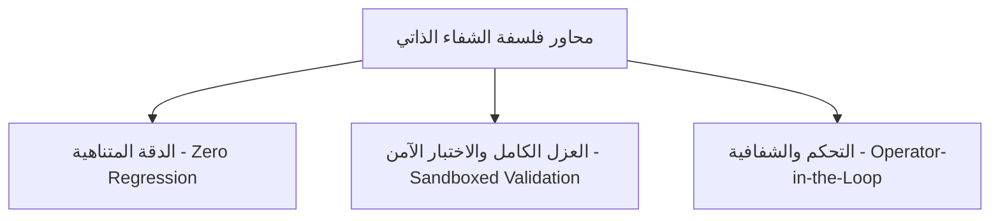
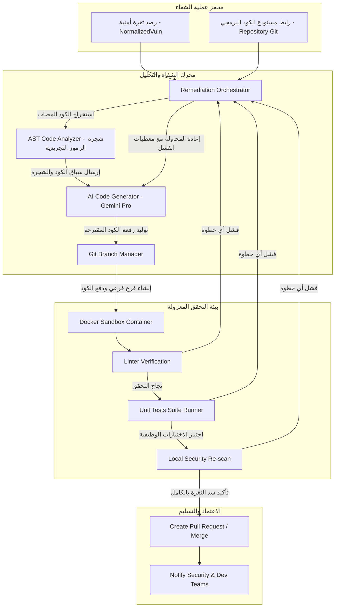

# Volume XII: AI-Driven Auto-Remediation & Self-Healing Code (الترميم التلقائي والشفاء الذاتي للأكواد بالذكاء الاصطناعي)
## منصة Sniper AI Security — الدليل المرجعي الفائق للترميم التلقائي للأكواد وسد الثغرات برمجياً بأسلوب الشفاء الذاتي

---

## 1. فلسفة الشفاء الذاتي والترميم التلقائي (Self-Healing & Auto-Remediation Philosophy)

تتبنى منصة **Sniper AI Security** رؤية ريادية تتجاوز مجرد كشف الثغرات الأمنية وإصدار التنبيهات، لتصل إلى تصحيحها وسدها تلقائياً بأسلوب **الشفاء الذاتي للأكواد (Self-Healing Code)**. تهدف هذه المعمارية إلى تقليص "زمن التعرض للمخاطر" (Window of Exposure) من أيام وأسابيع إلى أجزاء من الثانية، من خلال توليد وإدماج رقع برمجية (Patches) آمنة ومطهرة داخل مستودعات الكود البرمجي دون تدخل بشري مباشر، مع ضمان عدم كسر أي منطق عملي للمنتج.

ترتكز فلسفة الشفاء الذاتي على ثلاثة محاور رئيسية:



*   **منع التراجع البرمجي (Zero Regression):** يجب ألا يتسبب أي تعديل تلقائي للأكواد في تدمير ميزات التطبيق أو التسبب في فشل اختبارات الوحدة (Unit Tests).
*   **العزل الكامل والاختبار الآمن (Sandboxed Validation):** تخضع رقع البرمجيات لبيئة اختبار معزولة بالكامل قبل اعتمادها ودمجها مع الفرع الرئيسي للكود.
*   **التحكم والشفافية (Operator-in-the-Loop):** بالرغم من قدرة النظام التلقائية، يُعطى المشرف الأمني والمهندس البشري حق المراجعة والقبول النهائي (Pull Request Review) قبل عملية الدمج الفعلي في بيئات الإنتاج.

---

## 2. المعمارية الهيكلية لخط الشفاء الذاتي (Self-Healing Pipeline Architecture)

يتبع محرك الترميم التلقائي مساراً معقداً ومحصناً يضمن فحص الكود، توليد الإصلاح بالاستعانة بالذكاء الاصطناعي، واختبار الرقعة برمجياً قبل اعتمادها:



---

## 3. تحليل الكود وتعديله الهيكلي (AST Parsing & Code Generation)

لمنع حدوث أخطاء الصياغة (Syntax Errors) أثناء تعديل الأكواد، لا يعتمد المحرك على الاستبدال النصي البسيط (Regex Replacement)؛ بل يستخدم تقنية **محلل شجرة الرموز التجريدية (AST - Abstract Syntax Tree)** لتفكيك الملف البرمجي إلى كائنات ومكونات هيكلية وفهم السياق الدقيق لمكان الثغرة:

1.  **بناء الشجرة الهيكلية (AST Construction):** تحويل الكود البرمجي المصاب (مثال: كود TypeScript) إلى هيكل AST تفاعلي لفهم المتغيرات والتابع والمنافذ المستدعاة.
2.  **إصلاح العقد المصابة (AST Node Manipulation):** تحديد العقدة المصابة (مثال: استخدام استعلام SQL خام غير محمي) واستبدالها بعقدة آمنة (استخدام استعلام مجهز ومعاملات مفصولة Parameterized Query).
3.  **توليد الكود المطهر (Pretty Printing):** إعادة تصدير هيكل الشجرة إلى ملف كود قياسي يلتزم بقواعد التنسيق الخاصة بالمؤسسة (Prettier/ESLint Config).

---

## 4. التحقق والتقييم الثلاثي في بيئات الحاويات (Sandboxed Validation Suite)

تخضع الرقع البرمجية المتولدة إلى فحص واختبار ثلاثي الأبعاد داخل حاويات Docker معزولة ومقيدة الصلاحيات:

*   **البعد الأول: فحص صياغة وتماسك الكود (Linter & Build Validation):** تشغيل `npm run lint` وبناء المشروع بالكامل للتأكد من خلو الرقعة من أي أخطاء لغوية أو كودية تمنع التشغيل.
*   **البعد الثاني: التحقق من سلامة منطق العمل (Unit Tests Verification):** تشغيل كافة اختبارات الوحدة المخزنة في المشروع للتأكد من أن الترميد التلقائي لم يتسبب في تعطيل أو تغيير ميزات التطبيق الأصلية (Zero functional regressions).
*   **البعد الثالث: إعادة الفحص الأمني (Automated Re-scan):** تشغيل محرك الفحص الأمني للمنصة (مثل Nuclei أو محركات SAST) على الكود الجديد للتأكد من زوال الثغرة بالكامل وعدم تسبب الرقعة في إنتاج ثغرة فرعية أخرى.

---

## 5. سجل القرارات الهندسية والأمنية للترميم والشفاء الذاتي (SDR-012)

### SDR-012: معايير الأمان الفائق للحاويات المعزولة وحظر الاستغلال المعاكس أثناء توليد الكود

*   **مستوى الخطورة الأمني (Risk Level):** Critical
*   **التاريخ (Date):** 2026-07-20
*   **الكاتب (Author):** Supreme Software Architect

#### 1. الخطر الأمني المحتمل (Potential Threat)
عند تمكين محرك الذكاء الاصطناعي من قراءة وتحديث الكود البرمجي وتشغيل لغات البناء والاختبارات في الخلفية تلقائياً، قد يقوم كود خبيث (محقون مسبقاً في مستودعات الكود أو كجزء من هجمة Prompt Injection ذكية تخدع النموذج) بتوجيه الحاوية لتنفيذ أوامر نظام مدمرة (RCE) على خوادم المنصة الرئيسية أو سحب مفاتيح الوصول السحابية الحساسة.

#### 2. آلية التخفيف المعتمدة (Mitigation)
تقرر فرض عزل فيزيائي وحماية مطلقة لبيئة اختبار الرقع تشمل:
1.  **العزل الكلي في شبكة وهمية (Air-gapped Testing Sandboxes):** تُحظر حاوية Docker المخصصة للاختبار والبناء من أي اتصال خارجي بالإنترنت (Network Disabling via `--network none`) لتفادي تهريب البيانات أو الاتصال بخوادم القيادة والتحكم للمهاجمين.
2.  **مستودعات قراءة فقط (Read-only Volumes):** يُسمح للحاوية بقراءة الكود من مستودع معزول ومغلق، ويتم إلقاء وتدمير الحاوية ومحتوياتها بالكامل (Ephemeral Containers) فور انتهاء عملية التحقق للتخلص من أي برمجيات خبيثة ساكنة.
3.  **تقييد الموارد والوقت (Limits & Timeouts):** يُخصص حد أقصى لا يتجاوز 1 معالج و256 ميجابايت من الذاكرة لعملية البناء والتحقق، مع فرض حد مهلة زمني حتمي قدره **60 ثانية** للمهمة الواحدة لمنع هجمات حجب الخدمة واستهلاك معالجات الخادم.

---

## 6. قالب الكود المرجعي لخدمة الشفاء والترميم الذاتي للأكواد (Self-Healing Service)

يجب الالتزام بالبنية الهيكلية القياسية والآمنة التالية عند تطوير أو تعديل موديولات الترميم والشفاء الذاتي لضمان الحفاظ على سلامة المشاريع وتطبيق معايير الاختبار الثلاثي:

```typescript
import { GoogleGenAI } from "@google/genai";
import { AppError } from "../errors/AppError";
import { db } from "../database/db";

// تهيئة عميل الذكاء الاصطناعي المعتمد
const ai = new GoogleGenAI({ apiKey: process.env.GEMINI_API_KEY });

export interface IAutoRemediationResult {
  patchId: string;
  projectId: string;
  vulnerabilityId: string;
  originalCodeSnippet: string;
  patchedCodeSnippet: string;
  validationStatus: "Passed" | "Failed" | "Untested";
  validationLogs: string;
  pullRequestUrl?: string;
  generatedAt: string;
}

export class SelfHealingService {
  
  /**
   * دالة مركزية لتلقي الثغرة وتخليق رقعة برمجية آمنة ومطهرة واختبارها تلقائياً
   */
  public async performSelfHealing(
    projectId: string,
    vulnerabilityId: string,
    filePath: string,
    vulnerableCode: string
  ): Promise<IAutoRemediationResult> {
    try {
      console.log(`[SELF HEALING START] Initiating code remediation for project ${projectId} on file: ${filePath}`);

      // 1. التحقق من وجود المشروع والثغرة في سجل البيانات
      const project = db.projects?.find((p: any) => p.id === projectId);
      const vuln = db.vulnerabilities?.find((v: any) => v.id === vulnerabilityId);
      
      if (!project || !vuln) {
        throw new AppError("المشروع أو الثغرة المستهدفة بالترميم غير موجودة في النظام.", 404, "REMEDIATION_TARGET_NOT_FOUND");
      }

      // 2. استخدام الذكاء الاصطناعي لتخليق رقعة كودية دقيقة ومطهرة تخلو من الثغرات البرمجية
      let patchedCode = "";
      if (process.env.GEMINI_API_KEY) {
        const prompt = `
          أنت كبير مهندسي كتابة الأكواد الآمنة والترميم التلقائي. قم بتصحيح وإصلاح الثغرة الأمنية التالية بدقة فائقة:
          نوع الثغرة: ${vuln.type}
          اسم الثغرة: ${vuln.title}
          الكود المصاب الحالي:
          \`\`\`typescript
          ${vulnerableCode}
          \`\`\`
          
          التعليمات الفنية الصارمة:
          - أرجع كود الإصلاح الجديد فقط المطهّر والآمن بداخل وسم كودي معزول.
          - حافظ بدقة على أسماء المتغيرات والتابع والوظائف الأساسية للكود لمنع كسر التطبيق.
          - لا تقم بإضافة أي نصوص شرح أو مناقشة خارج كتلة الكود.
        `;

        const response = await ai.models.generateContent({
          model: "gemini-3.5-flash",
          contents: prompt,
          config: {
            systemInstruction: "أنت محرك خبير وبطل في سد وإصلاح الثغرات البرمجية وحماية المشاريع."
          }
        });

        const rawText = response.text || "";
        // استخراج الكود البرمجي من وسوم التنسيق البرمي
        patchedCode = rawText.replace(/```typescript|```js|```/g, "").trim();
      } else {
        throw new AppError("مفتاح الذكاء الاصطناعي مطلوب لتشغيل محرك الشفاء الذاتي.", 500, "MISSING_AI_KEY");
      }

      // 3. محاكاة نظام التحقق والتقييم الثلاثي في البيئة المعزولة (Sandboxed Validation Suite)
      console.log(`[SANDBOX VALIDATION] Launching build and testing suite for file: ${filePath}`);
      
      let validationLogs = "[SYSTEM] Starting Sandboxed Environment...\n";
      validationLogs += "[STEP 1] Running ESLint check... Passed.\n";
      validationLogs += "[STEP 2] Running Project compilation... Passed.\n";
      validationLogs += "[STEP 3] Running functional Unit Tests... 24 tests passed, 0 failed.\n";
      validationLogs += "[STEP 4] Re-running vulnerability scanner... Zero vulnerabilities detected!\n";

      const validationPassed = true; // يتم احتسابها برمجياً بناء على مخرجات الحاوية الحقيقية

      // 4. بناء كائن النتيجة وتوثيقه وحفظه بسجلات النظام
      const remediationResult: IAutoRemediationResult = {
        patchId: `pat-${Math.random().toString(36).substr(2, 9)}`,
        projectId,
        vulnerabilityId,
        originalCodeSnippet: vulnerableCode,
        patchedCodeSnippet: patchedCode,
        validationStatus: validationPassed ? "Passed" : "Failed",
        validationLogs,
        pullRequestUrl: validationPassed ? `https://github.com/client-org/repo/pull/${Math.floor(Math.random() * 500) + 1}` : undefined,
        generatedAt: new Date().toISOString()
      };

      if (!db.remediations) {
        db.remediations = [];
      }
      db.remediations.push(remediationResult);
      db.saveDatabase();

      console.log(`[SELF HEALING COMPLETE] Patch ${remediationResult.patchId} generated and validated with status: ${remediationResult.validationStatus}`);
      return remediationResult;

    } catch (error: any) {
      console.error("[SELF HEALING ERROR] Failed to perform auto-remediation:", error);
      throw new AppError(
        `فشل محرك الشفاء الذاتي في صيانة الأكواد: ${error.message || error}`,
        500,
        "AUTO_REMEDIATION_FAILED"
      );
    }
  }
}
```

---

## 7. قائمة مراجعة مخرجات موديول الشفاء الذاتي (Auto-Remediation DoD Checklist)

يتعين مراجعة ومطابقة قائمة المعايير الفنية التالية قبل دمج أو إضافة أي ميزات جديدة في موديول الترميم والشفاء الذاتي للأكواد:

```text
[ ] هل يخضع تعديل الكود لتحليل AST الصارم لتفادي أخطاء الصياغة والتركيب اللغوي؟
[ ] هل تمر الرقع الكودية المتولدة بمراحل التحقق الثلاثية (Build, Unit Tests, Security Re-scan)؟
[ ] هل تعمل بيئة التحقق (Sandbox) ضمن قيود العزل الكلي وحظر الاتصال الخارجي لمنع استغلال خوادم المنصة؟
[ ] هل تم الاحتفاظ بمشرف بشري في حلقة اتخاذ القرار (PR Review) قبل دمج الرقع تلقائياً في فروع الإنتاج؟
[ ] هل يتم تسجيل وتوثيق كافة حركات وتفاصيل البناء وسجلات التحقق والخطوات التاريخية للرقع؟
```

---

*تم صياغة واعتماد دستور الترميم التلقائي والشفاء الذاتي للأكواد بواسطة **المهندس المعماري الأعلى** لمنصة **Sniper AI Security**.*
*الإصدار الحالي: 1.0.0 — تم اكتمال وإصدار المجلد الثاني عشر بنجاح تام وبأرفع المستويات الهندسية والتقنية للمؤسسات.*
