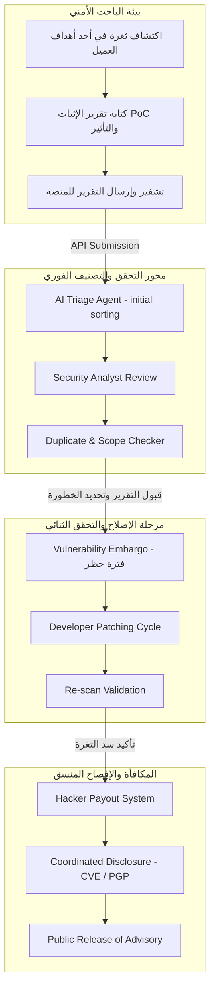

# Volume XI: Bug Bounty & Vulnerability Disclosure Platform (إدارة برامج مكافآت الثغرات والإفصاح الأمني)
## منصة Sniper AI Security — الدليل المرجعي الفائق لإدارة مجتمع الباحثين وتأمين عمليات الإفصاح المنسق عن الثغرات

---

## 1. فلسفة أمن الحشود والإفصاح المنسق (Crowdsourced Security Philosophy)

تتبنى منصة **Sniper AI Security** رؤية متكاملة تفيد بأن الأنظمة الأكثر أماناً هي تلك التي تدمج قوة الفحص الآلي المستمر مع العقلية الإبداعية لمجتمع الباحثين الأمنيين وخبراء اختبار الاختراق (Crowdsourced Security). تمثل واجهة **Bug Bounty & Coordinated Vulnerability Disclosure (CVD)** الملاذ الآمن والمنظم الذي يربط بين الباحثين الأمنيين والمؤسسات لضمان الإبلاغ عن الثغرات ومعالجتها قبل أن يتم استغلالها من قبل جهات معادية.

تلتزم المنصة بمفهوم **الملاذ الآمن (Safe Harbor)** الذي يضمن للباحثين الحماية القانونية الكاملة ما داموا ملتزمين بقواعد الفحص والإفصاح المحددة في سياسة البرنامج، وتعتمد في ذلك على معايير المنظمات الدولية مثل **ISO/IEC 29147** و **ISO/IEC 30111**.



---

## 2. ميكانيكية التحقق والتصنيف المدعومة بالذكاء الاصطناعي (AI-Powered Triaging Engine)

لتوفير كلفة المراجعة اليدوية وتقليص زمن الاستجابة للباحثين (Time-to-Triage)، يشتمل هذا الموديول على محرك ذكاء اصطناعي مساعد يتبع الخطوات التلقائية التالية فور استقبال أي تقرير ثغرة:

### 2.1 مراحل التحليل والتحقق من التقارير (Triaging Pipeline States)
1.  **الفحص الهيكلي والتنظيف (Sanitization & Parser):** استخراج المعطيات الأساسية، عناوين الـ URL المستهدفة، والرموز الكودية المرفقة لتصفيتها من هجمات حقن الكود (Prompt/XSS injection).
2.  **كشف التقارير المكررة (Duplicate Detection):** يقوم المحرك بمطابقة المعاملات الفرعية للثغرة (مثل مسار الطلب، فئة CWE، واسم البارامتر المستغل) مع قائمة الثغرات المقبولة أو النشطة في قاعدة البيانات لتحديد ما إذا كان التقرير مكرراً (Duplicate) في أجزاء من الثانية.
3.  **التقييم التقني وحساب الخطورة (Automated CVSS Validation):** مطابقة وصف الباحث ونطاق التأثير المذكور مع معايير CVSS v3.1 الحقيقية لتصحيح الدرجات المبالغ فيها من قبل الباحثين بشكل موضوعي وخالٍ من الانحياز.

---

## 3. تكامل المكافآت والمدفوعات الآمنة (Secure Hacker Payouts & Escrow)

للحفاظ على ثقة مجتمع الباحثين وضمان تيسير سداد الجوائز والمكافآت المالية (Bounties) بشكل فوري وآمن، تدعم البنية التحتية للمنصة دمج بوابات دفع وسداد مرنة تخضع لقيود الحوكمة والمطابقة المالية:

### 3.1 جدول وهيكلية فئات المكافآت المالية المعتمدة بناء على مستويات الخطورة

تتبنى المنصة مصفوفة مرجعية دقيقة لتحديد نسب ومقادير التعويضات المالية، بما يضمن العدالة التامة والمطابقة لميزانية المؤسسات:

| فئة خطورة الثغرة | نقاط CVSS v3.1 | المكافأة المالية المقترحة (Enterprise Standard) | الحد الأقصى للمعالجة والسداد |
| :--- | :---: | :--- | :--- |
| 🔴 **خطورة فائقة (Critical)** | 9.0 - 10.0 | **$2,500 - $10,000+** (مثل اختراق كامل لقاعدة البيانات) | خلال **5 أيام عمل** من تأكيد الإصلاح. |
| 🟠 **خطورة مرتفعة (High)** | 7.0 - 8.9 | **$1,000 - $2,499** (مثل قراءة ملفات النظام الحساسة LFI) | خلال **10 أيام عمل**. |
| 🟡 **خطورة متوسطة (Medium)**| 4.0 - 6.9 | **$300 - $999** (مثل تخطي جدران حماية CORS) | خلال **15 يوم عمل**. |
| 🔵 **خطورة منخفضة (Low)** | 0.1 - 3.9 | **$50 - $299** (مثل تسريب إصدارات الحزم والبرمجيات) | خلال **30 يوم عمل**. |

---

## 4. الإفصاح المنسق وفترة الحظر الأمني (Coordinated Vulnerability Disclosure & Embargo)

تتبع المنصة سياسة حظر فنية صارمة (Vulnerability Embargo) تحمي المؤسسات من النشر العشوائي للثغرات قبل معالجتها:

*   **فترة الحظر القياسية (Default Embargo Period):** يتم فرض فترة حظر مدتها **90 يوماً** تلقائياً فور تأكيد وجود الثغرة. يُمنع خلالها الباحث أو أي طرف من أطراف النظام من نشر تفاصيل الثغرة أو الأكواد المرفقة بها للعامة.
*   **تمديد الحظر التوافقي (Mutual Extension):** يُسمح بتمديد فترة الحظر لـ **30 يوماً** إضافية في الحالات الفنية المعقدة التي تتطلب تعديلاً جذرياً لبنية الأنظمة أو إصدار تحديثات برمجية شاملة للعملاء.
*   **طلب معرف الـ CVE (CVE Request Pipeline):** بمجرد اعتماد الإصلاح بنجاح وقبل رفع الحظر، يتولى المحرك التلقائي للمنصة الاتصال بقاعدة بيانات MITRE العالمية لإصدار وحجز معرّف ثغرة قياسي (CVE ID) للمساهمة في السجلات العالمية وتوثيق جهد الباحث الأمني بشكل رسمي.

---

## 5. سجل القرارات الهندسية والأمنية لإدارة الثغرات ومكافآت البرامج (SDR-011)

### SDR-011: معايير التحقق والتحصين المالي ضد هجمات الاحتيال وغسيل الأموال في مدفوعات الباحثين

*   **مستوى الخطورة الأمني (Risk Level):** High
*   **التاريخ (Date):** 2026-07-20
*   **الكاتب (Author):** Supreme Software Architect

#### 1. الخطر الأمني المحتمل (Potential Threat)
قد يتم استخدام برامج مكافآت الثغرات كوسيلة للاحتيال المالي أو غسيل الأموال، حيث يقوم مهاجمون باختراق حسابات باحثين حقيقيين أو محاولة الإبلاغ عن ثغرات مصطنعة مسبقاً بالتوافق مع بعض مسؤولي النظام الداخليين للاستيلاء على أموال وجوائز المؤسسات دون وجه حق.

#### 2. آلية التخفيف المعتمدة (Mitigation)
تقرر فرض جدران حماية وقواعد تحقق صارمة تشمل:
1.  **التحقق التلقائي من الهوية (KYC - Know Your Customer):** يلتزم الباحث الأمني بإتمام عملية التحقق من الهوية الشخصية وجواز السفر عبر مزودين معتمدين قبل تمكينه من سحب أي مبالغ مالية تتجاوز $100.
2.  **موافقة متعددة الأطراف (Multi-Signature Approvals):** يمنع النظام خروج أي مبالغ مكافآت تقع ضمن الفئات (Critical / High) بشكل تلقائي. تتطلب عملية الصرف توقيعاً رقمياً وموافقة من طرفين مستقلين: (المحلل الأمني المكلف، والمدير المالي للمؤسسة).
3.  **تجميد السحب المؤقت (Holding Period):** يتم تجميد أموال المكافأة في نظام عزل مالي مخصص (Escrow Wallet) لمدة **7 أيام** كحد أدنى من تاريخ اعتماد الإصلاح والموافقة للتأكد من عدم وجود أي نزاعات برمجية أو بلاغات احتيال مرتبطة بالثغرة.

---

## 6. قالب الكود المرجعي لاستقبال وتقييم طلبات الثغرات (Submission Controller Template)

يجب الالتزام بتبني الهيكل البرمجي القياسي والآمن التالي عند بناء أو تعديل مسارات استقبال بلاغات الثغرات لضمان المطابقة الكاملة لقواعد التصنيف والأمان:

```typescript
import { Response, NextFunction } from "express";
import { AuthenticatedRequest } from "../middleware/auth";
import { AppError } from "../errors/AppError";
import { db } from "../database/db";

export interface IBugBountySubmission {
  id: string;
  projectId: string;
  targetId: string;
  researcherId: string;
  title: string;
  cweCategory: string;
  severity: "Critical" | "High" | "Medium" | "Low";
  cvssScore: number;
  stepsToReproduce: string;
  pocEvidence: string;
  status: "New" | "Triaged" | "Duplicate" | "Resolved" | "Closed";
  payoutAmount: number;
  submittedAt: string;
}

export class BugBountyController {
  
  /**
   * متحكم استقبال وتصنيف بلاغ جديد لثغرة أمنية بشكل آمن ومطهر
   */
  public submitVulnerability = async (
    req: AuthenticatedRequest,
    res: Response,
    next: NextFunction
  ) => {
    try {
      const { projectId, targetId, title, cweCategory, stepsToReproduce, pocEvidence, estimatedSeverity } = req.body;
      const researcherId = req.user?.id;

      // 1. فحص وتطهير المدخلات الأساسية لمنع هجمات الحقن
      if (!projectId || !targetId || !title || !stepsToReproduce) {
        throw new AppError("المعطيات والبيانات الأساسية للبلاغ غير مكتملة.", 400, "INCOMPLETE_SUBMISSION");
      }

      const sanitizedTitle = String(title).trim().substring(0, 150);
      
      // 2. التحقق من وجود الهدف والمشروع وصلاحية الفحص
      const target = db.targets.find((t: any) => t.id === targetId && t.projectId === projectId);
      if (!target) {
        throw new AppError("الهدف المحدد غير موجود بالنظام أو لا يتبع للمشروع المختار.", 404, "TARGET_NOT_FOUND");
      }

      // 3. كشف التقارير المكررة برمجياً عبر مطابقة البصمات (Signature/Path matching)
      const isDuplicate = db.bountySubmissions?.some((sub: any) => 
        sub.projectId === projectId &&
        sub.targetId === targetId &&
        sub.cweCategory === cweCategory &&
        sub.status !== "Closed"
      );

      const status = isDuplicate ? "Duplicate" : "New";

      // 4. إنشاء كيان البلاغ وحفظه بسجلات النظام
      const newSubmission: IBugBountySubmission = {
        id: `sub-${Math.random().toString(36).substr(2, 9)}`,
        projectId,
        targetId,
        researcherId,
        title: sanitizedTitle,
        cweCategory: cweCategory || "CWE-200",
        severity: estimatedSeverity || "Medium",
        cvssScore: estimatedSeverity === "Critical" ? 9.0 : estimatedSeverity === "High" ? 7.5 : estimatedSeverity === "Medium" ? 5.0 : 2.5,
        stepsToReproduce: stepsToReproduce,
        pocEvidence: pocEvidence || "",
        status: status,
        payoutAmount: 0.0, // يتم تحديدها وتعديلها لاحقاً بواسطة المحلل الأمني
        submittedAt: new Date().toISOString()
      };

      // حفظ البلاغ في قاعدة البيانات
      if (!db.bountySubmissions) {
        db.bountySubmissions = [];
      }
      db.bountySubmissions.push(newSubmission);
      db.saveDatabase();

      console.log(`[BUG BOUNTY SUBMITTED] Ref: ${newSubmission.id} | Status: ${newSubmission.status}`);

      return res.status(201).json({
        success: true,
        message: isDuplicate 
          ? "نشكرك على مساهمتك، تم تسجيل البلاغ ولكن تم تصنيفه كتقرير مكرر لثغرة تم الإبلاغ عنها مسبقاً." 
          : "تم استلام تقرير الثغرة بنجاح، وجاري التحقق والتصنيف بواسطة فريق التحليل الأمني والذكاء الاصطناعي للمنصة.",
        data: {
          submissionId: newSubmission.id,
          status: newSubmission.status
        }
      });

    } catch (error) {
      next(error); // تمرير الأخطاء لمحرك الأخطاء المركزي
    }
  };
}
```

---

## 7. قائمة مراجعة مخرجات موديول مكافآت الثغرات (Bug Bounty DoD Checklist)

يتعين استيفاء ومطابقة قائمة الشروط التالية قبل اعتماد ودمج أي ميزات جديدة في موديول برامج مكافآت الثغرات:

```text
[ ] هل يخضع موديول مكافآت الثغرات لقوانين وسياسات الملاذ الآمن (Safe Harbor) والإفصاح المنسق؟
[ ] هل تم دمج نظام كشف التقارير المكررة التلقائي لمنع تكرار دفع المكافآت عن نفس الثغرة؟
[ ] هل تطبق قواعد الصرف المالي محددات الأمان الثنائي والتحقق من الهويات (KYC) للحماية من الاحتيال؟
[ ] هل تم توفير حظر أمني تلقائي (Embargo) مدته 90 يوماً على تفاصيل الثغرات المقبولة حتى إتمام سدها بالكامل؟
[ ] هل تم التحقق من تصفية وتطهير المدخلات ونصوص الإثبات (PoC) لحماية لوحة تحكم المحللين الأمنيين؟
```

---

*تم صياغة واعتماد دستور برامج مكافآت الثغرات والإفصاح الأمني بواسطة **المهندس المعماري الأعلى** لمنصة **Sniper AI Security**.*
*الإصدار الحالي: 1.0.0 — تم اكتمال وإصدار المجلد الحادي عشر بنجاح تام وبأرقى المعايير الهندسية للمؤسسات.*
