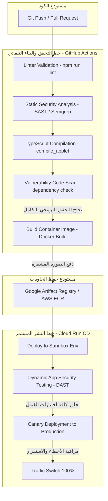
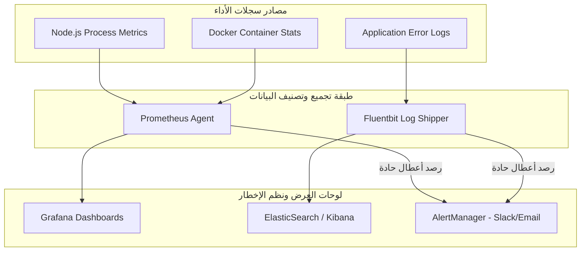

# Volume X: Deployment, DevOps & Cloud Infrastructure (النشر، العمليات السحابية وإدارة البنية التحتية البرمجية)
## منصة Sniper AI Security — الدليل المرجعي لتكامل وتركيب الحاويات وإدارة موارد المنصة في بيئات الإنتاج (Enterprise Cloud-Native Deployment Guide)

---

## 1. فلسفة النشر السحابي والأمان المعماري (Cloud-Native Deployment Philosophy)

تتبنى منصة **Sniper AI Security** بنية نشر حديثة ومحسنة تتبع معايير **التطبيقات السحابية الأصلية (Cloud-Native Applications)** بالكامل. نظراً لحساسية العمليات التي تجريها المنصة واحتوائها على أدوات اختبار الاختراق النشطة، فإن فلسفة النشر لدينا ترتكز على مبادئ أمان صارمة تعزل بيئة التشغيل عن أي اختراق أو هجوم معاكس.

### 1.1 مبادئ هندسة العمليات السحابية (DevOps Core Tenets)
*   **البنية التحتية كأكواد (IaC - Infrastructure as Code):** يتم تمثيل وتوليد كافة موارد الشبكة، الحاويات، وقواعد البيانات السحابية برمجياً عبر ملفات تهيئة مستقلة (Terraform) لضمان اتساق البيئات ومنع الأخطاء البشرية أثناء الإعداد اليدوي.
*   **الحاويات غير القابلة للتعديل (Immutable Infrastructure):** بمجرد بناء حاوية النظام واختبارها بنجاح في ممرات التطوير المستمر (CI/CD Pipelines)، يتم تجميد صورتها (Container Image) ونشرها في بيئات الإنتاج دون إجراء أي تعديل مباشر عليها داخل الخوادم.
*   **عزل الامتيازات والمصادر (Principle of Least Privilege):** تعمل خوادم وحاويات المنصة بأدنى صلاحيات وصول ممكنة على السحابية. يتم توجيه الصلاحيات ديناميكياً باستخدام هويات الخدمة (Service Accounts) بدلاً من تشفير مفاتيح الوصول الطويلة في ملفات التهيئة.

---

## 2. حاويات النظام والتركيب الموحد (Dockerization & Containerization Specification)

تعتمد المنصة على تقنية **Docker** لبناء حاويات خفيفة، معزولة وآمنة. يتم بناء صور الحاويات باتباع نهج البناء متعدد المراحل (Multi-stage Build) لتقليص حجم الصورة النهائية لأقل حد ممكن واستبعاد كافة حزم ومكتبات التطوير البرمجي غير الضرورية للتشغيل (كود المصدر الأصلي، ملفات TypeScript، ومجلدات الاختبارات).

### 2.1 كائن تهيئة الحاوية القياسي الموحد (`Dockerfile`)

```dockerfile
# ====================================================================
# المرحلة الأولى: بناء وتجميع واجهات المستخدم والخدمات الخلفية
# ====================================================================
FROM node:20-alpine AS builder

WORKDIR /usr/src/app

# نسخ ملفات حزم الاعتماديات لتفعيل آلية الكاش السريعة لـ Docker
COPY package*.json ./
RUN npm ci

# نسخ كود المصدر وإعدادات المشروع بالكامل
COPY . .

# تشغيل البناء الموحد لإنتاج ملفات الواجهة الساكنة وكود الخادم المترابط
RUN npm run build

# ====================================================================
# المرحلة الثانية: تجهيز الحاوية النهائية المخصصة للتشغيل والإنتاج
# ====================================================================
FROM node:20-alpine AS runner

WORKDIR /usr/src/app

# تثبيت الأدوات والبرمجيات الأمنية الأساسية لمحرك الفحص (Nmap, Subfinder, etc.)
RUN apk add --no-cache \
    nmap \
    ca-certificates \
    curl \
    bash

# تعيين بيئة التشغيل لنمط الإنتاج
ENV NODE_ENV=production
ENV PORT=3000

# إنشاء حساب مستخدم نظام منخفض الصلاحيات (غير تجذيري) لعزل تشغيل الحاوية أمنياً
RUN addgroup -g 1001 -S nodejs && \
    adduser -u 1001 -S runner -G nodejs

# نسخ الحزم البرمجية والملفات المبنية مسبقاً من مرحلة البناء حصراً
COPY --from=builder /usr/src/app/package*.json ./
COPY --from=builder /usr/src/app/dist ./dist
COPY --from=builder /usr/src/app/node_modules ./node_modules

# تغيير ملكية الملفات لحساب المستخدم منخفض الصلاحيات
RUN chown -R runner:nodejs /usr/src/app

# تفعيل حساب المستخدم المعزول لتشغيل العمليات
USER runner

# فتح منفذ الوصول القياسي المعتمد للمنصة
EXPOSE 3000

# أمر تشغيل الخادم والمنصة الرئيسي
CMD ["node", "dist/server.cjs"]
```

---

## 3. خطوط البناء والتكامل المستمر (CI/CD Pipeline & Orchestration)

تخضع كافة التعديلات البرمجية المدفوعة لمستودع المنصة إلى فحص تلقائي شامل ومقيد بمصفوفة الجودة لضمان تماسك النظام وخلوه من الثغرات قبل نقله آلياً إلى بيئة الإنتاج السحابية.



---

## 4. إدارة التهيئة والمفاتيح السرية (Configuration & Secrets Management)

تمنع المنصة بشكل حاسم كتابة أي مفاتيح برمجية، رموز سرية، أو معلومات اتصال بقاعدة البيانات داخل ملفات الكود مباشرة (Hardcoded Secrets). 

### 4.1 سياسات حماية المفاتيح وإدارة الثقة
*   **خزائن المفاتيح السحابية (Secrets Manager):** يتم حقن كافة المتغيرات السرية الحساسة مثل مفتاح الذكاء الاصطناعي `GEMINI_API_KEY` ورابط قاعدة البيانات `DATABASE_URL` ديناميكياً في ذاكرة حاويات النظام عند التشغيل باستخدام خزائن سحابية آمنة ومحمية (مثل Google Secret Manager أو HashiCorp Vault).
*   **فصل المتغيرات العامة (Environment Variables):** يتم تقسيم ملفات البيئة بوضوح تتبعاً لمعايير الأمان:
    *   `.env.example`: يوثق هيكل وأسماء المتغيرات البرمجية المطلوبة للتشغيل، ويُحظر إضافة أي قيم سرية حقيقية داخله.
    *   `.env`: يحتوي على القيم التجريبية المحلية ويضاف تلقائياً لملف التجاهل `.gitignore` لمنع دفعه عن طريق الخطأ لمستودعات الكود.

---

## 5. المراقبة والمتابعة واستكشاف الأخطاء (Observability, Monitoring & Alerting)

تتطلب إدارة المنصة في بيئات الإنتاج تتبعاً مستمراً ولحظياً لكفاءة التشغيل ورصد أي سلوك مشبوه أو زيادة مفاجئة في معدلات استهلاك المعالجات والذاكرة.

### 5.1 مصفوفة وأدوات المراقبة المعتمدة في بيئات التشغيل



*   **مراقبة مقاييس الأداء (Performance Metrics):** نستخدم **Prometheus** بالتكامل مع **Grafana** لرصد معدلات استهلاك الذاكرة، حجم الطوابير المعلقة، وعدد المعالجات الفرعية النشطة.
*   **تجميع السجلات المركزية (Centralized Logging):** يتم توجيه مخرجات سجلات الخادم القياسية (Stdout / Stderr) آلياً عبر برمجيات الشحن (Fluentbit) إلى مستودعات مركزية (ElasticSearch) لتسهيل فلترة وتتبع الأخطاء البرمجية واستكشاف الاختراقات.

---

## 6. سجل القرارات الهندسية للنشر والعمليات (ADR-010)

### ADR-010: اعتماد منصة Google Cloud Run للنشر وتفعيل تقنية الحماية gVisor

*   **الحالة (Status):** Accepted
*   **التاريخ (Date):** 2026-07-20
*   **الكاتب (Author):** Supreme Software Architect

#### 1. السياق والمشكلة (Context)
تتطلب منصة Sniper AI Security تشغيل عمليات فرعية (Subprocesses) لأدوات الفحص الأمنية، والتي قد تمثل خطراً كبيراً في حالة تمكن المهاجم من استغلال ثغرة في إحدى الأدوات للحصول على صلاحيات الوصول لنظام التشغيل المضيف للخادم السحابي. كما أن أحجام وصياغات الفحوصات المتغيرة تطلب نظام تمدد أفقي فائق السرعة لتقليص الكلفة التشغيلية وحجب الخوادم المعطلة.

#### 2. الحل المقترح (Decision)
تقرر نشر حاويات المنصة بالكامل على منصة **Google Cloud Run**، نظراً لأنها توفر تمدداً أفقياً تلقائياً من الصفر وحتى آلاف الحاويات بالتوازي تماشياً مع معدلات الضغط (Scale-to-Zero). كما تقوم المنصة بتغليف وتشغيل الحاويات بداخل واجهة الحماية الفائقة **gVisor**، والتي تعمل كـ Kernel معزول ومستقل داخل الحاوية يحجب تماماً أي محاولات لاستدعاء أو اختراق الـ Kernel الرئيسي للخادم المضيف (Kernel Syscall Sandboxing).

#### 3. التبعات (Consequences)
*   **إيجابياً:** الحصول على حماية أمنية حديدية ومقاومة تامة لثغرات الهروب من الحاويات (Container Escape)، تقليص الكلفة المادية للنشر لأدنى حد ممكن حيث يتم الدفع فقط مقابل أجزاء الثانية الفعلية لتشغيل الفحوصات والطلبات، وتبسيط البنية التحتية بالكامل والتخلص من إدارة مجموعات Kubernetes المعقدة.
*   **سلباً:** يفرض تشغيل gVisor قيوداً طفيفة على سرعة تشغيل بعض العمليات الفرعية كثيفة التفاعل مع الشبكة، وهو ما تم تفاديه عبر تهيئة وإعداد قوالب اتصالات محسنة بداخل محركات الإضافات الأمنية.

---

## 7. قائمة مراجعة الجاهزية للنشر والعمليات (Deployment & DevOps DoD Checklist)

لتأكيد سلامة وجاهزية كود المنصة للنشر الفوري في بيئات الإنتاج، يجب استيفاء شروط التحقق التالية:

```text
[ ] هل يخلو ملف "Dockerfile" بالكامل من نسخ ملفات التطوير البرمجي واستخدام الحزم غير المستخدمة في الإنتاج؟
[ ] هل يتم تشغيل حاوية النظام بحساب مستخدم عادي وغير تجذيري (Non-root user)?
[ ] هل تم فصل وحماية جميع المفاتيح السرية في الخزائن السحابية وحظر كتابتها في الكود أو .env.example؟
[ ] هل تلتزم ممرات CI/CD بفحص سلامة الكود وتشغيل Linter وبناء 'compile_applet' بنجاح كامل؟
```

---

*تم صياغة واعتماد دستور النشر والعمليات السحابية بواسطة **المهندس المعماري الأعلى** لمنصة **Sniper AI Security**.*
*الإصدار الحالي: 1.0.0 — تم اكتمال واعتماد الأقسام العشرة لـ **Volume I - X** من الموسوعة والهندسية للدستور بنجاح تام.*
